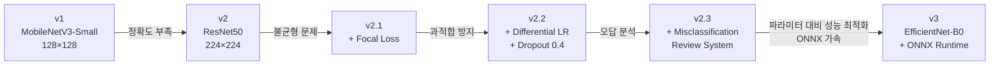

# 📚 Classification 모델 변경 히스토리

> 이 문서는 Vial Foreign Body Inspection 시스템의 **분류(Classification) 모델** 아키텍처 변경 이력을 기록합니다.
> 각 단계별로 **왜 바꿨는지**, **무엇이 달라졌는지**, **어떤 특성을 갖는지**를 설명합니다.

---

## 🔄 변경 흐름 요약



---

## 1️⃣ v1 — MobileNetV3-Small (초기 모델)

### 📋 스펙

| 항목 | 값 |
|------|-----|
| **백본(Backbone)** | MobileNetV3-Small (ImageNet 사전학습) |
| **입력 크기** | 128 × 128 px |
| **Classifier Head** | `nn.Linear(in_features, num_classes)` |
| **손실 함수** | `CrossEntropyLoss` (기본) |
| **Optimizer** | `Adam` (단일 학습률) |
| **학습 Epochs** | 30 |
| **Batch Size** | 32 |
| **Data Augmentation** | `RandomHorizontalFlip`, `RandomRotation(30°)` |

### 🎯 선택 이유
- **경량 모델**로 추론 속도가 빠름 (모바일/임베디드 환경 고려)
- 파라미터 수가 적어 적은 데이터로도 학습 가능
- 빠른 프로토타이핑에 적합

### ⚠️ 한계 및 문제점
- **정확도 부족**: Bubble과 Particle처럼 비슷하게 생긴 클래스를 구분하기 어려움
- **128×128 해상도가 너무 낮음**: 미세한 결함의 텍스처 정보가 리사이즈 과정에서 소실
- **클래스 불균형 미대응**: Noise_Dust 데이터가 압도적으로 많아 소수 클래스(Bubble, Particle)의 학습이 부족

---

## 2️⃣ v2 — ResNet50 (현재 모델)

### 📋 스펙

| 항목 | 값 |
|------|-----|
| **백본(Backbone)** | `ResNet50` (ImageNet V2 사전학습) |
| **입력 크기** | **224 × 224 px** |
| **Classifier Head** | `Dropout(0.4)` → `Linear(2048, num_classes)` |
| **손실 함수** | **Focal Loss** (gamma=2.0, class weights 적용) |
| **Optimizer** | `Adam` (**Differential LR**) |
| **학습 Epochs** | **50** |
| **Batch Size** | **16** (GPU 메모리 대응) |
| **Data Augmentation** | `HorizontalFlip`, `VerticalFlip`, `Rotation(180°)`, `ColorJitter` |
| **LR Scheduler** | `CosineAnnealingLR` |
| **Weight Decay** | `1e-4` |

### 🎯 변경 이유
사용자의 요청: **"정확도를 최대한 높이고 싶다. 모델이 커지고 느려져도 상관없다."**

### 🔍 각 변경 항목 상세 설명

---

### 2-1. 백본: MobileNetV3-Small → ResNet50

```python
# v1 (이전)
from torchvision.models import mobilenet_v3_small
model = mobilenet_v3_small(weights=MobileNet_V3_Small_Weights.DEFAULT)

# v2 (현재)
from torchvision.models import resnet50, ResNet50_Weights
model = resnet50(weights=ResNet50_Weights.IMAGENET1K_V2)
```

| 비교 | MobileNetV3-Small | ResNet50 |
|------|-------------------|----------|
| 파라미터 수 | ~2.5M | **~25.6M** (10배) |
| ImageNet Top-1 Acc | 67.7% | **80.9%** |
| 특징 추출 능력 | 제한적 | 매우 강력 |
| 추론 속도 | 매우 빠름 | 보통 |
| GPU 메모리 | 적음 | 보통 |

> [!NOTE]
> ResNet50의 **Residual Connection(잔차 연결)** 구조 덕분에 깊은 네트워크에서도 기울기가 사라지지 않아, 미세한 특징까지 학습할 수 있습니다.

---

### 2-2. 입력 크기: 128×128 → 224×224

```python
# v1
CLASSIFICATION_INPUT_SIZE = 128

# v2
CLASSIFICATION_INPUT_SIZE = 224  # ResNet50 표준 입력 크기
```

**왜?**
- 128×128에서는 미세한 결함의 **텍스처와 경계선** 정보가 리사이즈 시 뭉개짐
- 224×224는 ResNet50이 ImageNet에서 학습한 **원래 해상도**와 동일 → 사전학습 가중치를 최대한 활용
- 기존 128×128 이미지는 자동으로 **업스케일**되어 학습 (향후 224×224 원본 수집 권장)

---

### 2-3. Classifier Head: 단순 Linear → Dropout + Linear

```python
# v1
model.classifier[-1] = nn.Linear(in_features, num_classes)

# v2
model.fc = nn.Sequential(
    nn.Dropout(p=0.4, inplace=True),  # 40% 뉴런을 랜덤으로 꺼서 과적합 방지
    nn.Linear(in_features, num_classes)
)
```

> [!TIP]
> `Dropout(0.4)`은 학습 시 뉴런의 40%를 랜덤으로 비활성화합니다. 이렇게 하면 모델이 특정 뉴런에 의존하지 않고, **다양한 경로로 특징을 추출**하게 되어 일반화 성능이 올라갑니다.

---

### 2-4. 손실 함수: CrossEntropyLoss → Focal Loss

```python
# v1
criterion = nn.CrossEntropyLoss(weight=weights_tensor)

# v2
criterion = FocalLoss(weight=weights_tensor, gamma=2.0)
```

**Focal Loss의 핵심 원리:**

```
FL(pt) = -α × (1 - pt)^γ × log(pt)
```

| 상황 | CrossEntropy | Focal Loss (γ=2.0) |
|------|-------------|---------------------|
| 쉬운 샘플 (pt=0.9) | 동일 가중치 | 가중치 **0.01배**로 감소 |
| 어려운 샘플 (pt=0.2) | 동일 가중치 | 가중치 **0.64배**로 유지 |

> [!IMPORTANT]
> Noise_Dust가 90%인 불균형 데이터에서, CrossEntropy는 "전부 Noise라고 찍어도 90% 정확도"라는 **사기성 학습**이 가능합니다. Focal Loss는 이런 쉬운 맞추기를 **무시**하고, Bubble/Particle같은 어려운 케이스에 집중합니다.

---

### 2-5. Optimizer: 단일 LR → Differential Learning Rate

```python
# v1
optimizer = optim.Adam(model.parameters(), lr=1e-3)

# v2 — Backbone과 Head에 다른 학습률 적용
optimizer = optim.Adam([
    # Backbone: 이미 잘 학습된 가중치 → 아주 천천히 미세 조정
    {'params': [p for n, p in model.named_parameters() if 'fc' not in n], 'lr': 1e-5},
    # Head: 새로 추가한 레이어 → 빠르게 학습
    {'params': model.fc.parameters(), 'lr': 1e-3}
], weight_decay=1e-4)
```

| 부분 | 학습률 | 이유 |
|------|--------|------|
| **Backbone** (ResNet50 본체) | `1e-5` (매우 느림) | ImageNet에서 학습한 범용 특징을 **보존**하면서 미세 조정 |
| **Head** (분류기) | `1e-3` (100배 빠름) | 우리 데이터에 맞는 분류 기준을 **처음부터** 빠르게 학습 |

> [!CAUTION]
> Backbone에 높은 학습률을 적용하면, ImageNet에서 수백만 장으로 배운 귀중한 특징 추출 능력이 **파괴(Catastrophic Forgetting)**될 수 있습니다.

---

### 2-6. Data Augmentation 강화

```python
# v1
T.RandomRotation(degrees=30)

# v2 — 이물은 방향성이 없으므로 360° 회전
T.RandomHorizontalFlip(p=0.5),
T.RandomVerticalFlip(p=0.5),
T.RandomRotation(degrees=180),           # 모든 방향
T.ColorJitter(brightness=0.2, contrast=0.2),  # 조명 변화 대응
```

**왜 180°?**: 이물(Particle), 먼지(Noise), 기포(Bubble) 모두 **고정된 방향이 없습니다**. 30° 제한이면 학습 데이터의 다양성이 부족합니다.

---

### 2-7. LR Scheduler: CosineAnnealingLR

```python
scheduler = optim.lr_scheduler.CosineAnnealingLR(optimizer, T_max=epochs)
```

학습률이 코사인 곡선처럼 **점진적으로 감소**:
- 초반: 높은 LR로 빠르게 수렴
- 중반: 적당히 감소하며 세밀한 조정
- 후반: 매우 낮은 LR로 최적점 주변 탐색

---

### 2-8. Misclassification Review System (오답 분석)

학습 완료 후, 전체 데이터셋을 다시 추론하여 **틀린 이미지**를 자동 수집합니다.

```
📂 data_dir/
└── 📂 _misclassified/
    ├── Bubble_predicted_as_Particle_img_001.bmp
    ├── Particle_predicted_as_Noise_Dust_img_042.bmp
    └── ...
```

**활용 방법:**
1. `_misclassified` 폴더 확인
2. 파일명에서 `[정답]_predicted_as_[오답]` 패턴으로 어떤 실수를 했는지 파악
3. 잘못 라벨링된 데이터 수정 또는 어려운 케이스 추가 수집
4. 다시 학습 → 반복

---

## 3️⃣ v3 — EfficientNet-B0 (현재 모델)

### 📋 스펙

| 항목 | 값 |
|------|-----|
| **백본(Backbone)** | `EfficientNet-B0` (ImageNet1K V1 사전학습) |
| **입력 크기** | **224 × 224 px** (사전학습 해상도 유지) |
| **Classifier Head** | `Dropout(0.4)` → `Linear(in_features, num_classes)` |
| **손실 함수** | **Focal Loss** (gamma=2.0, class weights 적용) |
| **Optimizer** | `Adam` (**Differential LR**: backbone 1e-5, head 1e-3) |
| **추론 엔진** | **ONNX Runtime** (GPU/CPU) + PyTorch FP16 |
| **학습/추론 파이프라인** | **CPU-GPU 비동기 파이프라인 (ThreadPoolExecutor)** |

### 🎯 변경 이유 (v2 → v3)
v2의 ResNet50 모델은 정확도는 훌륭했으나, 파라미터 수(~25.6M)가 많고 무거워 다량의 Contour를 실시간 검사해야 하는 환경(10K+ ROI)에서 병목이 발생했습니다. 
이를 해결하기 위해 파라미터 대비 최고 성능을 내는 **EfficientNet** 계열로 아키텍처를 교체하고, **ONNX 가속**을 도입하여 실시간성을 확보했습니다.

### 🔍 각 변경 항목 상세 설명

---

### 3-1. 백본: ResNet50 → EfficientNet-B0

```python
# v2
from torchvision.models import resnet50, ResNet50_Weights
model = resnet50(weights=ResNet50_Weights.IMAGENET1K_V2)

# v3 (현재)
from torchvision.models import efficientnet_b0, EfficientNet_B0_Weights
model = efficientnet_b0(weights=EfficientNet_B0_Weights.IMAGENET1K_V1)
```

| 비교 | ResNet50 (v2) | EfficientNet-B0 (v3) |
|------|---------------|----------------------|
| 파라미터 수 | ~25.6M | **~5.3M** (약 1/5) |
| ImageNet 정확도 | 좋음 | **매우 좋음** (적은 파라미터로 동급 이상) |
| FLOPs (연산량) | 4.1G | **0.39G** (약 1/10) |
| 추론 속도 | 보통 | **매우 빠름** |

> [!NOTE]
> EfficientNet은 네트워크의 깊이(Depth), 너비(Width), 해상도(Resolution)를 최적의 비율로 동시에 확장하는 Compound Scaling 최적화 기법을 사용하여 극도로 가볍고 빠르면서도 정확도는 ResNet50과 맞먹거나 능가합니다.

---

### 3-2. 추론 최적화: ONNX Runtime 도입

학습 완료 후 PyTorch 모델(`.pth`)을 하드웨어 가속에 특화된 **ONNX 모델(`.onnx`)**로 내보내어(Export) 추론합니다.

```python
# ONNX Export 시 최적화 파라미터
torch.onnx.export(
    model, dummy_input, onnx_path,
    opset_version=14,
    do_constant_folding=True,  # 상수 연산 사전 계산
    dynamic_axes={'input': {0: 'batch_size'}}
)
```

**효과:**
- `CUDAExecutionProvider`를 통한 GPU 가속 수식 최적화.
- 만약 CUDA가 없거나 버전이 달라 PyTorch GPU가 동작하지 않더라도 `CPUExecutionProvider`로 폴백(Fallback)되어 범용적으로 매우 빠른 실행 가능.

---

### 3-3. 비동기 추론 파이프라인 (CPU pre-processing + GPU inference)

다수의 ROI 이미지를 생성하고(`cv2.resize`, 정규화) 추론하는 과정을 병렬화했습니다.

1. **CPU 스레드**: 다음 처리에 필요한 ROI 이미지 묶음(Chunk)을 리사이즈하고 Numpy 벡터 연산으로 고속 정규화 준비.
2. **GPU (또는 메인 스레드 ONNX)**: 바로 이전 묶음의 추론을 진행.

> [!TIP]
> CPU가 다음 이미지를 자르는 동안 GPU가 쉬지 않고 현재 이미지를 추론하게 하여 1만 개 단위의 검사 속도를 극적으로 낮췄습니다. (자세한 내용은 `classify_batch` 파이프라인 참조)

---

## 📊 모델 비교 총정리

| 항목 | v1 (MobileNetV3) | v2 (ResNet50) | v3 (EfficientNet-B0 + ONNX) |
|------|------------------|---------------|-----------------------------|
| 목표 | 빠른 프로토타이핑 | 최고 정확도 | **실시간성 + 고정확도** |
| 백본 파라미터 | ~2.5M | ~25.6M | **~5.3M** |
| 추론 엔진 | PyTorch FP32 | PyTorch FP32 | **ONNX Runtime / PyTorch FP16** |
| 손실 함수 | CrossEntropy | Focal Loss | Focal Loss |
| 학습 전략 | 기본 | 차등 LR (Differential) | 차등 LR (Differential) |
| 불균형 대응 | Class Weights만 | Focal Loss + Weights | Focal Loss + Weights |
| 추론 속도 | ⚡ 매우 빠름 | 🐢 보통 (ROI 많을시 병목) | **🚀 극강 속도 (비동기 병렬)** |
| 정확도 | ⭐⭐ | ⭐⭐⭐⭐⭐ | **⭐⭐⭐⭐⭐** |

---

## 🔮 향후 개선 방향 (참고)

1. **에폭 수 증가** (50 → 100): 데이터가 충분하면 더 오래 학습하여 성능 향상 가능
2. **Focal Loss gamma 튜닝**: gamma를 3.0~5.0으로 올리면 어려운 샘플에 더 집중
3. **EfficientNet-B4/B5**: B0 모델의 파라미터가 충분히 가벼워 연산 여유가 남는다면, 정확도를 조금 더 쥐어짜기 위해 Scaling 버전을 올릴 수 있음.
4. **Test-Time Augmentation (TTA)**: 추론 시 이미지를 여러 각도로 변환하여 예측 평균을 내면 더 안정적인 결과. 단 속도 저하를 감안해야 함.
