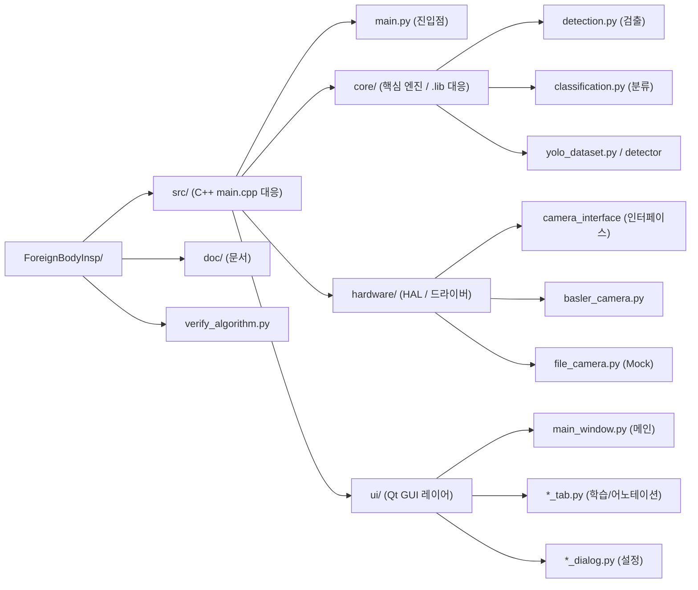
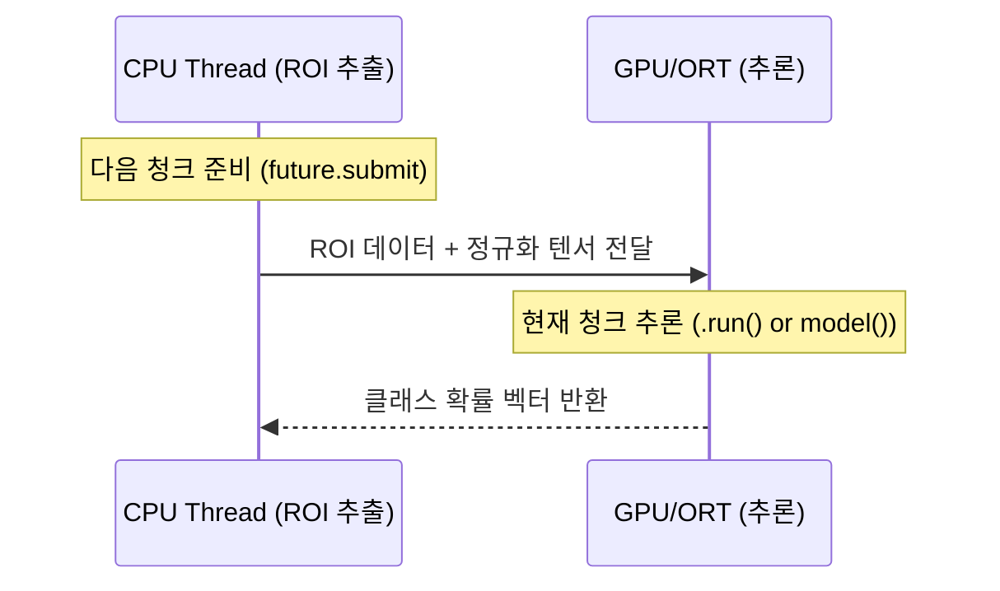
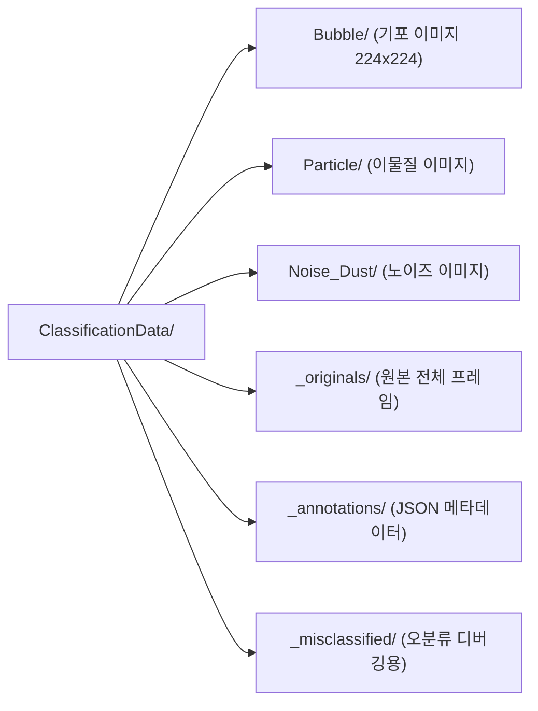
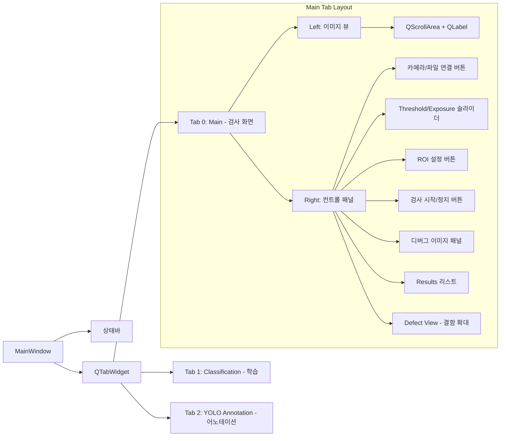
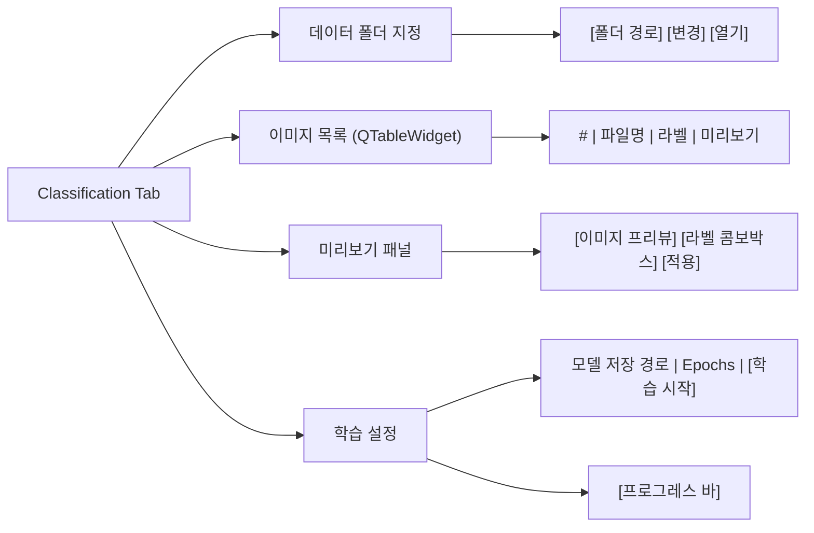
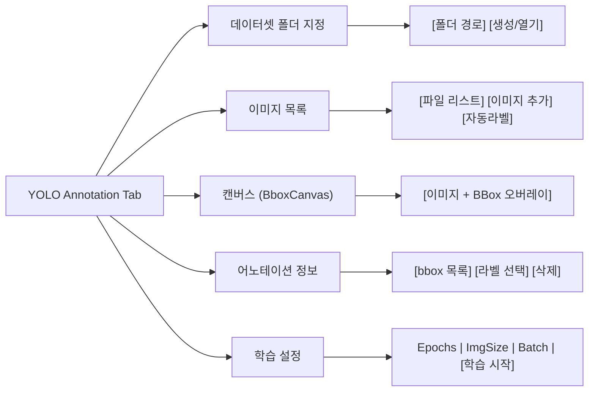
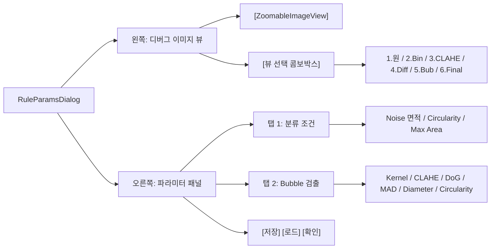
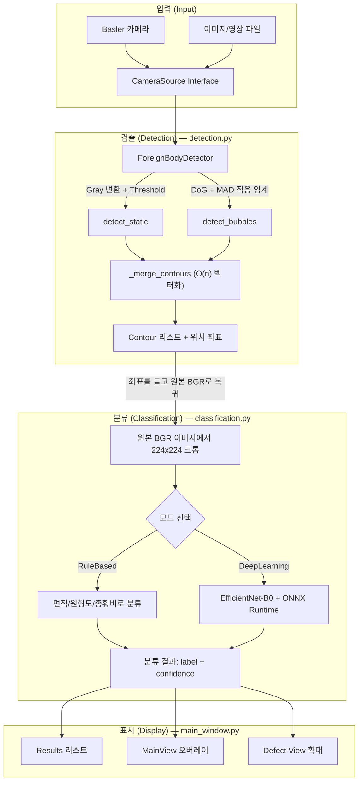

# 📖 ForeignBodyInsp 전체 소스코드 완전 해부 (C++ 개발자를 위한 가이드)

> 이 문서는 프로젝트의 **모든 `.py` 파일**을 빠짐없이 다루며, 각 파일의 역할·함수·설계 의도를 C++ 개발자의 관점에서 설명합니다.

---

## 🗂️ 프로젝트 폴더 구조 한눈에 보기



> **C++ 비유**: `src/core/`는 `.lib` 정적 라이브러리, `src/hardware/`는 HAL 드라이버, `src/ui/`는 MFC/Qt GUI 레이어에 해당합니다.

---

## 🐍 Python ↔ C++ 핵심 개념 매핑

| Python | C++ 대응 | 설명 |
|--------|----------|------|
| `class Foo:` | `class Foo { ... };` | 클래스 선언 |
| `def __init__(self)` | 생성자 `Foo::Foo()` | 인스턴스 최초 초기화 |
| `self.x = 10` | `this->x = 10` | 멤버 변수 접근 |
| `ABC` + `@abstractmethod` | 순수 가상 함수 `= 0` | 인터페이스 정의 |
| `import` | `#include` | 모듈 가져오기 |
| `dict` | `std::unordered_map` | 키-값 해시맵 |
| `list` | `std::vector` | 동적 배열 |
| `np.ndarray` | `cv::Mat` | N차원 배열 (이미지) |
| `QThread` | `std::thread` / `QThread` | 백그라운드 스레드 |
| `pyqtSignal` | Qt의 `signals:` | 시그널-슬롯 메커니즘 |
| `decorator (@)` | 없음 (매크로로 유사 구현) | 함수를 감싸는 래핑 |
| `with open(...)` | RAII / `std::ifstream` | 자동 리소스 해제 |
| `try/except` | `try/catch` | 예외 처리 |

---

# 📁 Part 1: 진입점 (Entry Point)

## [main.py](../../src/main.py#L1) — 47줄

> **C++ 비유**: `int main(int argc, char* argv[])` 에 해당합니다.

### 하는 일
1. **경로 설정**: `sys.path`에 프로젝트 루트를 등록합니다 (C++의 `#include` 경로 설정과 비슷).
2. **EXE 빌드 대응**: `getattr(sys, "frozen", False)`로 PyInstaller EXE 실행인지 판단합니다.
   - EXE일 때: `torch` DLL 경로를 `os.add_dll_directory()`로 등록 (C++에서 `SetDllDirectory()` 호출하는 것과 동일).
3. **QApplication 생성 후 MainWindow 띄우기**: Qt의 표준 패턴입니다.

```python
def main():
    app = QApplication(sys.argv)
    window = MainWindow()
    window.show()
    sys.exit(app.exec())  # C++: return app.exec();
```

---

# 📁 Part 2: 핵심 엔진 (`src/core/`)

## [detection.py](../../src/core/detection.py#L1) — 약 483줄

> **역할**: 이미지에서 이물질(Foreign Body)과 기포(Bubble)의 **위치**를 찾는 검출 엔진.

### 클래스: [`BubbleDetectorParams`](../../src/core/detection.py#L24) *(L24-73)*
기포 검출에 사용되는 파라미터를 묶어 관리하는 **데이터 클래스** (C++의 `struct`에 가깝습니다).

| 필드 | 기본값 | 설명 |
|------|--------|------|
| `bg_open_ksize` | 61 | 배경 평탄화용 모폴로지 커널 크기 |
| `clahe_clip` | 2.0 | 대비 향상(CLAHE) 강도 |
| `sigma_small` / `sigma_large` | 1.2 / 6.0 | DoG (Difference of Gaussians) 밴드패스 필터 시그마 |
| `thr_k` | 4.0 | MAD 기반 적응 임계값의 민감도 |
| `min_diameter` / `max_diameter` | 8 / 100 | 버블 크기 필터(px) |
| `circularity_min` | 0.35 | 원형도 하한 (1.0이면 완벽한 원) |

**메서드:**
- [`get_params()`](../../src/core/detection.py#L61) *(L61-62)* → `dict` 반환 (JSON 직렬화용)
- [`set_params()`](../../src/core/detection.py#L64) *(L64-73)* → dict에서 파라미터 복원

---

### 클래스: [`ForeignBodyDetector`](../../src/core/detection.py#L76) *(L76-420)*
실제 검출 로직을 담당하는 핵심 클래스입니다.

#### [`detect_static()`](../../src/core/detection.py#L81) *(L81-195)*
일반 이물질(Particle, Fiber 등)을 검출합니다.

**처리 요약:**
1. 그레이스케일 변환 (다운샘플 옵션 포함)
2. GaussianBlur → 이진화 (Threshold 또는 Adaptive) → Morphology Open/Close
3. `cv2.findContours()`로 외곽선 추출
4. 면적 필터링 (`min_area` 이하 제거)
5. (옵션) Bubble 검출 결과와 합침 (`_merge_contours`)

> **C++ 비유**: OpenCV의 `cv::findContours()`, `cv::threshold()`를 직접 쓰는 것과 동일합니다.

#### [`detect_bubbles()`](../../src/core/detection.py#L203) *(L203-368)*
기포 전용 검출 파이프라인입니다. 일반 이물질보다 훨씬 정교한 전처리를 거칩니다.

**처리 요약 (7단계):**
1. **Morphological Opening 배경 평탄화**: 큰 커널로 배경을 추정하고 빼기
2. **양극성 차이 맵**: 밝은 영역과 어두운 영역을 동시에 감지
3. **CLAHE 대비 향상** (선택): 로컬 대비를 높여 미세 기포 강조
4. **노이즈 제거**: Median / Bilateral
5. **DoG 밴드패스 필터**: 특정 크기의 구조만 통과시키는 주파수 필터
6. **MAD 적응 임계** → **Morphology 정리** (Close → Open)
7. **형상 필터**: 원형도, 솔리디티, 종횡비, 크기로 최종 필터링

#### [`_merge_contours()`](../../src/core/detection.py#L421) *(L421-480)*
두 검출 결과를 겹치지 않게 합칩니다.

- **최적화 포인트**: 이전 O(n²) 루프를 **NumPy 브로드캐스팅으로 O(n)으로 벡터화**하여 10,000배 빨라졌습니다.
- 새 contour의 중심점이 기존 contour의 bbox 안에 있으면 중복으로 판단하여 스킵합니다.

#### `detect_motion(frames)` — Placeholder
향후 스핀&스톱 방식의 동체 검출용으로 예약된 빈 메서드입니다.

---

## [classification.py](../../src/core/classification.py#L1) — 약 933줄

> **역할**: 검출된 이물질을 **분류**(Bubble/Particle/Noise/Unknown)하는 엔진. 규칙 기반과 딥러닝 두 가지 방식을 모두 지원합니다.

### 전역 상수

```python
BUBBLE_LABEL = "Bubble"
LEGACY_BUBBLE_FOLDERS = ("Small_Bubble", "Big_Bubble", "BackGround_Bubble")
CLASSIFICATION_INPUT_SIZE = 224  # 모든 학습·추론의 기준 이미지 크기
```

---

### 클래스: [`RuleBasedClassifier`](../../src/core/classification.py#L19) *(L19-119)*
Contrast(중심 vs 배경 밝기) 기반으로 Noise_Dust / Particle 구분. Bubble은 detect_bubbles에서 검출된 contour만 해당 라벨 부여.

**분류 기준 (기본값):**

| 조건 | 결과 |
|------|------|
| Contrast < `noise_contrast_threshold` (30) | Noise_Dust |
| Bubble 검출기에서 온 contour | Bubble |
| 그 외 | Particle |

**주요 메서드:**
- [`classify()`](../../src/core/classification.py#L50) *(L50-54)* → 단일 분류 (dict 반환)
- [`classify_batch()`](../../src/core/classification.py#L56) *(L56-125)* → 일괄 분류 (NumPy 벡터 연산으로 최적화)
- [`get_params()`](../../src/core/classification.py#L37) *(L37-41)* / [`set_params()`](../../src/core/classification.py#L43) *(L43-48)* → 파라미터 직렬화/역직렬화

> **C++ 비유**: 이 클래스는 if-else 분기로 구현된 `Strategy Pattern`입니다.

---

### 클래스: [`DeepLearningClassifier`](../../src/core/classification.py#L121) *(L121-412)*
사전 학습된 딥러닝 모델(EfficientNet-B0)로 분류합니다.

**멤버 변수:**
| 변수 | 타입 | 설명 |
|------|------|------|
| `model` | `torch.nn.Module` | PyTorch 모델 (호환 모드) |
| `ort_session` | `ort.InferenceSession` | ONNX Runtime 세션 (고속 모드) |
| `labels` | `list[str]` | 학습된 클래스 이름 목록 |
| `_device` | `str` | `"cuda"` 또는 `"cpu"` |
| `_use_fp16` | `bool` | FP16 반정밀도 사용 여부 |

#### [`load_model()`](../../src/core/classification.py#L149) *(L149-214)*
- `.onnx` 파일 → ONNX Runtime 세션으로 로드 (CUDAExecutionProvider 우선)
- `.pth` 파일 → PyTorch 모델로 로드 (하위 호환)
- 라벨 정보: `.onnx`는 `*_labels.json`, `.pth`는 checkpoint 내부에 저장

#### [`_extract_rois_chunk()`](../../src/core/classification.py#L230) *(L230-266)*
**CPU에서 수행하는 헬퍼 함수** (GPU 파이프라인의 일부):
1. 각 contour의 bbox 좌표로 **원본 BGR 이미지**에서 ROI 크롭
2. 224×224로 INTER_LINEAR 리사이즈
3. BGR→RGB 변환
4. float32 변환 + ImageNet 정규화 (mean=[0.485,0.456,0.406], std=[0.229,0.224,0.225])
5. HWC→CHW 전치 (PyTorch 텐서 형식)

> **핵심 포인트**: 이 함수는 **원본 컬러 이미지에서 크롭**합니다. 전처리된 이진화 이미지가 아닙니다!

#### [`classify_batch()`](../../src/core/classification.py#L268) *(L268-410)*
10,000개 이상의 contour를 효율적으로 분류하는 핵심 메서드입니다.

**파이프라인 구조:**


1. **청크 분할**: 2048개씩 나눔 (`CHUNK = 2048`)
2. **CPU/GPU 파이프라인**: `ThreadPoolExecutor`로 CPU 크롭과 GPU 추론을 **동시에** 수행
3. **ONNX Runtime 분기**: `ort_session`이 있으면 NumPy 배열을 직접 넘기고 NumPy softmax로 사후 확률 계산
4. **PyTorch 분기**: 미니배치(256)로 나누어 `model()` 호출 후 `torch.softmax()`
5. **결과 매핑**: 각 contour에 label, confidence, area, circularity, aspect_ratio 정보를 dict로 반환

---

### 클래스: [`ParticleClassifier`](../../src/core/classification.py#L414) *(L414-442)*
**RuleBased와 DeepLearning을 통합하는 파사드(Facade) 클래스**입니다.

> **C++ 비유**: `Strategy Pattern`의 Context 역할. 내부에 두 개의 전략 객체를 들고, `use_deep_learning` 플래그에 따라 분기합니다.

```python
class ParticleClassifier:
    def __init__(self):
        self.rule_based = RuleBasedClassifier()
        self.dl_classifier = DeepLearningClassifier()
        self.use_deep_learning = False  # True면 DL, False면 RuleBased
```

---

### 클래스: [`DefectImageSaver`](../../src/core/classification.py#L445) *(L445-573)*
검출된 결함을 라벨별 폴더에 BMP 파일로 저장하는 유틸리티입니다.

**저장 구조:**
```

```

**주요 메서드:**
- [`save()`](../../src/core/classification.py#L520) *(L520-573)* → BMP 파일 저장, 경로 반환
- [`parse_defect_filename()`](../../src/core/classification.py#L569) *(L569-587)* → 파일명에서 메타데이터(좌표, 라벨) 파싱
- [`save_original()`](../../src/core/classification.py#L494) *(L494-506)* → 원본 프레임 보관

---

### 독립 함수: [`_build_model(num_classes)`](../../src/core/classification.py#L660) *(L660-677)*
EfficientNet-B0 전이 학습 모델을 생성합니다.

```python
from torchvision.models import efficientnet_b0, EfficientNet_B0_Weights
model = efficientnet_b0(weights=EfficientNet_B0_Weights.IMAGENET1K_V1)
model.classifier = nn.Sequential(
    nn.Dropout(p=0.4, inplace=True),
    nn.Linear(in_features, num_classes)  # 마지막 레이어만 교체
)
```

> **C++ 비유**: 이미 학습된 신경망의 마지막 층만 교체하는 것은 C++에서 라이브러리의 `virtual` 함수를 오버라이드하는 것과 유사합니다.

---

### 독립 함수: [`train_classifier(data_dir, save_path, epochs, progress_callback)`](../../src/core/classification.py#L680) *(L680-908)*
분류 모델 학습의 전체 사이클을 수행합니다.

**학습 과정:**
1. 데이터 폴더 스캔 → 라벨 목록 자동 생성
2. 이미지 로드 + 224×224 리사이즈
3. 클래스 불균형 보정: `FocalLoss` + 클래스 가중치
4. 2-레이어 학습률: backbone(1e-5) vs classifier head(1e-3)
5. `CosineAnnealingLR` 스케줄러
6. Best Model Checkpointing (최저 손실 기준)
7. 오답 분석: `_misclassified/` 폴더에 오분류 이미지 복사
8. **PyTorch `.pth` 저장 + ONNX `.onnx` 자동 변환** (dynamic batch axes 지원)

### 클래스: [`FocalLoss`](../../src/core/classification.py#L634) *(L634-657)*
불균형 데이터에 효과적인 손실 함수입니다. 쉬운 샘플(Noise)의 가중치를 줄이고 어려운 샘플(Bubble, Particle)에 집중합니다.

---

## [yolo_detector.py`](../../src/core/yolo_detector.py#L1) — 183줄

> **역할**: `ultralytics` 라이브러리의 YOLO 모델을 감싸는 래퍼 클래스.

### 클래스: [`YOLODetector`](../../src/core/yolo_detector.py#L15) *(L15-182)*

| 메서드 | 설명 |
|--------|------|
| [`load_model()`](../../src/core/yolo_detector.py#L29) *(L29-63)* | `.pt` 모델 로드 (ultralytics YOLO 형식) |
| [`detect()`](../../src/core/yolo_detector.py#L65) *(L65-127)* | 한 번의 추론으로 위치+분류 동시 수행 |
| [`train()`](../../src/core/yolo_detector.py#L129) *(L129-182)* | YOLO 모델 학습 실행 |

`detect()` 의 반환 형식은 `list[dict]`로, 각 dict에 `label`, `confidence`, `bbox (x1,y1,x2,y2)`, `area`, `circularity`, `contour` 등이 포함됩니다.

> **기존 파이프라인과의 차이**: 기존은 (검출→분류) 2단계였지만, YOLO는 1단계로 둘 다 수행합니다.

---

## [yolo_dataset.py`](../../src/core/yolo_dataset.py#L1) — 413줄

> **역할**: YOLO 학습용 데이터셋 폴더 구조 생성 및 관리 유틸리티.

### 독립 함수들
- [`contour_to_yolo_bbox()`](../../src/core/yolo_dataset.py#L22) *(L22-29)* → OpenCV contour → YOLO 정규화 좌표 `(cx, cy, w, h)`
- [`bbox_xyxy_to_yolo()`](../../src/core/yolo_dataset.py#L32) *(L32-39)* → 절대 좌표 → 정규화 좌표
- [`yolo_to_bbox_xyxy()`](../../src/core/yolo_dataset.py#L42) *(L42-53)* → 정규화 좌표 → 절대 좌표

### 클래스: [`YOLODatasetManager`](../../src/core/yolo_dataset.py#L56) *(L56-412)*

YOLO 표준 폴더 구조를 생성하고 관리합니다:
```
dataset/
├── images/train/    ├── images/val/
├── labels/train/    ├── labels/val/
└── data.yaml
```

**주요 메서드:**
| 메서드 | 설명 |
|--------|------|
| [`create_structure()`](../../src/core/yolo_dataset.py#L84) *(L84-88)* | 폴더 구조 생성 |
| [`write_data_yaml()`](../../src/core/yolo_dataset.py#L90) *(L90-103)* | `data.yaml` 작성 (학습 설정 파일) |
| [`add_image_with_labels()`](../../src/core/yolo_dataset.py#L109) *(L109-171)* | 이미지+어노테이션 추가 |
| [`add_frame_with_contours()`](../../src/core/yolo_dataset.py#L173) *(L173-222)* | OpenCV contour → YOLO 형식 변환 후 추가 |
| [`auto_label_image()`](../../src/core/yolo_dataset.py#L224) *(L224-283)* | Threshold+RuleBase로 자동 어노테이션 생성 |
| [`split_train_val()`](../../src/core/yolo_dataset.py#L285) *(L285-305)* | 랜덤 train/val 분할 |
| [`get_stats()`](../../src/core/yolo_dataset.py#L307) *(L307-335)* | 이미지 수, 클래스별 통계 반환 |

---

# 📁 Part 3: 하드웨어 추상화 (`src/hardware/`)

## [camera_interface.py`](../../src/hardware/camera_interface.py#L1) — 29줄

> **C++ 비유**: 순수 가상 클래스 (Abstract Base Class) `ICameraSource`

```python
class CameraSource(ABC):  # ABC = Abstract Base Class (C++의 '= 0' 순수가상)
    @abstractmethod
    def open(self): ...
    @abstractmethod
    def close(self): ...
    @abstractmethod
    def grab_frame(self) -> np.ndarray: ...
    @abstractmethod
    def set_exposure(self, value): ...
    @abstractmethod
    def get_exposure(self): ...
```

이 인터페이스를 상속받아 `BaslerCamera`와 `FileCamera`가 구현체를 제공합니다.

> **C++로 표현하면:**
> ```cpp
> class CameraSource {
> public:
>     virtual bool open() = 0;
>     virtual void close() = 0;
>     virtual cv::Mat grab_frame() = 0;
>     virtual void set_exposure(double value) = 0;
>     virtual double get_exposure() = 0;
> };
> ```

---

## [basler_camera.py`](../../src/hardware/basler_camera.py#L1) — 175줄

> **역할**: Basler GigE 카메라(acA1920-25gm 등) 실제 연결 및 프레임 획득.

### 의존성
- `pypylon`: Basler의 공식 Python SDK (C++ Pylon SDK의 Python 바인딩)
- SDK가 없으면 `pylon = None`으로 안전하게 폴백

### 주요 메서드 ([`BaslerCamera` 클래스](../../src/hardware/basler_camera.py#L27) *(L27-174)*)

| 메서드 | 설명 |
|--------|------|
| [`open()`](../../src/hardware/basler_camera.py#L44) *(L44-88)* | GigE 디바이스 탐색 → 연결 → Grabbing 시작. 실패 시 상세 오류 메시지 반환 |
| [`close()`](../../src/hardware/basler_camera.py#L90) *(L90-99)* | Grabbing 중지 → 카메라 해제 |
| [`grab_frame()`](../../src/hardware/basler_camera.py#L101) *(L101-110)* | `RetrieveResult()` → BGR 변환 → numpy 배열 반환 |
| [`set_exposure()`](../../src/hardware/basler_camera.py#L112) *(L112-118)* | ExposureAuto=Off → ExposureTime 설정 |
| [`get_parameters_dict()`](../../src/hardware/basler_camera.py#L128) *(L128-148)* | 현재 노출, 게인 등을 dict로 반환 |
| [`set_parameters_dict()`](../../src/hardware/basler_camera.py#L150) *(L150-174)* | dict에서 카메라 파라미터 일괄 적용 |

> **핵심**: `_find_basler_device()` 함수가 `PREFERRED_MODEL = "acA1920-25gm"`을 우선 검색합니다.

---

## [file_camera.py`](../../src/hardware/file_camera.py#L1) — 130줄

> **역할**: 정적 이미지 파일이나 동영상 파일을 카메라처럼 취급하는 Mock 구현체.

### 동작 방식
- `.avi/.mp4/.mov` → `cv2.VideoCapture`로 영상 재생 (루프 반복)
- `.bmp/.jpg/.png` → `cv2.imdecode`로 정적 이미지 로드
- 한글 경로 대응: `np.frombuffer()` → `cv2.imdecode()` 패턴 사용

### 추가 메서드 (`CameraSource`에 없는 확장, [`FileCamera` 클래스](../../src/hardware/file_camera.py#L15) *(L15-129)*)
| 메서드 | 설명 |
|--------|------|
| [`is_video()`](../../src/hardware/file_camera.py#L107) *(L107-109)* | 동영상인지 정적 이미지인지 판별 |
| [`get_frame_count()`](../../src/hardware/file_camera.py#L111) *(L111-116)* | 총 프레임 수 (이미지=1) |
| [`get_frame_position()`](../../src/hardware/file_camera.py#L118) *(L118-122)* | 현재 재생 위치 |
| [`set_frame_position()`](../../src/hardware/file_camera.py#L124) *(L124-129)* | 특정 프레임으로 시크 |

> **C++와의 차이**: Python은 `virtual`이 아닌 메서드도 자유롭게 추가할 수 있습니다 (Duck Typing).

---

# 📁 Part 4: GUI 레이어 (`src/ui/`)

## [main_window.py](../../src/ui/main_window.py#L1) — 약 3000줄

> **역할**: 프로그램의 **메인 윈도우(뼈대)**. 모든 UI 요소, 이벤트 처리, 타이머, 검사 파이프라인 통합, User/Maker/Viewer 모드가 이 파일에 있습니다.

### 클래스: [`DetectionWorker(QThread)`](../../src/ui/main_window.py#L30) *(L30-275)*
검사를 **백그라운드 스레드**에서 실행하여 UI가 멈추지 않게 합니다.

> **C++ 비유**: `QThread`를 상속받아 `run()`을 오버라이드 하는 것은 C++ Qt와 100% 동일합니다.

| 메서드 | 설명 |
|--------|------|
| [`run_detection()`](../../src/ui/main_window.py#L45) *(L45-63)* | 파라미터 세팅 후 스레드 시작 요청 |
| [`run()`](../../src/ui/main_window.py#L65) *(L65-80)* | 스레드 본체: `_run_threshold()` 또는 `_run_yolo()` 호출 |
| [`_run_threshold()`](../../src/ui/main_window.py#L82) *(L82-208)* | Threshold+Bubble 검출 → 분류 → 프로파일링 출력 |
| [`_run_yolo()`](../../src/ui/main_window.py#L210) *(L210-240)* | YOLO 단일 추론 파이프라인 |

`result_ready` 시그널로 결과를 메인 스레드(UI)에 전달합니다.

---

### 클래스: [`MainWindow(QMainWindow)`](../../src/ui/main_window.py#L247) *(L247-2998)* — 핵심

#### [생성자 `__init__()`](../../src/ui/main_window.py#L248) *(L248-328)* 에서 초기화하는 주요 멤버

| 변수 | 타입 | 설명 |
|------|------|------|
| `camera` | `CameraSource` | 현재 연결된 카메라 (Basler 또는 FileCamera) |
| `detector` | `ForeignBodyDetector` | 이물질 검출 엔진 인스턴스 |
| `classifier` | `ParticleClassifier` | 분류 엔진 (RuleBased + DL 통합) |
| `yolo_detector` | `YOLODetector` | YOLO 검출기 |
| `timer` | `QTimer` | 프레임 갱신 타이머 (영상 재생/실시간 촬영) |
| `inspection_roi` | `tuple(x,y,w,h)` | 검사 영역 좌표 |
| `current_display_frame` | `np.ndarray` | 현재 표시 중인 원본 프레임 |
| `zoom_factor` | `float` | 뷰 확대 배율 |
| `view_cx, view_cy` | `float` | 뷰 중심 좌표 (패닝용) |

#### [`init_ui()`](../../src/ui/main_window.py#L332) *(L332-950)* — UI 레이아웃 구축 (메뉴, 탭, Main/Classification/YOLO 탭, 스플리터, Basler/Inspection/Settings/Results, Viewer 모드용 위젯 등)

**레이아웃 구조:**


#### 주요 메서드 그룹

**카메라 관련:**
| 메서드 | 설명 |
|--------|------|
| [`connect_camera()`](../../src/ui/main_window.py#L814) *(L814-861)* | Basler 카메라 연결/해제 토글 |
| [`load_file()`](../../src/ui/main_window.py#L866) *(L866-873)* → [`load_image_path()`](../../src/ui/main_window.py#L875) *(L875-925)* | 이미지/영상 파일 로드 |
| [`_on_realtime_view_toggled()`](../../src/ui/main_window.py#L927) *(L927-937)* | 실시간 뷰 타이머 제어 |

**검사 파이프라인:**
| 메서드 | 설명 |
|--------|------|
| [`toggle_inspection()`](../../src/ui/main_window.py#L1011) *(L1011-1028)* | 검사 시작/정지 토글 |
| [`update_frame()`](../../src/ui/main_window.py#L1400) *(L1400-1537)* | 타이머에서 호출: 프레임 획득 → 검사 요청 |
| [`_on_detection_result()`](../../src/ui/main_window.py#L1034) *(L1034-1222)* | 검출 완료 후 결과 표시·저장 (시그널 슬롯) |

**ROI 및 어노테이션:**
| 메서드 | 설명 |
|--------|------|
| [`_on_roi_button_clicked()`](../../src/ui/main_window.py#L1895) *(L1895-1913)* | 검사 ROI 설정 모드 진입 |
| [`_on_annotation_roi_button_clicked()`](../../src/ui/main_window.py#L1915) *(L1915-1936)* | 어노테이션 Rect 드래그 모드 진입 |
| [`_finish_annotation_rect()`](../../src/ui/main_window.py#L1938) *(L1938-2038)* | 드래그 완료 → 라벨 선택 팝업 → 224×224 크롭 저장 |

**이벤트 필터 (`eventFilter`):**
마우스/키보드 이벤트를 가로채는 핵심 허브입니다:
- `MouseButtonPress` → ROI 드래그 시작 / 어노테이션 드래그 시작 / 팬 시작
- `MouseMove` → 드래그 중 실시간 렌더링 / 팬 이동
- `MouseButtonRelease` → ROI 확정 / 어노테이션 저장 팝업 / 클릭 판정
- `Wheel` → Ctrl+휠로 줌 인/아웃
- `DblClick(Middle)` → 1:1 줌 토글

**렌더링:**
| 메서드 | 설명 |
|--------|------|
| `render_main_view()` | 전체 프레임에서 zoom/pan 계산 → 크롭 → 리사이즈 → QLabel에 표시 |
| [`update_debug_panel()`](../../src/ui/main_window.py#L1773) *(L1773-1806)* | Binary/CLAHE/Diff Map 등 디버그 이미지 표시 |
| [`update_defect_view()`](../../src/ui/main_window.py#L1812) *(L1812-1883)* | 선택된 결함의 확대 이미지 + 정보 표시 |

**단축키:**
| 키 | 동작 |
|----|------|
| `Tab` | Main ↔ Classification 탭 전환 |
| `R` | 어노테이션 ROI 설정 토글 |
| `Ctrl+R` | 검사 ROI 설정 토글 |
| `Space` | 영상 Pause/Resume |
| `F5` | 앱 재시작 |

---

## [classification_tab.py`](../../src/ui/classification_tab.py#L1) — 765줄

> **역할**: 분류 학습 데이터 준비(이미지 등록·라벨링) 및 학습 런칭 UI.

### 클래스: [`TrainWorker(QThread)`](../../src/ui/classification_tab.py#L22) *(L22-40)*
학습을 백그라운드에서 수행합니다. `progress` 시그널로 epoch별 진행률을 UI에 전달합니다.

### 유틸 함수들
| 함수 | 설명 |
|------|------|
| [`_project_root()`](../../src/ui/classification_tab.py#L47) *(L47-51)* | EXE/프로젝트 기준 루트 경로 |
| [`_resolve_path()`](../../src/ui/classification_tab.py#L54) *(L54-61)* | 상대 경로 → 절대 경로 변환 |
| [`_load_path_config()`](../../src/ui/classification_tab.py#L78) *(L78-88)* / [`_save_path_config()`](../../src/ui/classification_tab.py#L91) *(L91-106)* | `path_config.json`에서 데이터 폴더 경로 읽기/쓰기 |

### 클래스: [`ClassificationTab(QWidget)`](../../src/ui/classification_tab.py#L113) *(L113-764)*

**UI 구성:**


**주요 메서드:**
| 메서드 | 설명 |
|--------|------|
| [`_load_images()`](../../src/ui/classification_tab.py#L391) *(L391-398)* | 파일 다이얼로그로 이미지 등록 |
| [`_load_folder_path()`](../../src/ui/classification_tab.py#L406) *(L406-448)* | 폴더 내 이미지 일괄 등록 (라벨 폴더 자동 인식) |
| [`_register_images()`](../../src/ui/classification_tab.py#L450) *(L450-473)* | 경로 목록 → 이미지 리스트에 추가 |
| [`_apply_label()`](../../src/ui/classification_tab.py#L562) *(L562-579)* | 선택 항목에 라벨 적용 |
| `_save_all()` | 라벨별 폴더에 이미지 일괄 저장 |
| `_start_training()` | `TrainWorker` 생성 → 학습 시작 |
| `_refresh_data_summary()` | 클래스별 이미지 수 표시 |

**단축키 (Classification 탭 전용):**
| 키 | 동작 |
|----|------|
| `1~9` | n번째 라벨 적용 |
| `S` | 저장 |
| `Delete` | 선택 삭제 |

**드래그 앤 드롭:**
- 이미지 파일 → 자동 등록
- 폴더 → 폴더 내 이미지 일괄 등록

---

## [yolo_annotation_tab.py`](../../src/ui/yolo_annotation_tab.py#L1) — 1029줄

> **역할**: YOLO 학습용 BBox 어노테이션 도구 및 학습 런칭 UI.

### 클래스: [`YOLOTrainWorker(QThread)`](../../src/ui/yolo_annotation_tab.py#L39) *(L39-72)*
YOLO 학습을 백그라운드에서 수행합니다.

### 클래스: [`BboxCanvas(QLabel)`](../../src/ui/yolo_annotation_tab.py#L92) *(L92-315)*
이미지 위에 바운딩 박스를 그리는 커스텀 캔버스 위젯입니다.

**기능:**
- 마우스 드래그로 bbox 생성
- 기존 bbox 클릭 → 선택/이동
- Delete 키로 선택된 bbox 삭제
- 라벨별 색상 구분 (Bubble=시안, Particle=빨강, Fiber=주황 등)

**좌표 변환:**
| 메서드 | 설명 |
|--------|------|
| [`_widget_to_image()`](../../src/ui/yolo_annotation_tab.py#L162) *(L162-168)* | 위젯 좌표 → 이미지 좌표 (확대/축소 고려) |
| [`_image_to_widget()`](../../src/ui/yolo_annotation_tab.py#L170) *(L170-174)* | 이미지 좌표 → 위젯 좌표 |

### 클래스: [`YOLOAnnotationTab(QWidget)`](../../src/ui/yolo_annotation_tab.py#L322) *(L322-1028)*

**UI 구성:**


**주요 메서드:**
| 메서드 | 설명 |
|--------|------|
| `_create_or_open_dataset()` | YOLO 데이터셋 폴더 구조 생성 |
| `_add_images()` | 이미지를 데이터셋에 추가 |
| `_auto_label_folder()` | Threshold+RuleBase로 자동 bbox 생성 |
| `_split_train_val()` | Train/Val 랜덤 분할 |
| `_start_training()` | `YOLOTrainWorker` → 학습 시작 |
| `_on_canvas_bbox_changed()` | 캔버스에서 bbox가 변경될 때 어노테이션 저장 |

---

## [rule_params_dialog.py`](../../src/ui/rule_params_dialog.py#L1) — 1200줄

> **역할**: Rule-based 분류 파라미터와 Bubble 검출 파라미터를 **실시간 미리보기**와 함께 조정하는 강력한 다이얼로그.

### 클래스: [`ZoomableImageView(QGraphicsView)`](../../src/ui/rule_params_dialog.py#L35) *(L35-91)*
마우스 휠 확대/축소 + 드래그 팬을 지원하는 이미지 뷰어입니다. `QGraphicsScene` 위에 `QPixmap`을 놓고 `scale()`로 줌을 구현합니다.

### 클래스: [`DebugDetectionWorker(QThread)`](../../src/ui/rule_params_dialog.py#L98) *(L98-277)*
파라미터를 변경할 때마다 검출을 백그라운드에서 재실행합니다. `target_view` 인자로 특정 디버그 뷰까지만 실행하여 속도를 높입니다.

### 클래스: [`RuleParamsDialog(QDialog)`](../../src/ui/rule_params_dialog.py#L284) *(L284-1199)*

**UI 구성 (왼쪽: 디버그 뷰, 오른쪽: 파라미터):**


**핵심 기능: 실시간 디바운스 디버깅**
- 파라미터를 변경하면 `_schedule_debug_for(widget)` → 300ms 디바운스 → `DebugDetectionWorker` 실행
- 각 위젯이 어떤 디버그 뷰에 해당하는지 자동 매핑 (`_connect_realtime_signals`)
- 파라미터 변경 시 관련 디버그 뷰로 **자동 전환**

**파라미터 저장/로드:**
- `_auto_save()` → `rule_params.json`에 자동 저장 (앱 재시작 시 복원)
- `_save_to_file()` / `_load_from_file()` → 수동 JSON 내보내기/가져오기

---

## [basler_settings_dialog.py`](../../src/ui/basler_settings_dialog.py#L1) — 161줄

> **역할**: Basler 카메라의 노출(Exposure)과 게인(Gain)을 조절하는 간단한 설정 다이얼로그.

### 클래스: [`BaslerSettingsDialog(QDialog)`](../../src/ui/basler_settings_dialog.py#L22) *(L22-160)*

**UI 구성:**
- ExposureAuto (Off/Once/Continuous)
- ExposureTime (μs)
- GainAuto (Off/Once/Continuous)
- Gain (0~24)
- [카메라→화면 로드] [화면→카메라 적용] [파일 저장/로드]

---

# 📁 Part 5: 기타 파일

## `__init__.py` 파일들 (3개)
`src/core/__init__.py`, `src/hardware/__init__.py`, `src/ui/__init__.py`는 모두 **빈 파일**입니다. Python에서 해당 폴더가 패키지(모듈)임을 표시하는 역할만 합니다.

> **C++ 비유**: 네임스페이스를 선언하는 것과 유사. 내용은 없지만 구조적 의미를 가집니다.

## [verify_algorithm.py](../../verify_algorithm.py#L1)
CLI 기반 알고리즘 검증 스크립트입니다. GUI 없이 터미널에서 검출+분류를 실행하여 결과를 확인할 수 있습니다.

## [build_exe.py](../../build_exe.py#L1)
PyInstaller EXE 빌드 스크립트 (본 문서에서 생략).

---

# 🔄 Part 6: 전체 데이터 흐름 요약



---

> [!TIP]
> 이 프로젝트의 핵심 설계 철학은 **"관심사의 분리"**입니다. 검출(detection.py#L1)은 "어디에", 분류(classification.py#L1)는 "무엇인지"만 담당하고, UI(main_window.py#L1)가 이 둘을 조합합니다. C++에서의 MVC 패턴과 매우 유사합니다.
