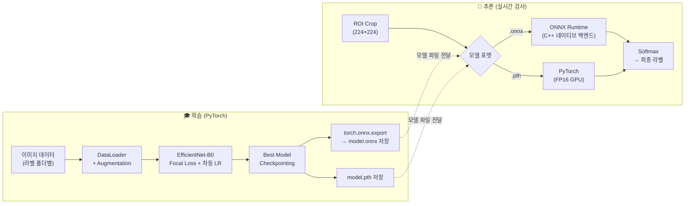

# 🔬 ForeignBodyInsp 전체 검사 파이프라인 도표

> **작성일**: 2026. 03. 06  
> **목적**: 시스템의 전체 검사 흐름을 시각적으로 정리합니다.  
> **분기 기준**: `Use Classification` 체크 여부에 따라 분류 방식이 달라집니다.  
> **💡 노드 클릭**: 플로우차트의 각 노드를 클릭하면 해당 소스 코드 위치로 이동합니다.

---

## 📊 전체 검사 흐름도 (Mermaid)

```mermaid
flowchart TD
    %% ───── 영상 입력 ─────
    A["📷 영상 입력<br/>(Basler Camera / File / Video)"]
    A --> B{"검사 ROI<br/>설정되어 있는가?"}
    B -- Yes --> C["ROI 영역만 Crop"]
    B -- No --> D["전체 프레임 사용"]
    C --> E["DetectionWorker<br/>(백그라운드 QThread)"]
    D --> E

    %% ───── 검사 모드 분기 (Threshold vs YOLO) ─────
    E --> F{"검사 모드"}
    F -- "Threshold+분류<br/>(기본 모드)" --> G["⚙️ Rule-based 검출 파이프라인"]
    F -- "YOLO" --> Y["🤖 YOLO 통합 검출+분류<br/>(ultralytics)"]

    %% ───── Rule-based 검출 상세 ─────
    G --> G1["1️⃣ Grayscale 변환"]
    G1 --> G2{"일반 검출<br/>활성화?"}
    G2 -- Yes --> G3["2️⃣ GaussianBlur 노이즈 제거"]
    G3 --> G4{"Adaptive Threshold<br/>사용?"}
    G4 -- Yes --> G5["적응형 이진화<br/>+ 글로벌 임계 AND 연산"]
    G4 -- No --> G6["글로벌 이진화<br/>(cv2.threshold)"]
    G5 --> G7["3️⃣ Morphology<br/>Open → Close"]
    G6 --> G7
    G7 --> G8["4️⃣ findContours<br/>→ min_area 필터"]
    G2 -- No --> G8_SKIP["일반 검출 스킵<br/>(빈 리스트)"]

    %% ───── Bubble 검출 ─────
    G8 --> BUB{"Bubble 검출<br/>활성화?"}
    G8_SKIP --> BUB
    BUB -- Yes --> BUB1["🫧 Bubble 전용 파이프라인"]
    BUB1 --> BUB2["Morph-Open 배경 평탄화<br/>→ 양극성 차이 계산"]
    BUB2 --> BUB3{"CLAHE<br/>활성화?"}
    BUB3 -- Yes --> BUB4["CLAHE 적용<br/>(국소 대비 극대화)"]
    BUB3 -- No --> BUB5["스킵"]
    BUB4 --> BUB6["노이즈 제거<br/>(Median / Bilateral)"]
    BUB5 --> BUB6
    BUB6 --> BUB7["DoG 밴드패스 필터<br/>(특정 크기 특징만 부각)"]
    BUB7 --> BUB8["MAD 적응형 임계 이진화"]
    BUB8 --> BUB9["형태학 정리<br/>(Close → Open)"]
    BUB9 --> BUB10["형상 필터<br/>(크기, 원형도, 솔리디티, 종횡비)"]
    BUB10 --> MERGE["🔀 Bubble + 일반<br/>Contour 병합<br/>(중복 제거)"]
    BUB -- No --> MERGE_SKIP["일반 Contour만 사용"]
    MERGE_SKIP --> CLASSIFY_BRANCH

    MERGE --> CLASSIFY_BRANCH

    %% ═══════════════════════════════════════════
    %% ───── ⭐ Classification 분기 (핵심) ─────
    %% ═══════════════════════════════════════════

    CLASSIFY_BRANCH{"⭐ Use Classification<br/>체크 여부"}

    %% ── Classification ON ──
    CLASSIFY_BRANCH -- "✅ 체크됨<br/>(딥러닝 모델 로드 완료)" --> DL["🧠 딥러닝 분류<br/>(EfficientNet-B0)"]
    DL --> DL1["모든 Contour의<br/>ROI를 Crop (224×224)"]
    DL1 --> DL2["CPU: ImageNet 정규화<br/>(비동기 파이프라인)"]
    DL2 --> DL3{"추론 엔진"}
    DL3 -- ".onnx 모델" --> DL4["ONNX Runtime<br/>(NumPy 직접 입력)"]
    DL3 -- ".pth 모델" --> DL5["PyTorch 엔진<br/>(FP16 GPU 지원)"]
    DL4 --> DL6["Softmax → 클래스 확률 계산"]
    DL5 --> DL6
    DL6 --> DL7["각 Contour에<br/>AI 라벨 부여"]
    DL7 --> RESULT

    %% ── Classification OFF ──
    CLASSIFY_BRANCH -- "❌ 미체크<br/>(또는 모델 미로드)" --> RB["📏 Rule-based 분류"]
    RB --> RB1["Bubble Contour<br/>→ 무조건 'Bubble' 라벨<br/>(confidence: 1.0)"]
    RB1 --> RB2["일반 Contour<br/>→ Contrast(중심 vs 배경 밝기) 계산"]
    RB2 --> RB4["Contrast < threshold<br/>→ 'Noise_Dust'"]
    RB2 --> RB5["Contrast ≥ threshold<br/>→ 'Particle'"]
    RB4 --> RESULT
    RB5 --> RESULT

    %% ───── YOLO 결과 합류 ─────
    Y --> Y1["YOLO가 검출+분류<br/>동시에 수행"]
    Y1 --> RESULT

    %% ───── 최종 결과 ─────
    RESULT["📋 최종 결과 생성<br/>(label, confidence, area, ...)"]
    RESULT --> DISPLAY
    RESULT --> SAVE

    %% ───── 화면 표시 & 저장 ─────
    DISPLAY["🖥️ MainView 표시<br/>Contour 색상별 그리기<br/>• Particle: 🔴 빨강<br/>• Noise_Dust: 🔵 파랑<br/>• Bubble: 🟢 초록"]
    SAVE{"Defect 이미지<br/>저장 체크?"}
    SAVE -- Yes --> SAVE1["📁 백그라운드 저장<br/>(ThreadPoolExecutor)<br/>라벨별 폴더에 BMP 저장"]
    SAVE -- No --> FIN["검사 완료"]
    SAVE1 --> FIN
    DISPLAY --> FIN

    %% ───── 판정 ─────
    FIN --> JUDGE{"Contour가<br/>존재하는가?"}
    JUDGE -- Yes --> NG["🔴 NG: Foreign Body"]
    JUDGE -- No --> OK["🟢 OK"]

    %% ═══════════════════════════════════════════
    %% ───── 🔗 클릭 이벤트 (소스 코드 링크) ─────
    %% ═══════════════════════════════════════════
    click A "/src/hardware/basler_camera.py#L1" "basler_camera.py 열기"
    click E "/src/ui/main_window.py#L30" "DetectionWorker 클래스 열기"
    click G "/src/core/detection.py#L81" "detect_static() 함수 열기"
    click G1 "/src/core/detection.py#L96" "Grayscale 변환 코드"
    click G3 "/src/core/detection.py#L122" "GaussianBlur 코드"
    click G5 "/src/core/detection.py#L126" "adaptiveThreshold 코드"
    click G6 "/src/core/detection.py#L133" "threshold 코드"
    click G7 "/src/core/detection.py#L139" "morphologyEx 코드"
    click G8 "/src/core/detection.py#L147" "findContours 코드"
    click BUB1 "/src/core/detection.py#L203" "detect_bubbles() 함수 열기"
    click BUB2 "/src/core/detection.py#L248" "Morph-Open 배경 평탄화"
    click BUB4 "/src/core/detection.py#L257" "CLAHE 적용 코드"
    click BUB6 "/src/core/detection.py#L274" "노이즈 제거 코드"
    click BUB7 "/src/core/detection.py#L292" "DoG 밴드패스 필터"
    click BUB8 "/src/core/detection.py#L336" "MAD 적응형 임계"
    click BUB10 "/src/core/detection.py#L360" "형상 필터 코드"
    click MERGE "/src/core/detection.py#L421" "_merge_contours() 함수"
    click CLASSIFY_BRANCH "/src/ui/main_window.py#L1688" "_on_use_dl_toggled() 함수"
    click DL "/src/core/classification.py#L268" "classify_batch() 함수"
    click DL1 "/src/core/classification.py#L230" "_extract_rois_chunk() 함수"
    click DL4 "/src/core/classification.py#L337" "ONNX Runtime 추론 코드"
    click DL5 "/src/core/classification.py#L354" "PyTorch 추론 코드"
    click RB "/src/core/classification.py#L19" "RuleBasedClassifier 클래스"
    click Y "/src/core/yolo_detector.py#L1" "YOLO Detector 열기"
    click DISPLAY "/src/ui/main_window.py#L1466" "MainView contour 그리기 코드"
    click SAVE1 "/src/core/classification.py#L445" "DefectImageSaver 클래스"
```

---

## 🔗 클릭 가능한 검사 파이프라인 (텍스트에 소스 링크)

> 💡 각 텍스트를 `Ctrl+Click`하면 해당 소스 코드 위치로 이동합니다.

### 1️⃣ 영상 입력

📷 [Basler Camera 프레임 Grab](/src/hardware/basler_camera.py#L101) / [File/Video 로드](/src/hardware/file_camera.py#L1)  
　　↓  
🖼️ [update_frame() — 프레임 획득 및 검사 시작](/src/ui/main_window.py#L2126)  
　　↓  
❓ **검사 ROI 설정?**  
　├─ Yes → [ROI Crop 후 검사](/src/ui/main_window.py#L1629)  
　└─ No → [전체 프레임으로 검사](/src/ui/main_window.py#L1686)  
　　↓  
⚡ [DetectionWorker.run_detection() — 백그라운드 QThread 시작](/src/ui/main_window.py#L47)  

---

### 2️⃣ 검사 모드 분기

❓ **검사 모드 선택** — [_on_inspect_mode_changed()](/src/ui/main_window.py#L1695)  
　├─ **Threshold+분류 (기본)** → [_run_threshold()](/src/ui/main_window.py#L84)  
　└─ **YOLO** → [_run_yolo()](/src/ui/main_window.py#L212) → [yolo_detector.py](/src/core/yolo_detector.py#L1)  

---

### 3️⃣ Rule-based 검출 파이프라인 (Threshold 모드)

🔍 [detect_static() — 일반 이물 검출](/src/core/detection.py#L81)  
　　↓  
　　1\. [Grayscale 변환](/src/core/detection.py#L96)  
　　↓  
　　2\. [GaussianBlur 노이즈 제거](/src/core/detection.py#L122)  
　　↓  
　　3\. ❓ **Adaptive Threshold?**  
　　　├─ Yes → [적응형 이진화 + 글로벌 AND](/src/core/detection.py#L126)  
　　　└─ No → [글로벌 이진화 (cv2.threshold)](/src/core/detection.py#L133)  
　　↓  
　　4\. [Morphology: Open → Close](/src/core/detection.py#L139)  
　　↓  
　　5\. [findContours → min_area 필터](/src/core/detection.py#L147)  

---

### 4️⃣ Bubble 검출 파이프라인

❓ **Bubble 검출 활성화?**  
　├─ No → 일반 Contour만 사용  
　└─ Yes ↓  

🫧 [detect_bubbles() — Bubble 전용 검출](/src/core/detection.py#L203)  
　　↓  
　　1\. [Morph-Open 배경 평탄화 → 양극성 차이 계산](/src/core/detection.py#L248)  
　　↓  
　　2\. ❓ **CLAHE?** → [CLAHE 적용 (국소 대비 극대화)](/src/core/detection.py#L257)  
　　↓  
　　3\. [노이즈 제거 (Median / Bilateral)](/src/core/detection.py#L274)  
　　↓  
　　4\. [DoG 밴드패스 필터](/src/core/detection.py#L292) — 특정 크기 특징만 부각  
　　↓  
　　5\. [MAD 적응형 임계 이진화](/src/core/detection.py#L336)  
　　↓  
　　6\. [형태학 정리 (Close → Open)](/src/core/detection.py#L345)  
　　↓  
　　7\. [형상 필터 (크기, 원형도, 솔리디티, 종횡비)](/src/core/detection.py#L360)  
　　↓  
🔀 [_merge_contours() — Bubble + 일반 Contour 병합 (중복 제거)](/src/core/detection.py#L421)  

---

### 5️⃣ ⭐ Classification 분기 (핵심)

❓ **Use Classification 체크?** — [_on_use_dl_toggled()](/src/ui/main_window.py#L1688)

#### ✅ Classification ON (딥러닝)

🧠 [classify_batch() — 딥러닝 배치 추론](/src/core/classification.py#L268)  
　　↓  
　　1\. [_extract_rois_chunk() — ROI Crop 224×224 + ImageNet 정규화](/src/core/classification.py#L230) (CPU 비동기)  
　　↓  
　　2\. ❓ **추론 엔진?**  
　　　├─ `.onnx` → [ONNX Runtime 추론 (NumPy 직접)](/src/core/classification.py#L337)  
　　　└─ `.pth` → [PyTorch 엔진 (FP16 GPU)](/src/core/classification.py#L354)  
　　↓  
　　3\. Softmax → 클래스 확률 → AI 라벨 부여  

#### ❌ Classification OFF (Rule-based)

📏 [RuleBasedClassifier — 형상 기반 분류](/src/core/classification.py#L19)  
　　├─ Bubble Contour (detect_bubbles에서 검출) → 무조건 `Bubble` (confidence: 1.0)  
　　├─ [면적, 원형도, 종횡비 계산](/src/core/classification.py#L68)  
　　├─ [Contrast(중심 vs 배경 밝기 차이) < threshold → 'Noise_Dust'](/src/core/classification.py#L112)  
　　└─ 그 외 → `Particle`  

---

### 6️⃣ 결과 처리 & 표시

📋 [_on_detection_result() — 최종 결과 처리](/src/ui/main_window.py#L1409)  
　　↓  
🖥️ [MainView Contour 색상별 그리기](/src/ui/main_window.py#L1466) — 🔴Particle / 🔵Noise / 🟢Bubble  
　　↓  
❓ **Defect 저장 체크?**  
　├─ Yes → 📁 [DefectImageSaver — 백그라운드 BMP 저장](/src/core/classification.py#L445)  
　└─ No → 스킵  
　　↓  
**판정**: Contour 있음 → 🔴 **NG** / 없음 → 🟢 **OK**  

---

## 📝 Classification 분기 상세 비교

| 항목 | ❌ Classification OFF | ✅ Classification ON |
|:---|:---|:---|
| **분류 엔진** | Rule-based (Contrast 수식) | EfficientNet-B0 AI 모델 |
| **분류 기준** | 중심-배경 밝기 차이(Contrast) 기반 Noise_Dust/Particle 구분 | 딥러닝 학습된 텍스처 패턴 인식 |
| **Bubble 판단** | Bubble 검출기 Contour → 무조건 Bubble | AI가 분석하여 Bubble 확률 판정 |
| **속도** | 매우 빠름 (수식 계산만) | 빠름 (ONNX Runtime 비동기 파이프라인) |
| **정확도** | 기포와 이물 혼동 가능 | 미세 텍스처까지 분석하여 높은 정확도 |
| **모델 필요** | 불필요 | `.onnx` 또는 `.pth` 모델 파일 로드 필요 |
| **적합한 상황** | 빠른 테스트, 모델 없는 초기 환경 | 실제 검사 라인 운용(권장) |

---

## 🔧 학습 & 추론 파이프라인 (별도 흐름)

---

## 📌 파일별 역할 요약 (클릭하여 소스 이동)

| 파일 | 역할 | 소스 코드 열기 |
|:---|:---|:---|
| `basler_camera.py` | Basler 카메라 하드웨어 연결 및 프레임 Grab | [열기](/src/hardware/basler_camera.py#L1) |
| `file_camera.py` | 이미지/동영상 파일을 가상 카메라로 로드 | [열기](/src/hardware/file_camera.py#L1) |
| `detection.py` | Rule-based 전처리 + Bubble 검출 파이프라인 | [열기](/src/core/detection.py#L1) |
| `classification.py` | RuleBased / DeepLearning 분류기, 학습 함수 | [열기](/src/core/classification.py#L1) |
| `yolo_detector.py` | YOLO 객체 탐지 (ultralytics 기반) | [열기](/src/core/yolo_detector.py#L1) |
| `main_window.py` | 메인 GUI + DetectionWorker(검사 스레드) | [열기](/src/ui/main_window.py#L1) |
| `classification_tab.py` | 라벨링 및 학습 UI 탭 | [열기](/src/ui/classification_tab.py#L1) |
| `rule_params_dialog.py` | Rule-based 파라미터 조절 다이얼로그 | [열기](/src/ui/rule_params_dialog.py#L1) |

---

## 🔑 핵심 함수 바로가기

| 함수 | 위치 | 설명 |
|:---|:---|:---|
| [detect_static()](/src/core/detection.py#L81) | `detection.py:81` | 일반 이물 검출 (이진화 기반) |
| [detect_bubbles()](/src/core/detection.py#L203) | `detection.py:203` | Bubble 전용 검출 (DoG + MAD) |
| [_merge_contours()](/src/core/detection.py#L421) | `detection.py:421` | Contour 병합 (벡터화) |
| [classify_batch()](/src/core/classification.py#L268) | `classification.py:268` | 딥러닝 배치 추론 (파이프라인) |
| [_extract_rois_chunk()](/src/core/classification.py#L230) | `classification.py:230` | ROI Crop + 정규화 (CPU 워커) |
| [train_classifier()](/src/core/classification.py#L680) | `classification.py:680` | 모델 학습 함수 |
| [_build_model()](/src/core/classification.py#L660) | `classification.py:660` | EfficientNet-B0 모델 생성 |
| [_run_threshold()](/src/ui/main_window.py#L84) | `main_window.py:84` | 검사 파이프라인 메인 루프 |
| [_on_detection_result()](/src/ui/main_window.py#L1409) | `main_window.py:1409` | 검사 결과 처리 + 화면 표시 |
