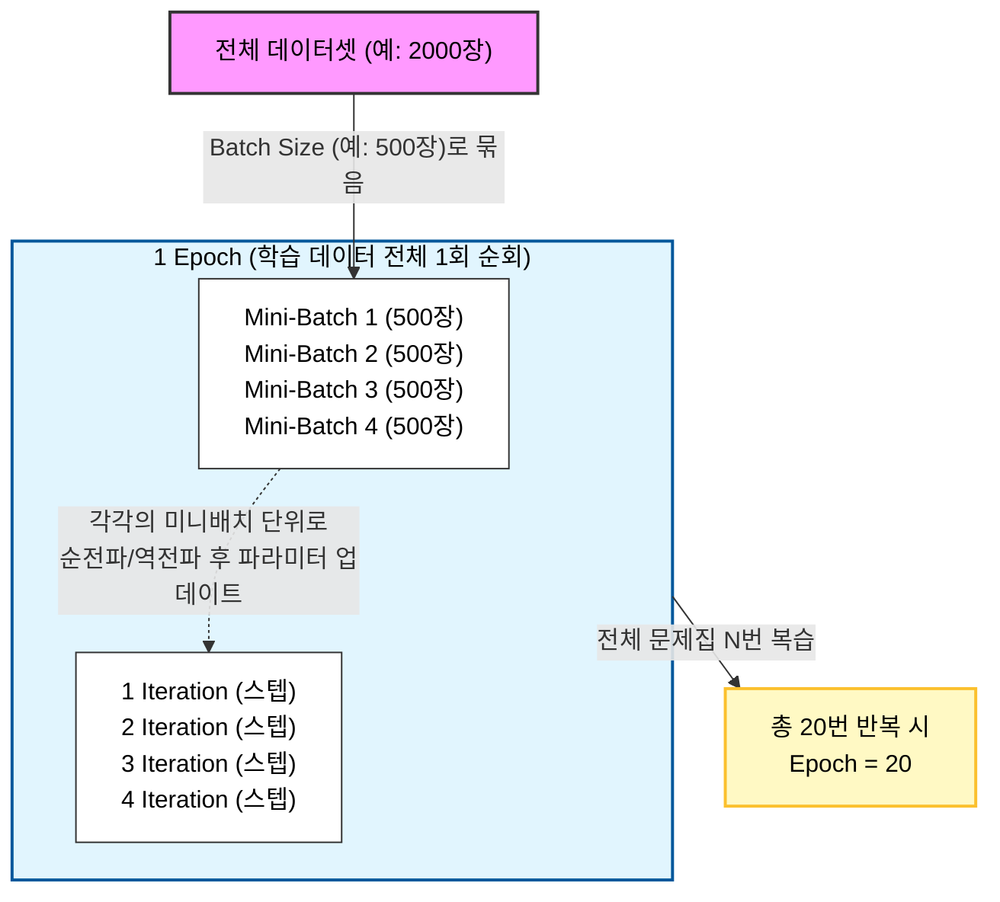

# 딥러닝 학습 용어 정리: Batch Size, Epoch, Iteration

## 🧠 기계 학습의 일반적인 과정
기계는 일반적으로 다음과 같은 흐름을 반복하며 학습합니다.
1. 임의의 파라미터(가중치 $w$) 지정
2. 이 가중치에 대한 손실값(Loss) 및 손실 함수의 기울기(Gradient) 계산
3. 경사하강법(Gradient Descent)을 통해 파라미터 최소화 방향으로 업데이트
4. 업데이트된 새로운 지점에서 다시 2~3번 과정을 반복
5. 파라미터가 최적값에 도달하면 업데이트 중지

하지만 방대한 양의 전체 데이터를 한 번에 모델에 넣고 계산(Full-Batch)하면 컴퓨터가 버티지 못합니다. 메모리 부족 현상이 발생하거나 한 번의 파라미터 업데이트에 걸리는 시간이 너무 길어지기 때문입니다. 따라서 데이터를 적당한 크기로 잘게 쪼개어 여러 번 반복 학습하는 방식을 사용합니다.

---

## 1. Batch Size (배치 사이즈)
> 한 번의 파라미터 업데이트(학습)에 사용되는 데이터의 묶음 크기

- **비유**: 1000개의 수학 문제가 담긴 1권의 문제집을 풀 때, 한 번에 **20문제씩** 풀고 채점/복습(업데이트)을 한다면 이 **20**이 Batch Size가 됩니다.
- **특징**
  - 모델이 한 방향으로 가중치를 수정하기 위해 참고하는 데이터의 양이라고 볼 수 있습니다.
  - **Batch size가 너무 클 경우**: 한 번에 처리할 데이터가 많아져 메모리 부족 현상(OOM)이 발생하거나, 한 스텝 진행에 필요한 계산량이 너무 많아집니다.
  - **Batch size가 너무 작을 경우**: 너무 적은 데이터만 보고 가중치를 자주 업데이트하므로 방향이 이리저리 튀면서 훈련이 불안정(진동)해집니다.

---

## 2. Iteration (또는 Step)
> 1 Epoch를 마치기 위해 필요한 미니 배치의 개수 (즉, 1 에폭 당 가중치 업데이트 횟수)

- **비유**: 1000개의 수학 문제를 20개씩(Batch Size) 나누어 푼다면, 총 **50번**을 채점받아야 1000문제를 다 풀게 됩니다. 이때의 **50**번이 1 Epoch 동안의 Iteration입니다.
- **특징**
  - **계산식**: `전체 데이터 개수 ÷ Batch Size = Iteration 수`
  - 각 배치 그룹이 신경망을 통과할 때마다 1번씩 파라미터 업데이트가 이루어지므로, Iteration은 곧 학습 스텝(Step)의 수와 같습니다.

---

## 3. Epoch (에포크)
> 전체 데이터셋이 신경망을 모두 통과하여 학습(순전파+역전파)을 마친 전체 횟수

- **비유**: 1000개의 수학 문제집을 **처음부터 끝까지 1번 다 풀었다면** 1 Epoch입니다. 틀린 문제를 복습하기 위해 문제집 전체를 3번 반복해서 풀었다면 3 Epoch가 됩니다.
- **특징**
  - **Epoch이 너무 작으면 (Underfitting)**: 기계가 충분히 패턴을 학습하지 못해 성능이 떨어집니다.
  - **Epoch이 너무 크면 (Overfitting)**: 기계가 훈련 데이터에 너무 익숙해져 불필요한 노이즈까지 암기해버리며, 이로 인해 처음 보는 새로운 데이터에 대한 예측 성능이 오히려 떨어집니다.

---

## 📊 요약 도식화 (개념 관계도)

> 전체 **2,000장**의 데이터를 가진 문제집을 학습한다고 가정해 봅시다. 🏫

 

| 단계 | 개념 | 비유 | 도식화 (시각 구조) |
| :---: | :---: | :--- | :--- |
| **Step 1** | **Dataset** | 📚 전체 문제 (2,000장) | 🟩🟩🟩🟩🟩🟩🟩🟩🟩🟩🟩🟩... (2,000개) |
| **Step 2** | **Batch Size** (500장) | 📝 한 번에 학습할 문제 분량 | [ 🟩🟩🟩🟩.. (500개) ] ➡️ `1묶음` |
| **Step 3** | **Iteration** (4회) | 👨‍🏫 1회독을 위해 채점 받는 횟수 | [묶음1] 🔄채점 & 업데이트 [묶음2] 🔄채점 & 업데이트 [묶음3] 🔄채점 & 업데이트 [묶음4] 🔄채점 & 업데이트 |
| **Step 4** | **1 Epoch** | 💯 문제집 1권 처음부터 끝까지 다 풀었음! | 📦 `[묶음1] + [묶음2] + [묶음3] + [묶음4]` 완료 |
| **Step 5** | **N Epoch** (20회) | 🔁 문제집 전체 복습 횟수 | 📦 📦 📦 📦 📦 ... (총 20번 반복) |

 

💡 **핵심 요약 공식**
> 🎯 **1 Epoch 안의 Iteration 수** = `전체 데이터 개수` ÷ `Batch Size`
> 🏆 **학습 종료 시 총 파라미터 업데이트 횟수** = `Iteration 수` × `총 Epoch 수`

 

### 🔄 전체 흐름 플로우차트 (Mermaid)

> **cf. 📝 초보자를 위한 알쓸신잡: 순전파(Forward)와 역전파(Backward)란?**
>
> 💡 **Propagation (전파 / 傳播) 이란?**
> 물결이나 전파(신호)가 퍼져나가는 것처럼, 신경망의 수많은 노드(Node)들을 따라 **데이터나 계산 결과가 앞(Forward)으로, 혹은 뒤(Backward)로 "전달되며 퍼져나가는" 모습**을 본떠 만들어진 용어입니다.
> 
> - ➡️ **순전파 (Forward Propagation)**: 학생이 문제를 보고 **"정답을 일단 찍어보는(예측하는)"** 과정입니다. 
>   - 입력(문제)이 신경망을 앞으로 통과하며 최종 예측값(학생의 답)을 내놓습니다.
> - ⬅️ **역전파 (Backpropagation)**: 선생님이 채점 후 **"너 여기서 틀렸으니까 다음엔 이렇게 고쳐!" 하고 뒤로 돌아가며 오답 노트를 작성**해주는 과정입니다.
>   - 정답(실제값)과 예측값의 차이(오차)를 계산한 뒤, 신경망을 거꾸로(뒤로) 거슬러 올라가며 가중치(파라미터)를 수정합니다.
> - 즉, **"한 번 풀어보고(순전파) → 틀린 걸 확인해서 고친다(역전파)"**가 합쳐져야 진정한 1번의 학습(Iteration)이 완성됩니다!

 

### 💡 실제 설정 계산 예시
> **조건**: 전체 수집된 이미지가 **2,000장**이고, 파라미터 설정에서 **Batch Size를 500**, **Epoch를 20**으로 설정했다고 가정합니다.

- **Iteration (1 Epoch 파라미터 업데이트 수)**: 2,000 ÷ 500 = **4회**
- **1 Epoch 당 학습하는 전체 데이터 수**: 500장 × 4스텝 = **2,000장** (전체 학습 완료)
- **전체 파라미터 총 업데이트(Step) 횟수**: 4 Iteration × 20 Epoch = **총 80 스텝**

 

> *참고자료 및 출처: [Bruders 블로그 - 배치 사이즈 | 에포크 | 반복 차이](https://bruders.tistory.com/79)*
