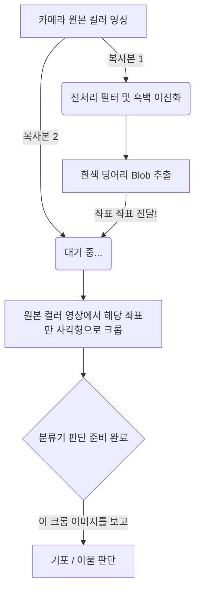

# 🎯 알기 쉬운 분류기(Classifier) 입력 데이터의 비밀

외관 검증 파이프라인에서 인공지능(EfficientNet)이나 규칙 기반(Rule-based) 분류기가 도대체 **"어떤 이미지를 보고"** 기포인지 먼지인지 판단하는 걸까요?

핵심부터 말씀드리면: **전처리된 흑백(Blob) 영상이 아니라, "가장 처음 찍힌 순수한 원본 컬러 영상"을 잘라서 봅니다.**

---

## 📸 1. 검사 파이프라인의 2단계 역할 분담

우리 시스템은 똑똑하게 일하기 위해 역할을 두 단계로 완벽하게 나누었습니다.

### 👉 1단계: 사냥개 역할 (전처리 & RuleBase 검출)
* **목적**: "어디에 수상한 게 있나?" 위치만 빠르게 찾기
* **방법**: 조명을 균일하게 맞추고 배경을 없앤 뒤, 이미지를 극단적인 흑백(이진화)으로 만듭니다. 이렇게 하면 하얀색 덩어리(Blob)들만 남게 됩니다.
* **결과물**: 결함의 **위치 좌표(x, y)**와 대략적인 테두리(Contour) 정보 겟!

### 👉 2단계: 감정사 역할 (분류기 Classification)
* **목적**: "찾아낸 이 덩어리가 기포야? 이물질이야?" 정체 밝히기
* **방법**: 1단계에서 얻은 '좌표'만 들고 **원본 컬러 카메라 영상**으로 돌아갑니다. 그 좌표 주변을 네모낳게 오려내어 분류기에 넣습니다.
* **결과물**: "이건 99% 확률로 먼지(Particle)입니다!"

---

## 🤔 2. 왜 전처리된 흑백 영상을 쓰면 안 될까요?

만약 1단계에서 만든 흑백 덩어리(Blob) 영상을 바로 인공지능에게 주면 어떻게 될까요?

> **인공지능**: "음... 하얀색 동그라미네요. 끝입니다."

흑백으로 변환하는 과정에서 아래와 같은 핵심 단서들이 전부 **삭제**되어 버리기 때문입니다:

1. **컬러(Color)**: 실오라기인지 쇳가루인지 구분할 색상 단서 증발.
2. **투명도(Transparency)**: 기포(투명함)와 이물질(불투명함)을 구분할 수 없음.
3. **질감(Texture)**: 표면이 거친지 매끄러운지 알 수 없음.
4. **그림자(Shadow)**: 입체감을 유추할 그림자 실종.

결국 기포든 먼지든 똑같이 '하얀 덩어리'로만 보이기 때문에 분류기가 바보가 됩니다.

---

## ✨ 3. 요약: 최종 데이터 흐름도

### 한 줄 요약:
전처리 영상은 오직 **"알맹이를 찾기 위한 레이더"**로만 쓰고, 진짜 감정(분류)을 할 때는 레이더가 알려준 위치로 가서 **"생얼(원본 컬러 영상)"을 보고 판단합니다!**
