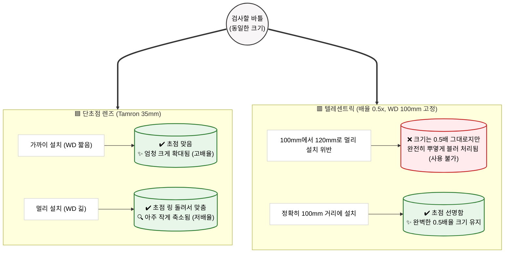

# 📷 머신비전 렌즈 기초 가이드: 단초점 vs 텔레센트릭

이 문서는 머신비전(Machine Vision) 세계에서 렌즈 스펙을 읽을 때 가장 흔히 겪는 "배율"과 "작업 거리(WD)"에 대한 오해를 바로잡기 위한 기초 학습 자료입니다.

현재 사용 중인 **Tamron 35mm 단초점 렌즈**와 시중의 **배율 고정형(텔레센트릭) 렌즈**의 차이를 명확히 비교합니다.

---

## 1. 🔍 왜 머신비전 렌즈 카탈로그에는 "배율"이 잘 없을까?

우리가 흔히 쓰는 현미경이나 망원경에는 "10배율", "50배율"과 같은 수치가 적혀 있습니다.
하지만 일반적인 머신비전 렌즈(예: CCTV 렌즈, 일반 단초점 렌즈) 스펙표에는 **초점 거리(Focal Length, 예: 35mm)** 만 적혀 있을 뿐, 배율은 적혀 있지 않습니다.

### **이유: 배율은 내가 카메라를 어디에 설치하느냐에 따라 고무줄처럼 변하기 때문입니다!**

- 카메라를 물체에 **가까이 가져가면 (짧은 WD)** ➡️ 물체가 화면에 **크게 맺힘 (고배율)**
- 카메라를 물체에서 **멀리 떨어뜨리면 (긴 WD)** ➡️ 물체가 화면에 **작게 맺힘 (저배율)**

따라서 렌즈 제조사 입장에서는 고객이 현장에서 이 카메라를 10cm 거리에 달지, 1m 거리에 달지 알 수 없으므로 애초에 "몇 배율이다"라고 확정 지어 적어놓을 수가 없습니다.

 

---

## 2. 🎛️ 단초점 렌즈 vs 배율 고정 렌즈 핵심 비교

### 🟦 A. 일반 단초점 렌즈 (현재 프로젝트의 Tamron 35mm)
- **개념**: "단초점"은 줌(Zoom) 기능이 없어서 **화각이 고정**되어 있다는 뜻이지, 배율이나 설치 가능 거리가 고정되었다는 뜻이 아닙니다. (마치 스마트폰 기본 카메라 렌즈와 같습니다.)
- **WD (Working Distance, 작업 거리)**: **가변적 (내 마음대로 조절 가능)**
  - 렌즈 몸통에 **초점 조절 링(Focus Ring)** 이 달려 있습니다.
  - 100mm 거리에 달든, 300mm 거리에 달든 카메라 설치 후 손으로 초점 링을 휙휙 돌려서 뚜렷하게 맞추면 그만입니다.
- **배율 변화**: ⭕ **거리에 따라 무조건 변함 (원근감 존재)**
  - 카메라가 피사체와 멀어지면 화면 속 피사체는 작아집니다.
  - 현재 검사 장비의 경우 바이알 전체 모습(45 x 28.1 mm)을 1.1인치 센서(14.2 x 10.4 mm)라는 작은 도화지에 알맞게 욱여넣어야 하므로, 거리를 벌려서 **약 0.315배로 축소**시켜 보고 있습니다. 
  - *(참고: 광학 배율 공식은 `센서 크기 ÷ 실제 시야(FOV)` 입니다. 즉, `14.2mm ÷ 45mm ≈ 0.315x` 이며, 렌즈 초점거리(35mm)를 물체 크기(45mm)로 나누는 것이 아닙니다!)*

### 🟥 B. 배율 고정형 렌즈 (텔레센트릭 등 스펙에 '0.5x'가 박힌 렌즈)
- **개념**: 제품명이나 카탈로그에 대문짝만하게 `Magnification: 0.5x`, `WD: 65mm` 처럼 명시된 렌즈들입니다. 초정밀 반도체/디스플레이 치수 검사 시에 씁니다.
- **WD (Working Distance, 작업 거리)**: **절대 고정 (내 마음대로 설치 불가!)**
  - 대부분 초점을 맞추는 **포커스 링 자체가 아예 없습니다.**
  - 제조사가 **"무조건 65mm 거리에 나사를 조여 고정해라. 그러면 완벽히 0.5배율로 나온다"** 라며 통짜 쇳덩어리로 광학계를 굳혀버린 것입니다.
- **배율 변화**: ❌ **절대 안 변함 (원근감 없음)**
  - 카메라 렌즈 앞의 피사체가 앞뒤로 움직여도 렌즈 속 특수한 구조(조리개 필터링) 때문에 **물체의 크기가 전혀 변하지 않습니다.**
  - **주의점**: 정해진 65mm 거리를 벗어나면 크기는 그대로 유지되는데, 초점이 나가버려서 심도 구간을 벗어나는 순간 **화면이 완전히 뿌옇게(블러처리) 되어 쓸 수 없게 됩니다.**

 

---

## 3. 📊 한눈에 보는 요약 도식화

> 카메라를 이동시키며 거리를 조절할 때, 두 렌즈가 어떻게 반응하는지 직관적으로 비교해 보세요!

 

 

---

## 4. 🧠 심화 학습: 궁금증 해결 (Q&A)

### ❓ 초점 조절 링을 돌리면 배율도 바뀌지 않나요?
**맞습니다!** 기술적으로는 초점 링을 돌려 렌즈 알맹이를 이동시키면 화면 크기가 아주 미세하게 변하는데, 이를 **'렌즈 브리딩(Lens Breathing)'** 현상이라고 합니다.
- 하지만 이는 초점을 잡기 위한 부수적인 효과일 뿐이며, 변화량이 매우 적어(보통 1~5% 미만) 배율 조절 용도로는 쓰지 않습니다. 
- 배율을 본격적으로 바꾸려면 카메라 자체를 물리적으로 앞뒤로 옮겨야 합니다.

### ❓ 초점 거리(35mm)가 1배율이 되는 지점 아닌가요?
**아닙니다.** 35mm는 렌즈의 굴절 능력을 나타내는 고유 수치일 뿐, 1배율(1:1 크기)과는 직접적인 상관이 없습니다. 
- 단초점 렌즈로 **정확히 1배율**을 찍으려면 피사체와 센서를 초점 거리의 약 2배인 70mm 거리에 각각 배치해야 하는 등 세팅이 매우 까다롭습니다. 
- 그래서 1:1 촬영이 필요할 때는 일반 단초점 렌즈 대신 **'매크로 렌즈'**를 전용으로 사용합니다.

### ❓ 0.315배율은 어떻게 계산된 결과인가요? (핵심 공식)
배율은 렌즈 이름(35mm)으로 구하는 것이 아니라, **결과물(센서)과 실제 크기를 비교**해서 도출합니다.

> 📏 **광학 배율** = **카메라 센서 크기** ÷ **실제 시야 크기(FOV)**
> - 우리 센서 가로: **14.2 mm** (1.1인치 센서 기준)
> - 실제 바이알 가로: **45 mm**
> - 계산: `14.2 / 45` = **약 0.315x** (축소 촬영 중)

 

### 💡 최종 결론 (우리가 단초점 렌즈를 선택한 이유)

초정밀 마이크로미터 치수를 재야 하는 측정기라면 텔레센트릭 렌즈를 써야 하지만, 
우리의 **[바이알 이물 검사 프로젝트]**는 **장비 내 공간의 타협이 필요하고(거리 조절의 유연성), 바이알 액상부 전체 영역을 모니터 화면 안에 작게 담아 한 번에 봐야 하므로** 일반적인 **단초점 머신비전 렌즈**가 최적의 형태인 것입니다!
