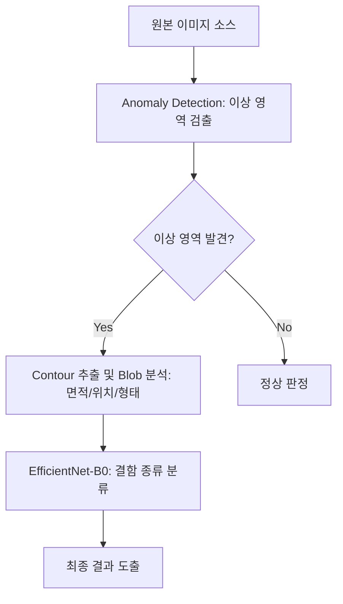

# YOLO vs. Classification 전략 가이드 및 딥러닝 기법 비교

이 문서는 외관 검증 시스템에서 YOLO(Object Detection)와 파이프라인(Classification) 방식의 차이점, 학습 데이터 구축의 고충, 그리고 대안인 이상 탐지(Anomaly Detection) 기법에 대해 요약합니다.

## 1. YOLO(Object Detection) vs. Classification 파이프라인

현재 시스템은 **Rule-based 검출(위치) + Deep Learning 분류(라벨)**의 2단계 구조를 사용하고 있습니다.

| 비교 항목 | 파이프라인 (현재) | YOLO (Object Detection) |
| :--- | :--- | :--- |
| **작동 원리** | Threshold로 위치를 먼저 찾고 잘린 이미지를 분류 | 이미지 전체에서 위치 찾기와 분류를 동시에 수행 |
| **어노테이션** | 잘린 이미지(224x224)에 라벨만 부여 (쉬움) | 원본 이미지 내 결함 위치 사각형(BBox) 지정 (어려움) |
| **학습 데이터** | 결함 중심의 크롭 이미지 모음 | 원본 이미지 + 결함 좌표 텍스트 파일(.txt) |
| **특징** | 정밀한 Blob 분석(면적, 형태) 병행 가능 | 검출과 분류가 통합되어 있어 처리 흐름이 단순함 |

---

## 2. YOLO 학습 데이터 구축 시 주의사항 (The Labeling Problem)

YOLO와 같은 Object Detection 모델은 **"한 이미지 내의 모든 결함이 빠짐없이 표시되어야 함"**이 매우 중요합니다.

### ⚠️ 미비한 어노테이션의 위험성 (False Negative Supervision)
수천 개의 결함이 있는 프레임에서 30개만 칠하고 나머지를 방치하고 학습시키면:
- 모델은 어노테이션이 없는 나머지 수천 개의 결함을 **"배경(정상)"**으로 인식합니다.
- 결함 모양임에도 불구하고 "정상"이라는 피드백을 자꾸 받게 되어, 모델이 헷갈려서 감도가 급격히 떨어지게 됩니다.

### 💡 현실적인 데이터셋 수집 전략
1.  **완전 어노테이션**: 한 이미지 내의 결함은 **반드시 100% 다** 칠해야 합니다.
2.  **선별적 학습**: 결함이 너무 많아 다 칠하기 힘들다면, 결함이 1~5개 정도만 있는 깨끗한 프레임을 여러 장 확보하여 완벽하게 칠하는 것이 좋습니다.
3.  **Negative Samples**: 결함이 아예 없는 **"정상 이미지"**도 전체 데이터의 약 30% 정도 포함해야 오탐(False Positive)을 줄일 수 있습니다.

---

## 3. 대안 딥러닝 기법: Anomaly Detection (이상 탐지)

Threshold 기반 검출이 이미지 상태(노이즈, 오염) 때문에 불안정할 때 가장 강력한 대안입니다.

### 핵심 아이디어: "정상이 어떻게 생겼는지만 가르친다"
- **학습 데이터**: 정상(양품) 이미지 100~500장만 필요. **결함 데이터나 어노테이션이 아예 필요 없음.**
- **작동 방식**: 정상 패턴에서 벗어나는 영역을 "이상 영역"으로 감지하여 히트맵으로 표시.
- **장점**: 
    - 어노테이션 노다가에서 완전히 해방됨.
    - 듣도 보도 못한 새로운 유형의 결함도 "정상이 아니기 때문에" 잡아낼 수 있음.

---

## 4. 최종 추천 하이브리드 구조

수작업 어노테이션을 최소화하면서 정확도를 높이는 최적의 설계안입니다.

이 구조를 사용하면 **Object Detection 특유의 고된 수작업 어노테이션 과정 없이도** 위치 정보와 분류 정보를 모두 정밀하게 얻을 수 있습니다.

---
> [!NOTE]
> 현재 시스템은 **224x224 (CLASSIFICATION_INPUT_SIZE)** 크기를 기준으로 학습 및 추론을 수행하도록 최적화되어 있습니다.
