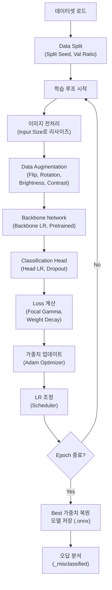
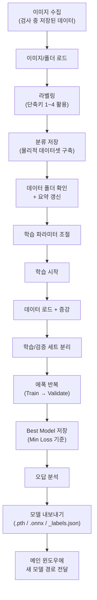

# Classification 학습 탭 상세 설명 (Classification Training Tab)

본 문서는 AI 이물 분류 모델을 학습시키고 관리하는 **Classification 탭**의 구성, 학습 파라미터, 학습 프로세스에 대해 상세히 설명합니다.

---

## 1. 화면 구성 (UI Layout)

분류 탭은 좌측 **미리보기 영역**과 우측 **데이터/학습 관리 영역**으로 나뉩니다.

### 1.1 좌측 패널: 이미지 미리보기 (Preview)

| 항목 | 설명 |
|------|------|
| **미리보기 창** | 선택된 이미지의 확대 이미지를 표시한다. (400×400 이상 권장) |
| **파일 정보** | 이미지 파일명, 해상도(W×H), 파일 용량, 현재 설정된 라벨 정보가 하단에 강조 표시된다. |

### 1.2 우측 패널: 데이터 및 학습 관리 (스크롤 가능)

#### [이미지 등록 박스]

| 항목 | 기능 |
|------|------|
| **이미지 로드 (L)** | 개별 또는 다수의 이미지 파일을 선택하여 목록에 추가한다. 단축키 `L`. |
| **폴더 로드** | 특정 폴더 내의 모든 이미지를 가져온다. 하위 폴더명이 라벨과 일치하면 자동 인식된다. |
| **이미지 리스트** | 등록된 이미지들의 목록. `[라벨] 파일명` 형식으로 표시되며 라벨별로 색상이 구분된다. |
| **라벨 설정** | `Particle`, `Noise_Dust`, `Bubble`, `Unknown` 중 선택하여 **라벨 적용** 버튼으로 일괄 변경할 수 있다. |
| **분류 저장** | 리스트의 이미지를 실제 학습 데이터 폴더(ClassificationData) 내의 라벨별 서브 폴더로 복사/이동한다. **학습 전 반드시 이 단계를 수행해야 한다.** |

> **라벨 통합**: `Bubble`은 내부적으로 `Small Bubble`, `Big Bubble`, `BackGround_Bubble`을 하나의 `Bubble` 라벨로 통합하여 처리한다. 과거 데이터의 레거시 폴더명도 자동 인식된다.

#### [학습 데이터 박스]

| 항목 | 설명 |
|------|------|
| **데이터 폴더** | 실제 학습용 데이터가 모여있는 최상위 경로. `path_config.json`에 저장된다. |
| **데이터 요약** | 현재 폴더 내 각 라벨별 이미지 수를 실시간으로 표시한다. |

---

## 2. 학습 파라미터 상세 (Hyper-Parameters)

### 2.1 모델 아키텍처 선택

| 모델 | 파라미터 수 | 특징 |
|------|------------|------|
| **EfficientNet-B0** (기본) | 5.3M | 정확도-속도 균형이 가장 좋은 범용 모델 |
| **RepViT-M0.9** (추천) | ~5M | B0 대비 2배 빠르고 정확도 +2%. timm 라이브러리 필요 |
| **MobileOne-S1** (최고속) | ~4M | B0 대비 3배 빠름. timm 라이브러리 필요 |

### 2.2 기본 설정

| 파라미터 | 단위 | 범위 | 기본값 | 설명 및 영향 |
|----------|------|------|--------|-------------|
| **Epochs** | 회 | 5~500 | 50 | 전체 데이터를 반복 학습하는 횟수. 부족하면 과소적합(Underfitting: 학습 부족), 많으면 과적합(Overfitting: 학습 데이터만 외움). Fine-tuning에는 30~80이 적절. |
| **Batch Size** | 장 | 4~128 (4단위) | 16 | 한 번에 모델에 넣는 이미지 수. 크면 학습이 안정적이고 빠르지만 GPU VRAM을 많이 소모한다. VRAM 부족 시 8이나 4로 줄인다. |
| **Val Ratio** | 비율 | 0.05~0.40 | 0.20 | 전체 데이터 중 성능 평가(검증)용으로 분리할 비율. 0.20이면 80%가 학습용, 20%가 검증용. 데이터가 적으면 0.10으로 줄인다. |
| **Backbone LR** | 무차원 (학습률) | 1e-6 ~ 1e-3 | 1e-5 (0.000010) | 사전학습된 특징 추출층의 학습률. ImageNet에서 배운 특징이 망가지지 않도록 **매우 작게** 설정한다. Head LR의 1/100 수준이 일반적. |
| **Head LR** | 무차원 (학습률) | 1e-5 ~ 1e-2 | 1e-3 (0.001000) | 최종 분류층(새로 추가된 층)의 학습률. 새 데이터에 빠르게 적응하도록 Backbone LR보다 100배 크게 설정한다. |
| **Weight Decay** | 무차원 (L2 계수) | 0.0 ~ 0.01 | 1e-4 (0.00010) | L2 정규화 강도. 가중치가 지나치게 커지는 것을 억제하여 일반화 성능을 향상시킨다. 0이면 정규화 없음. |
| **Focal Gamma** | 무차원 | 0.0~5.0 | 2.0 | Focal Loss의 γ 파라미터. 쉬운 샘플(확률 높은 것)의 loss를 줄이고 **어려운 샘플에 집중**한다. 불균형 데이터(이물 적음, 노이즈 많음)에서 효과적. 0이면 일반 CrossEntropy와 동일. |

> **Backbone LR과 Head LR의 관계**: 두 값의 비율이 중요하다. Head LR / Backbone LR ≈ 100이 일반적. Backbone LR을 너무 높이면 ImageNet에서 배운 좋은 특징이 파괴되고, Head LR을 너무 낮추면 새 데이터에 적응이 느려진다.

### 2.3 고급 설정

| 파라미터 | 단위 | 범위 | 기본값 | 설명 및 영향 |
|----------|------|------|--------|-------------|
| **Input Size** | px (정사각형 한 변) | 64~512 (32단위) | 224 | 학습 전 모든 이미지를 이 크기로 리사이즈한다. 크면 세부 특징을 잘 잡지만 학습 속도와 VRAM 사용량이 **size²에 비례**하여 급증한다. 224는 대부분의 분류 모델 표준 입력 크기. |
| **Min/Class** | 장 | 1~1,000 | 10 | 클래스당 최소 필요 이미지 수. 이보다 적은 클래스가 있으면 **학습을 시작하지 않는다**. 불균형 방지용 안전장치. |
| **Dropout** | 비율 | 0.00~0.90 | 0.40 | 학습 중 무작위로 뉴런을 끄는 비율. 높을수록 과적합 억제력이 강하지만, 너무 높으면 학습 자체가 어려워진다. 0.3~0.5가 일반적. |
| **Split Seed** | 정수 | 0~999,999 | 42 | 데이터 셔플링 시 사용되는 난수 시드. **같은 값이면 항상 동일한 학습/검증 분할**을 보장하여 실험 재현성을 확보한다. |

### 2.4 데이터 증강 (Augmentation)

학습 데이터를 인위적으로 변형하여 모델의 일반화 성능을 높이는 기법이다. 원본 데이터는 변경되지 않으며, 학습 시에만 실시간으로 적용된다.

| 파라미터 | 단위 | 범위 | 기본값 | 설명 및 영향 |
|----------|------|------|--------|-------------|
| **HFlip p** | 확률 | 0.00~1.00 | 0.50 | 좌우 반전을 적용할 확률. 0.50이면 50% 확률로 반전된다. 바이알 회전 방향과 무관한 이물 검출 시 효과적. |
| **VFlip p** | 확률 | 0.00~1.00 | 0.50 | 상하 반전 확률. 중력 방향이 중요하지 않은 부유물에 사용. 바닥에 가라앉는 이물이면 0으로 둔다. |
| **Rotation** | 도 (°) | 0~360 | 180 | 무작위 회전 최대 각도. ±이 값 범위에서 랜덤 회전. 0이면 회전 증강 없음. 360이면 전 방향 회전. |
| **Brightness** | 비율 (변화 강도) | 0.00~1.00 | 0.20 | 밝기 변화 강도. 0.20이면 ±20% 범위에서 밝기가 랜덤 변동한다. 조명 편차가 큰 현장에서 유용. |
| **Contrast** | 비율 (변화 강도) | 0.00~1.00 | 0.20 | 대비 변화 강도. 0.20이면 ±20% 범위에서 대비가 랜덤 변동한다. 배경-이물 대비가 불안정할 때 도움. |

### 2.5 시스템 설정

| 파라미터 | 옵션 | 기본값 | 설명 및 영향 |
|----------|------|--------|-------------|
| **Scheduler** | CosineAnnealing / None | CosineAnnealing | 학습률 감소 전략. **CosineAnnealing**: 학습 초반에는 큰 학습률로 빠르게 탐색하고, 후반부로 갈수록 부드럽게 줄여 최적점에 안착한다. **None**: 학습률을 고정. |
| **Pretrained** | ImageNet / None | ImageNet | 사전학습 가중치. **ImageNet**: 수백만 장으로 미리 학습된 가중치로 시작. 적은 데이터로도 좋은 성능을 낸다. **None**: 랜덤 초기화. 데이터가 충분할 때만 사용. |

---

## 3. 학습 파라미터 영향 흐름도

각 파라미터가 학습의 어느 단계에서 작용하는지 보여주는 전체 흐름도입니다.



---

## 4. 학습 프로세스 워크플로우

이미지 준비부터 최종 모델 배포까지의 상세 과정입니다.



### 4.1 폴더 구조

학습 데이터 폴더는 다음 구조를 따른다:

```
ClassificationData/
├── Particle/          ← 실제 이물 이미지
│   ├── img_001.bmp
│   └── ...
├── Noise_Dust/        ← 노이즈/먼지 이미지
│   ├── img_002.bmp
│   └── ...
├── Bubble/            ← 기포 이미지
│   ├── img_003.bmp
│   └── ...
└── _misclassified/    ← 학습 완료 후 자동 생성
    ├── [정답]_to_[오답]_img_xxx.bmp
    └── ...
```

### 4.2 단축키 가이드

대량 라벨링 시 마우스보다 단축키가 훨씬 빠릅니다.

| 단축키 | 기능 |
|--------|------|
| **`L`** | 이미지 로드 창 열기 |
| **`Del`** | 현재 선택된 항목을 리스트에서 제거 (원본 파일은 유지) |
| **`1`** | 선택된 항목들에 `Particle` 라벨 즉시 지정 |
| **`2`** | 선택된 항목들에 `Noise_Dust` 라벨 즉시 지정 |
| **`3`** | 선택된 항목들에 `Bubble` 라벨 즉시 지정 |
| **`4`** | 선택된 항목들에 `Unknown` 라벨 즉시 지정 |
| **`Up / Down`** | 리스트 항목 이동 (이동 시 미리보기 즉시 갱신) |

### 4.3 오답 분석 시스템

학습이 끝나면 시스템이 자동으로 전체 학습 데이터를 다시 추론합니다. 모델이 정답과 다르게 예측한 이미지가 있다면 `_misclassified` 폴더에 `[정답]_to_[오답]_파일명.bmp` 형식으로 복사합니다.

> **활용법**: 오답 리스트를 확인하여:
> 1. **라벨링 오류 발견** → 잘못된 라벨을 수정하고 재학습
> 2. **모델 약점 파악** → 특정 유형의 이물을 어려워하면 해당 유형의 학습 데이터를 보강
> 3. **모호한 경계 사례** → Particle과 Noise_Dust 경계가 불분명한 이미지를 정리

### 4.4 분류 저장의 의미

단순히 리스트에 이미지를 올리는 것만으로는 학습되지 않습니다. 반드시 **분류 저장** 버튼을 눌러 `ClassificationData/Particle/`, `ClassificationData/Noise_Dust/`, `ClassificationData/Bubble/` 등의 폴더 구조를 실제로 생성해야 학습 엔진이 인식합니다.

### 4.5 학습 출력물

학습이 완료되면 다음 파일들이 생성됩니다:

| 파일 | 형식 | 용도 |
|------|------|------|
| `model_best.pth` | PyTorch 가중치 | 학습된 모델 가중치 (재학습/분석용) |
| `model_best.onnx` | ONNX 모델 | 추론용 경량 모델 (메인 윈도우에서 로드) |
| `model_best_labels.json` | JSON | 모델이 인식하는 클래스 목록과 순서 |

### 4.6 학습 중 조기 종료

학습 도중 **학습 중단** 버튼을 누르면 현재 에폭이 끝난 후 안전하게 종료됩니다. 그 시점까지의 Best 가중치가 저장됩니다.

---

## 5. 파라미터 튜닝 가이드

### 5.1 데이터가 적을 때 (클래스당 50장 미만)

| 파라미터 | 권장값 | 이유 |
|----------|--------|------|
| Epochs | 30~50 | 적은 데이터에서 많이 돌리면 과적합 |
| Dropout | 0.50~0.60 | 과적합 억제 강화 |
| Weight Decay | 2e-4 ~ 5e-4 | 정규화 강화 |
| Augmentation | 모두 높게 | 데이터 부족을 증강으로 보상 |
| Pretrained | ImageNet | 필수. 사전학습 없이는 학습 불안정 |

### 5.2 데이터가 충분할 때 (클래스당 500장 이상)

| 파라미터 | 권장값 | 이유 |
|----------|--------|------|
| Epochs | 50~100 | 충분한 데이터에서 오래 학습 가능 |
| Backbone LR | 5e-5 ~ 1e-4 | 데이터가 많으면 Backbone도 더 적극적으로 학습 |
| Input Size | 224~320 | 더 큰 입력으로 세부 특징 활용 |
| Batch Size | 32~64 | VRAM이 허용하면 크게 |

### 5.3 불균형 데이터 (Particle이 매우 적을 때)

| 파라미터 | 권장값 | 이유 |
|----------|--------|------|
| Focal Gamma | 2.0~3.0 | 소수 클래스의 어려운 샘플에 집중 |
| Min/Class | 5~10 | 너무 높이면 소수 클래스 학습 불가 |
| Augmentation | Particle에 대해 높게 | 소수 클래스 데이터 증강 극대화 |
