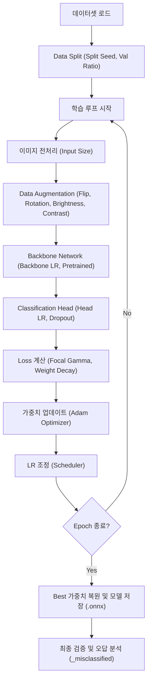
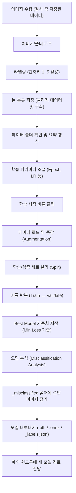

# Classification 학습 탭 상세 설명 (Classification Training Tab)

본 문서는 AI 이물 분류 모델을 학습시키고 관리하는 **Classification 탭**의 구성과 학습 프로세스에 대해 상세히 설명합니다.

---

## 1. 화면 구성 (UI Layout)

분류 탭은 크게 좌측의 **미리보기 영역**과 우측의 **데이터/학습 관리 영역**으로 나뉩니다.

### 1.1 좌측 패널: 이미지 미리보기 (Preview)
*   **미리보기 창**: 선택된 이미지의 확대 이미지를 보여줍니다. (400x400 이상 권장)
*   **파일 정보**: 이미지 파일명, 해상도(W×H), 파일 용량, 그리고 현재 설정된 라벤 정보가 하단에 강조되어 표시됩니다.

### 1.2 우측 패널: 데이터 및 학습 관리 (Scrollable)

#### [이미지 등록 박스]
*   **이미지 로드 (L)**: 개별 또는 다수의 이미지 파일을 선택하여 목록에 추가합니다.
*   **폴더 로드**: 특정 폴더 내의 모든 이미지를 가져옵니다. (하위 폴더명이 라벨과 일치하면 자동 인식)
*   **이미지 리스트**: 등록된 이미지들의 목록입니다. `[라벨] 파일명` 형식으로 표시되며 라벨별로 색상이 달라 구분하기 쉽습니다.
*   **라벨 설정**: `Particle`, `Noise_Dust`, `Bubble`, `Unknown` 중 선택하여 **라벨 적용** 버튼으로 일괄 변경할 수 있습니다.
*   **분류 저장**: **가장 중요한 단계**로, 리스트의 이미지를 실제 학습 데이터 폴더(ClassificationData) 내의 라벨별 서브 폴더로 복사/이동합니다.

#### [학습 데이터 박스]
*   **데이터 폴더**: 실제 학습용 데이터가 모여있는 최상위 경로를 지정합니다.
*   **데이터 요약**: 현재 폴더 내 각 라벨별로 몇 장의 이미지가 확보되었는지 실시간으로 보여줍니다.

#### [학습 설정 박스 (Hyper-Parameters)]

모델의 학습 효율과 성능을 좌우하는 모든 파라미터에 대한 상세 설명입니다.

| 분류 | 파라미터 | 기본값 | 상세 설명 및 영향 |
| :--- | :--- | :--- | :--- |
| **기본 설정** | **Epochs** | 50 | 전체 데이터를 반복 학습하는 횟수. 부족하면 과소적합(Underfitting), 많으면 과적합(Overfitting) 발생. |
| | **Batch Size** | 16 | 한 번에 처리하는 데이터 묶음. 크면 학습이 안정적이고 빠르나 메모리(VRAM)를 많이 소모함. |
| | **Val Ratio** | 0.20 | 전체 중 성능 평가용으로 분리할 비율. (0.1~0.2 권장) |
| | **Backbone LR** | 1e-5 | 하부 특징 추출층의 학습률. 이미 학습된 특징이 망가지지 않도록 매우 작게 설정. |
| | **Head LR** | 1e-3 | 최종 분류층의 학습률. 새로운 데이터에 빠르게 적응하도록 Backbone보다 크게 설정. |
| | **Weight Decay** | 1e-4 | L2 정규화 강도. 모델이 데이터를 과하게 외우지 못하게 방해하여 일반화 성능 향상. |
| | **Focal Gamma** | 2.0 | 어려운 샘플에 대한 페널티 강도. 불균형 데이터셋(이물 적음, 노이즈 많음)에서 유리함. |
| **고급 설정** | **Input Size** | 224 | 입력 이미지 크기. 320 이상으로 높이면 세부 특징을 잘 잡지만 학습 속도가 급격히 저하됨. |
| | **Min/Class** | 10 | 클래스당 최소 필요 이미지 수. 데이터가 이보다 적은 클래스가 있으면 학습을 시작하지 않음. |
| | **Dropout** | 0.40 | 학습 중 임시로 뉴런을 끄는 비율. 높을수록 과적합 억제력이 강해짐. |
| | **Split Seed** | 42 | 데이터 셔플링 시사용되는 난수 시드. 같은 값이면 항상 동일한 데이터 분할을 보장. |
| **증강(Aug)** | **HFlip p** | 0.50 | 좌우 반전을 적용할 확률. 바이알 회전 방향과 무관한 이물 검출 시 효과적임. |
| | **VFlip p** | 0.50 | 상하 반전을 적용할 확률. 중력 방향이 중요하지 않은 부유물 검출 시 사용. |
| | **Rotation** | 180 | 이미지를 무작위로 회전시킬 최대 각도(0~360). |
| | **Brightness** | 0.20 | 밝기 변화 강도. 조명 편차에 강인한 모델을 만들 때 유용함. |
| | **Contrast** | 0.20 | 대비 변화 강도. 배경과 이물의 대비가 불안정한 경우 성능 향상에 도움. |
| **시스템** | **Scheduler** | Cosine | 학습 후반부로 갈수록 학습률을 부드럽게 낮춰 최적의 수렴 지점을 찾도록 유도. |
| | **Pretrained** | ImageNet | 수백만 장의 이미지를 미리 배운 가중치로 시작할지 여부. (항상 사용하는 것 권장) |

---

## 2. 학습 프로세스 및 파라미터 영향 흐름도

각 파라미터가 학습의 어느 단계에서 어떻게 작용하는지를 포함한 전체 흐름도입니다.

---

## 3. 학습 프로세스 흐름도 (Training Workflow)

이미지 준비부터 최종 모델 배포까지의 상세 과정입니다.

---

### 3.1 단축키 가이드
학습 데이터가 수천 장일 경우 마우스 클릭보다 단축키를 사용하면 매우 빠릅니다.
*   **`L`**: 이미지 로드 창 열기
*   **`Del`**: 현재 선택된 항목 제거 (리스트에서만 제거)
*   **`1 ~ 4`**: 선택된 항목들에 대해 라벨 즉시 지정 및 적용
*   **`Up / Down`**: 리스트 항목 이동 (이동 시 미리보기 즉시 갱신)

### 3.2 오답 분석 시스템
학습이 끝나면 시스템이 자동으로 모든 학습 데이터를 다시 한번 훑어봅니다. 모델이 정답과 다르게 예측한 이미지가 있다면, 학습 데이터 폴더 내의 `_misclassified` 폴더에 `[정답]_to_[오답]_.bmp` 형식으로 복사해 둡니다.
> [!TIP]
> 이 오답 리스트를 확인하여 라벨링이 잘못되었는지, 혹은 특정 유형의 이물을 모델이 유독 어려워하는지 파악하여 데이터를 보강하십시오.

### 3.3 분류 저장의 의미
단순히 리스트에 이미지를 올리는 것만으로는 학습되지 않습니다. 반드시 **분류 저장**을 눌러 `ClassificationData/Particle/`, `ClassificationData/Noise_Dust/` 등의 폴더 구조가 실제로 생성되어야 학습 엔진이 이를 인식할 수 있습니다.
