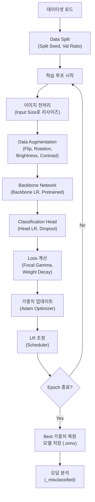
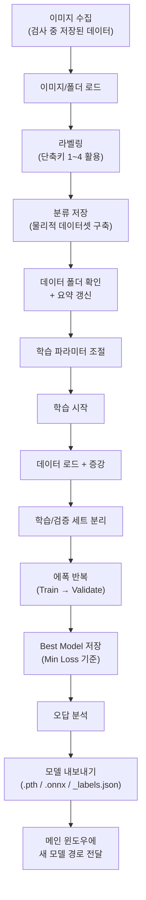

# Classification 학습 탭 상세 설명 (Classification Training Tab)

본 문서는 AI 이물 분류 모델을 학습시키고 관리하는 **Classification 탭**의 구성, 학습 파라미터, 학습 프로세스에 대해 상세히 설명합니다.

---

## 1. 화면 구성 (UI Layout)

분류 탭은 좌측 **미리보기 영역**과 우측 **데이터/학습 관리 영역**으로 나뉩니다.

### 1.1 좌측 패널: 이미지 미리보기 (Preview)

| 항목 | 설명 |
|------|------|
| **미리보기 창** | 선택된 이미지의 확대 이미지를 표시한다. (400×400 이상 권장) |
| **파일 정보** | 이미지 파일명, 해상도(W×H), 파일 용량, 현재 설정된 라벨 정보가 하단에 강조 표시된다. |

> **cf. 용어 해설**
> - **미리보기 (Preview)**: 선택한 이미지를 실시간으로 확대하여 보여주는 화면 영역
> - **해상도 (Resolution)**: 이미지의 가로(W) × 세로(H) 픽셀 수로, 이미지의 세밀함을 나타내는 지표

### 1.2 우측 패널: 데이터 및 학습 관리 (스크롤 가능)

#### [이미지 등록 박스]

| 항목 | 기능 |
|------|------|
| **이미지 로드 (L)** | 개별 또는 다수의 이미지 파일을 선택하여 목록에 추가한다. 단축키 `L`. |
| **폴더 로드** | 특정 폴더 내의 모든 이미지를 가져온다. 하위 폴더명이 라벨과 일치하면 자동 인식된다. |
| **이미지 리스트** | 등록된 이미지들의 목록. `[라벨] 파일명` 형식으로 표시되며 라벨별로 색상이 구분된다. |
| **라벨 설정** | `Particle`, `Noise_Dust`, `Bubble`, `Unknown` 중 선택하여 **라벨 적용** 버튼으로 일괄 변경할 수 있다. |
| **분류 저장** | 리스트의 이미지를 실제 학습 데이터 폴더(ClassificationData) 내의 라벨별 서브 폴더로 복사/이동한다. **학습 전 반드시 이 단계를 수행해야 한다.** |

> **라벨 통합**: `Bubble`은 내부적으로 `Small Bubble`, `Big Bubble`, `BackGround_Bubble`을 하나의 `Bubble` 라벨로 통합하여 처리한다. 과거 데이터의 레거시 폴더명도 자동 인식된다.

#### [학습 데이터 박스]

| 항목 | 설명 |
|------|------|
| **데이터 폴더** | 실제 학습용 데이터가 모여있는 최상위 경로. `path_config.json`에 저장된다. |
| **데이터 요약** | 현재 폴더 내 각 라벨별 이미지 수를 실시간으로 표시한다. |

> **cf. 용어 해설**
> - **라벨 (Label)**: 이미지에 부여하는 분류 카테고리 이름 (예: Particle, Noise_Dust 등)
> - **Particle**: 실제 이물질로 판단되는 입자를 나타내는 라벨
> - **Noise_Dust**: 검출되었으나 이물이 아닌 노이즈나 먼지에 해당하는 라벨
> - **Bubble**: 액체 내 기포를 나타내는 라벨. Small Bubble, Big Bubble, BackGround_Bubble을 통합한 것
> - **Unknown**: 분류가 불확실한 이미지에 임시로 부여하는 라벨
> - **ClassificationData**: 학습용 이미지가 라벨별로 저장되는 최상위 데이터 폴더 이름
> - **서브 폴더 (Subfolder)**: 상위 폴더 아래에 라벨명으로 생성되는 하위 폴더 (예: `ClassificationData/Particle/`)
> - **레거시 (Legacy)**: 과거 버전에서 사용하던 이전 형식의 데이터나 폴더 구조
> - **라벨 통합**: 여러 개의 세부 라벨을 하나의 상위 라벨로 합치는 처리 (예: Small Bubble + Big Bubble → Bubble)

---

## 2. 학습 파라미터 상세 (Hyper-Parameters)

### 2.1 모델 아키텍처 선택

| 모델 | 파라미터 수 | 특징 |
|------|------------|------|
| **EfficientNet-B0** (기본) | 5.3M | 정확도-속도 균형이 가장 좋은 범용 모델 |
| **RepViT-M0.9** (추천) | ~5M | B0 대비 2배 빠르고 정확도 +2%. timm 라이브러리 필요 |
| **MobileOne-S1** (최고속) | ~4M | B0 대비 3배 빠름. timm 라이브러리 필요 |

> **cf. 용어 해설**
> - **EfficientNet-B0**: Google이 개발한 경량 CNN 모델로, 정확도와 연산량의 균형을 자동 탐색하여 설계된 아키텍처
> - **RepViT-M0.9**: Vision Transformer 구조를 모바일 환경에 최적화한 경량 모델로, CNN 대비 빠른 추론 속도를 제공
> - **MobileOne-S1**: Apple이 개발한 초경량 모델로, 추론 시 구조를 단순화(re-parameterization)하여 최고 속도를 달성
> - **파라미터 (Parameter)**: 모델이 학습을 통해 조정하는 내부 가중치의 총 개수. M은 백만 단위
> - **timm**: PyTorch Image Models의 약자로, 수백 가지 사전학습된 이미지 분류 모델을 제공하는 오픈소스 라이브러리
> - **Backbone**: 모델에서 이미지의 특징을 추출하는 핵심 네트워크 부분. 사전학습된 가중치를 재활용하는 대상
> - **아키텍처 (Architecture)**: 신경망의 전체 구조 설계로, 층의 종류·개수·연결 방식 등을 정의한 것

### 2.2 기본 설정

| 파라미터 | 단위 | 범위 | 기본값 | 설명 및 영향 |
|----------|------|------|--------|-------------|
| **Epochs** | 회 | 5~500 | 50 | 전체 데이터를 반복 학습하는 횟수. 부족하면 과소적합(Underfitting: 학습 부족), 많으면 과적합(Overfitting: 학습 데이터만 외움). Fine-tuning에는 30~80이 적절. |
| **Batch Size** | 장 | 4~128 (4단위) | 16 | 한 번에 모델에 넣는 이미지 수. 크면 학습이 안정적이고 빠르지만 GPU VRAM을 많이 소모한다. VRAM 부족 시 8이나 4로 줄인다. |
| **Val Ratio** | 비율 | 0.05~0.40 | 0.20 | 전체 데이터 중 성능 평가(검증)용으로 분리할 비율. 0.20이면 80%가 학습용, 20%가 검증용. 데이터가 적으면 0.10으로 줄인다. |
| **Backbone LR** | 무차원 (학습률) | 1e-6 ~ 1e-3 | 1e-5 (0.000010) | 사전학습된 특징 추출층의 학습률. ImageNet에서 배운 특징이 망가지지 않도록 **매우 작게** 설정한다. Head LR의 1/100 수준이 일반적. |
| **Head LR** | 무차원 (학습률) | 1e-5 ~ 1e-2 | 1e-3 (0.001000) | 최종 분류층(새로 추가된 층)의 학습률. 새 데이터에 빠르게 적응하도록 Backbone LR보다 100배 크게 설정한다. |
| **Weight Decay** | 무차원 (L2 계수) | 0.0 ~ 0.01 | 1e-4 (0.00010) | L2 정규화 강도. 가중치가 지나치게 커지는 것을 억제하여 일반화 성능을 향상시킨다. 0이면 정규화 없음. |
| **Focal Gamma** | 무차원 | 0.0~5.0 | 2.0 | Focal Loss의 γ 파라미터. 쉬운 샘플(확률 높은 것)의 loss를 줄이고 **어려운 샘플에 집중**한다. 불균형 데이터(이물 적음, 노이즈 많음)에서 효과적. 0이면 일반 CrossEntropy와 동일. |

> **Backbone LR과 Head LR의 관계**: 두 값의 비율이 중요하다. Head LR / Backbone LR ≈ 100이 일반적. Backbone LR을 너무 높이면 ImageNet에서 배운 좋은 특징이 파괴되고, Head LR을 너무 낮추면 새 데이터에 적응이 느려진다.

> **cf. 용어 해설**
> - **Epoch**: 전체 학습 데이터를 한 번 완전히 순회하는 단위. 50 Epoch이면 전체 데이터를 50번 반복 학습
> - **Batch Size**: 한 번의 가중치 업데이트에 사용하는 이미지 묶음 크기
> - **VRAM**: GPU에 탑재된 비디오 메모리로, 학습 시 이미지와 모델을 올려두는 공간
> - **Val Ratio (Validation Ratio)**: 전체 데이터 중 검증용으로 분리하는 비율
> - **검증 (Validation)**: 학습에 사용하지 않은 별도 데이터로 모델 성능을 평가하는 과정
> - **과소적합 (Underfitting)**: 모델이 학습 데이터의 패턴조차 충분히 학습하지 못한 상태
> - **과적합 (Overfitting)**: 모델이 학습 데이터를 암기하여 새로운 데이터에 대한 성능이 떨어지는 현상
> - **Fine-tuning**: 사전학습된 모델을 새로운 데이터셋에 맞게 추가 학습시키는 전이학습 기법
> - **Backbone LR (Learning Rate)**: Backbone 네트워크(특징 추출층)에 적용하는 학습률
> - **Head LR (Learning Rate)**: 분류층(Classification Head)에 적용하는 학습률
> - **학습률 (Learning Rate)**: 가중치 업데이트 시 한 번에 조정하는 크기. 클수록 빠르게 변하지만 불안정
> - **ImageNet**: 1,400만 장 이상의 이미지로 구성된 대규모 이미지 분류 데이터셋. 사전학습의 표준 기반
> - **사전학습 (Pretrained)**: 대규모 데이터셋(ImageNet 등)으로 미리 학습하여 범용 특징 추출 능력을 갖춘 상태
> - **Weight Decay**: 학습 시 가중치 크기에 비례하는 페널티를 부과하여 과적합을 방지하는 정규화 기법
> - **L2 정규화 (L2 Regularization)**: 가중치의 제곱합에 비례하는 벌칙항을 손실 함수에 추가하여 가중치를 작게 유지하는 기법
> - **Focal Loss**: 쉬운 샘플의 기여를 줄이고 어려운 샘플에 집중하도록 설계된 손실 함수. 클래스 불균형에 효과적
> - **Focal Gamma (γ)**: Focal Loss에서 쉬운 샘플을 얼마나 강하게 억제할지 제어하는 하이퍼파라미터. 값이 클수록 어려운 샘플에 더 집중
> - **CrossEntropy**: 분류 모델의 표준 손실 함수로, 예측 확률 분포와 정답 분포 간의 차이를 측정
> - **불균형 데이터 (Imbalanced Data)**: 클래스별 샘플 수가 크게 차이 나는 데이터셋 (예: Particle 50장 vs Noise_Dust 5,000장)
> - **Softmax**: 모델 출력을 0~1 사이의 확률 분포로 변환하는 활성화 함수. 모든 클래스 확률의 합이 1
> - **가중치 (Weight)**: 신경망 내부에서 입력 신호에 곱해지는 학습 가능한 숫자 값
> - **분류층 (Classification Head)**: Backbone이 추출한 특징 벡터를 받아 최종 클래스 확률을 출력하는 마지막 층

### 2.3 고급 설정

| 파라미터 | 단위 | 범위 | 기본값 | 설명 및 영향 |
|----------|------|------|--------|-------------|
| **Input Size** | px (정사각형 한 변) | 64~512 (32단위) | 224 | 학습 전 모든 이미지를 이 크기로 리사이즈한다. 크면 세부 특징을 잘 잡지만 학습 속도와 VRAM 사용량이 **size²에 비례**하여 급증한다. 224는 대부분의 분류 모델 표준 입력 크기. |
| **Min/Class** | 장 | 1~1,000 | 10 | 클래스당 최소 필요 이미지 수. 이보다 적은 클래스가 있으면 **학습을 시작하지 않는다**. 불균형 방지용 안전장치. |
| **Dropout** | 비율 | 0.00~0.90 | 0.40 | 학습 중 무작위로 뉴런을 끄는 비율. 높을수록 과적합 억제력이 강하지만, 너무 높으면 학습 자체가 어려워진다. 0.3~0.5가 일반적. |
| **Split Seed** | 정수 | 0~999,999 | 42 | 데이터 셔플링 시 사용되는 난수 시드. **같은 값이면 항상 동일한 학습/검증 분할**을 보장하여 실험 재현성을 확보한다. |

> **cf. 용어 해설**
> - **Input Size**: 모델에 입력하기 전 이미지를 통일하는 정사각형 픽셀 크기 (예: 224×224)
> - **리사이즈 (Resize)**: 이미지를 지정된 크기로 축소 또는 확대하는 전처리 과정
> - **Min/Class**: 학습을 시작하기 위해 각 클래스에 최소한으로 필요한 이미지 장수
> - **Dropout**: 학습 과정에서 무작위로 일부 뉴런의 출력을 0으로 만들어 과적합을 방지하는 정규화 기법
> - **뉴런 (Neuron)**: 신경망의 기본 연산 단위로, 입력을 받아 가중합과 활성화 함수를 거쳐 출력을 생성
> - **과적합 (Overfitting)**: 모델이 학습 데이터를 암기하여 새로운 데이터에 대한 일반화 성능이 떨어지는 현상
> - **Split Seed**: 데이터를 학습/검증 세트로 나눌 때 사용하는 난수 생성기의 초기값
> - **난수 시드 (Random Seed)**: 난수 생성 알고리즘의 초기값으로, 같은 시드를 사용하면 동일한 난수 순서가 재현됨
> - **셔플링 (Shuffling)**: 데이터를 무작위로 섞는 과정. 학습 시 데이터 순서에 의한 편향을 방지
> - **재현성 (Reproducibility)**: 동일한 조건에서 실험을 반복했을 때 같은 결과를 얻을 수 있는 성질

### 2.4 데이터 증강 (Augmentation)

학습 데이터를 인위적으로 변형하여 모델의 일반화 성능을 높이는 기법이다. 원본 데이터는 변경되지 않으며, 학습 시에만 실시간으로 적용된다.

| 파라미터 | 단위 | 범위 | 기본값 | 설명 및 영향 |
|----------|------|------|--------|-------------|
| **HFlip p** | 확률 | 0.00~1.00 | 0.50 | 좌우 반전을 적용할 확률. 0.50이면 50% 확률로 반전된다. 바이알 회전 방향과 무관한 이물 검출 시 효과적. |
| **VFlip p** | 확률 | 0.00~1.00 | 0.50 | 상하 반전 확률. 중력 방향이 중요하지 않은 부유물에 사용. 바닥에 가라앉는 이물이면 0으로 둔다. |
| **Rotation** | 도 (°) | 0~360 | 180 | 무작위 회전 최대 각도. ±이 값 범위에서 랜덤 회전. 0이면 회전 증강 없음. 360이면 전 방향 회전. |
| **Brightness** | 비율 (변화 강도) | 0.00~1.00 | 0.20 | 밝기 변화 강도. 0.20이면 ±20% 범위에서 밝기가 랜덤 변동한다. 조명 편차가 큰 현장에서 유용. |
| **Contrast** | 비율 (변화 강도) | 0.00~1.00 | 0.20 | 대비 변화 강도. 0.20이면 ±20% 범위에서 대비가 랜덤 변동한다. 배경-이물 대비가 불안정할 때 도움. |

> **cf. 용어 해설**
> - **Data Augmentation (데이터 증강)**: 원본 이미지에 변환을 적용하여 학습 데이터를 인위적으로 늘리는 기법. 모델의 일반화 성능 향상에 기여
> - **HFlip (Horizontal Flip)**: 이미지를 좌우로 뒤집는 수평 반전 변환
> - **VFlip (Vertical Flip)**: 이미지를 상하로 뒤집는 수직 반전 변환
> - **Rotation**: 이미지를 지정된 각도 범위 내에서 무작위로 회전시키는 변환
> - **Brightness**: 이미지의 전체적인 밝기를 무작위로 변동시키는 변환
> - **Contrast**: 이미지의 밝은 부분과 어두운 부분 사이의 차이(대비)를 무작위로 변동시키는 변환
> - **일반화 (Generalization)**: 학습에 사용하지 않은 새로운 데이터에 대해서도 올바르게 예측할 수 있는 모델의 능력

### 2.5 시스템 설정

| 파라미터 | 옵션 | 기본값 | 설명 및 영향 |
|----------|------|--------|-------------|
| **Scheduler** | CosineAnnealing / None | CosineAnnealing | 학습률 감소 전략. **CosineAnnealing**: 학습 초반에는 큰 학습률로 빠르게 탐색하고, 후반부로 갈수록 부드럽게 줄여 최적점에 안착한다. **None**: 학습률을 고정. |
| **Pretrained** | ImageNet / None | ImageNet | 사전학습 가중치. **ImageNet**: 수백만 장으로 미리 학습된 가중치로 시작. 적은 데이터로도 좋은 성능을 낸다. **None**: 랜덤 초기화. 데이터가 충분할 때만 사용. |

> **cf. 용어 해설**
> - **Scheduler (학습률 스케줄러)**: 학습 진행에 따라 학습률을 자동으로 조정하는 전략
> - **CosineAnnealing**: 코사인 함수 곡선을 따라 학습률을 점진적으로 줄이는 스케줄러. 초반에는 빠르게 탐색하고 후반에 정밀 수렴
> - **학습률 감소 (Learning Rate Decay)**: 학습이 진행될수록 학습률을 줄여 안정적인 수렴을 유도하는 기법
> - **Pretrained**: 대규모 데이터셋으로 미리 학습된 모델 가중치를 활용하는 방식
> - **ImageNet**: 1,400만 장 이상의 라벨링된 이미지로 구성된 대규모 데이터셋. 사전학습의 표준 기반
> - **사전학습 가중치 (Pretrained Weights)**: ImageNet 등 대규모 데이터셋에서 학습하여 얻은 모델 파라미터 값
> - **랜덤 초기화 (Random Initialization)**: 사전학습 없이 가중치를 무작위 값으로 설정하고 처음부터 학습하는 방식

---

## 3. 학습 파라미터 영향 흐름도

각 파라미터가 학습의 어느 단계에서 작용하는지 보여주는 전체 흐름도입니다.



> **cf. 용어 해설**
> - **Data Split**: 전체 데이터를 학습용과 검증용으로 나누는 과정
> - **Split Seed**: 데이터 분할 시 사용하는 난수 시드로, 동일한 값이면 동일한 분할 결과를 보장
> - **Val Ratio**: 전체 데이터 중 검증용으로 분리하는 비율
> - **Input Size**: 모델 입력 전 이미지를 통일하는 정사각형 픽셀 크기
> - **Augmentation (데이터 증강)**: 이미지에 변환(반전, 회전, 밝기 등)을 적용하여 학습 데이터를 다양화하는 기법
> - **Backbone**: 이미지의 특징을 추출하는 사전학습된 핵심 네트워크 부분
> - **Head (Classification Head)**: Backbone이 추출한 특징을 받아 최종 클래스 확률을 출력하는 분류층
> - **Loss (손실 함수)**: 모델의 예측과 정답 사이의 차이를 수치화하는 함수. 학습의 최적화 대상
> - **Focal Gamma**: Focal Loss에서 쉬운 샘플의 기여를 억제하는 정도를 제어하는 파라미터
> - **Weight Decay**: 가중치 크기에 비례하는 페널티를 부과하여 과적합을 방지하는 정규화 기법
> - **Adam Optimizer**: 학습률을 파라미터별로 적응적으로 조정하는 최적화 알고리즘. 모멘텀과 RMSProp을 결합
> - **LR Scheduler (학습률 스케줄러)**: 학습 진행에 따라 학습률을 자동으로 조정하는 전략
> - **Epoch**: 전체 학습 데이터를 한 번 완전히 순회하는 단위
> - **Best Weight**: 학습 과정에서 검증 손실이 가장 낮았던 시점의 모델 가중치
> - **ONNX**: Open Neural Network Exchange의 약자로, 다양한 프레임워크 간 모델 호환을 위한 표준 형식. 추론 배포에 사용
> - **오답 분석 (Misclassification Analysis)**: 학습 완료 후 모델이 잘못 분류한 이미지를 자동으로 추출하여 분석하는 과정

---

## 4. 학습 프로세스 워크플로우

이미지 준비부터 최종 모델 배포까지의 상세 과정입니다.



### 4.1 폴더 구조

학습 데이터 폴더는 다음 구조를 따른다:

```
ClassificationData/
├── Particle/          ← 실제 이물 이미지
│   ├── img_001.bmp
│   └── ...
├── Noise_Dust/        ← 노이즈/먼지 이미지
│   ├── img_002.bmp
│   └── ...
├── Bubble/            ← 기포 이미지
│   ├── img_003.bmp
│   └── ...
└── _misclassified/    ← 학습 완료 후 자동 생성
    ├── [정답]_to_[오답]_img_xxx.bmp
    └── ...
```

> **cf. 용어 해설**
> - **폴더 구조**: 학습 데이터가 저장되는 디렉토리 계층 구조. 라벨명이 폴더명으로 사용됨
> - **_misclassified**: 학습 완료 후 모델이 잘못 분류한 이미지가 자동 복사되는 특수 폴더
> - **서브 폴더 (Subfolder)**: ClassificationData 아래에 라벨명으로 생성되는 하위 폴더 (Particle, Noise_Dust, Bubble 등)

### 4.2 단축키 가이드

대량 라벨링 시 마우스보다 단축키가 훨씬 빠릅니다.

| 단축키 | 기능 |
|--------|------|
| **`L`** | 이미지 로드 창 열기 |
| **`Del`** | 현재 선택된 항목을 리스트에서 제거 (원본 파일은 유지) |
| **`1`** | 선택된 항목들에 `Particle` 라벨 즉시 지정 |
| **`2`** | 선택된 항목들에 `Noise_Dust` 라벨 즉시 지정 |
| **`3`** | 선택된 항목들에 `Bubble` 라벨 즉시 지정 |
| **`4`** | 선택된 항목들에 `Unknown` 라벨 즉시 지정 |
| **`Up / Down`** | 리스트 항목 이동 (이동 시 미리보기 즉시 갱신) |

> **cf. 용어 해설**
> - **단축키 (Shortcut)**: 키보드 키 조합으로 특정 기능을 빠르게 실행하는 방법
> - **라벨링 (Labeling)**: 이미지에 분류 카테고리(라벨)를 지정하는 작업. 지도학습의 핵심 전처리 단계

### 4.3 오답 분석 시스템

학습이 끝나면 시스템이 자동으로 전체 학습 데이터를 다시 추론합니다. 모델이 정답과 다르게 예측한 이미지가 있다면 `_misclassified` 폴더에 `[정답]_to_[오답]_파일명.bmp` 형식으로 복사합니다.

> **활용법**: 오답 리스트를 확인하여:
> 1. **라벨링 오류 발견** → 잘못된 라벨을 수정하고 재학습
> 2. **모델 약점 파악** → 특정 유형의 이물을 어려워하면 해당 유형의 학습 데이터를 보강
> 3. **모호한 경계 사례** → Particle과 Noise_Dust 경계가 불분명한 이미지를 정리

> **cf. 용어 해설**
> - **오답 분석 (Misclassification Analysis)**: 모델이 잘못 분류한 샘플을 추출하고 원인을 파악하여 데이터 품질과 모델 성능을 개선하는 과정
> - **추론 (Inference)**: 학습이 완료된 모델에 새로운 이미지를 입력하여 분류 결과를 얻는 과정
> - **재학습 (Retraining)**: 데이터를 수정·보강한 후 모델을 다시 학습시키는 과정

### 4.4 분류 저장의 의미

단순히 리스트에 이미지를 올리는 것만으로는 학습되지 않습니다. 반드시 **분류 저장** 버튼을 눌러 `ClassificationData/Particle/`, `ClassificationData/Noise_Dust/`, `ClassificationData/Bubble/` 등의 폴더 구조를 실제로 생성해야 학습 엔진이 인식합니다.

> **cf. 용어 해설**
> - **분류 저장**: 라벨링된 이미지를 실제 파일 시스템의 라벨별 폴더로 복사/이동하여 학습용 데이터셋을 물리적으로 구축하는 작업
> - **ClassificationData**: 학습용 이미지가 라벨별 서브 폴더로 저장되는 최상위 데이터 디렉토리
> - **학습 엔진**: 데이터를 읽어 모델을 학습시키는 내부 프로그램 모듈

### 4.5 학습 출력물

학습이 완료되면 다음 파일들이 생성됩니다:

| 파일 | 형식 | 용도 |
|------|------|------|
| `model_best.pth` | PyTorch 가중치 | 학습된 모델 가중치 (재학습/분석용) |
| `model_best.onnx` | ONNX 모델 | 추론용 경량 모델 (메인 윈도우에서 로드) |
| `model_best_labels.json` | JSON | 모델이 인식하는 클래스 목록과 순서 |

> **cf. 용어 해설**
> - **.pth (PyTorch)**: PyTorch 프레임워크에서 모델 가중치를 저장하는 파일 형식. 재학습이나 분석 시 사용
> - **.onnx (ONNX)**: Open Neural Network Exchange 표준 형식으로, 프레임워크에 독립적인 추론용 모델 파일
> - **.json**: JavaScript Object Notation 형식의 텍스트 파일로, 클래스 라벨 목록 등 설정 정보를 저장
> - **가중치 (Weight)**: 학습을 통해 결정된 모델 내부의 숫자 파라미터 값. 모델의 판단 기준이 됨
> - **추론 (Inference)**: 학습 완료된 모델을 사용하여 새로운 이미지의 분류 결과를 예측하는 과정

### 4.6 학습 중 조기 종료

학습 도중 **학습 중단** 버튼을 누르면 현재 에폭이 끝난 후 안전하게 종료됩니다. 그 시점까지의 Best 가중치가 저장됩니다.

> **cf. 용어 해설**
> - **조기 종료 (Early Stopping)**: 설정된 전체 Epoch을 다 돌리지 않고 학습을 중간에 안전하게 종료하는 기능
> - **Best Weight**: 학습 과정에서 검증 손실이 가장 낮았던 시점의 모델 가중치. 조기 종료 시에도 이 가중치가 저장됨
> - **에폭 (Epoch)**: 전체 학습 데이터를 한 번 완전히 순회하는 단위

---

## 5. 파라미터 튜닝 가이드

### 5.1 데이터가 적을 때 (클래스당 50장 미만)

| 파라미터 | 권장값 | 이유 |
|----------|--------|------|
| Epochs | 30~50 | 적은 데이터에서 많이 돌리면 과적합 |
| Dropout | 0.50~0.60 | 과적합 억제 강화 |
| Weight Decay | 2e-4 ~ 5e-4 | 정규화 강화 |
| Augmentation | 모두 높게 | 데이터 부족을 증강으로 보상 |
| Pretrained | ImageNet | 필수. 사전학습 없이는 학습 불안정 |

> **cf. 용어 해설**
> - **과적합 (Overfitting)**: 학습 데이터에 과도하게 맞춰져 새로운 데이터에 대한 예측 성능이 저하되는 현상. 데이터가 적을수록 발생하기 쉬움
> - **Dropout**: 학습 중 무작위로 뉴런을 비활성화하여 과적합을 억제하는 정규화 기법
> - **Weight Decay**: 가중치 크기에 비례하는 페널티를 부과하는 L2 정규화 기법
> - **Augmentation (데이터 증강)**: 이미지에 변환을 적용하여 학습 데이터를 인위적으로 다양화하는 기법

### 5.2 데이터가 충분할 때 (클래스당 500장 이상)

| 파라미터 | 권장값 | 이유 |
|----------|--------|------|
| Epochs | 50~100 | 충분한 데이터에서 오래 학습 가능 |
| Backbone LR | 5e-5 ~ 1e-4 | 데이터가 많으면 Backbone도 더 적극적으로 학습 |
| Input Size | 224~320 | 더 큰 입력으로 세부 특징 활용 |
| Batch Size | 32~64 | VRAM이 허용하면 크게 |

> **cf. 용어 해설**
> - **Backbone LR**: Backbone 네트워크(특징 추출층)에 적용하는 학습률. 데이터가 충분하면 더 높게 설정하여 적극적으로 특징을 재학습
> - **Input Size**: 모델 입력 이미지의 정사각형 픽셀 크기. 클수록 세밀한 특징을 포착하지만 연산량이 증가
> - **Batch Size**: 한 번의 가중치 업데이트에 사용하는 이미지 묶음 크기. VRAM 용량에 따라 조절

### 5.3 불균형 데이터 (Particle이 매우 적을 때)

| 파라미터 | 권장값 | 이유 |
|----------|--------|------|
| Focal Gamma | 2.0~3.0 | 소수 클래스의 어려운 샘플에 집중 |
| Min/Class | 5~10 | 너무 높이면 소수 클래스 학습 불가 |
| Augmentation | Particle에 대해 높게 | 소수 클래스 데이터 증강 극대화 |

> **cf. 용어 해설**
> - **Focal Gamma**: Focal Loss에서 쉬운 샘플의 기여를 억제하는 강도 파라미터. 값이 클수록 소수 클래스의 어려운 샘플에 집중
> - **Min/Class**: 학습 시작을 위해 각 클래스에 최소한으로 요구되는 이미지 장수. 소수 클래스 보호를 위한 안전장치
> - **Augmentation (데이터 증강)**: 소수 클래스에 더 강한 증강을 적용하여 데이터 부족을 보상하는 전략
