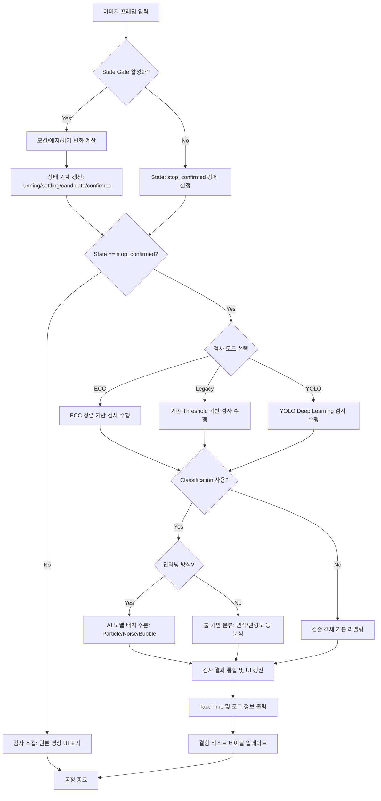

# 상세 검사 프로세스 플로우차트 (Detailed Inspection Flow)

본 문서는 바이알 이물 검사 시스템의 전체 알고리즘 처리를 생략 없이 상세하게 설명합니다.

---

## 1. 전체 통합 프로세스 흐름도

프레임 입력부터 최종 결과 출력까지의 전 과정입니다.

---

## 2. 모드별 상세 알고리즘 단계

### 2.1 기존 검사 모드 (Legacy / Maker Mode) 상세
기존 검사에서는 일반 이물과 버블을 동시에 검출하기 위해 병렬 처리를 수행합니다.

1.  **Parallel Detection**: 
    *   **일반 검출**: Gray -> Gaussian Blur -> Adaptive/Static Threshold -> Morphology(Close) -> Contour 추출.
    *   **버블 검출**: CLAHE -> DoG(Difference of Gaussians) -> Binary -> Contour 추출.
2.  **Merge & Filter**: 버블 검출 결과와 일반 검출 결과를 병합하고, 중복되는 영역을 제거(Bubble 우선)합니다.
3.  **Geometry Check**: 설정된 최소/최대 면적, 원형도(Circularity), 견고도(Solidity) 파라미터를 기준으로 1차 필터링을 수행합니다.

### 2.2 ECC 정렬 검사 모드 상세
정밀한 정지 검사를 위해 기준 템플릿과 현재 프레임을 픽셀 단위로 비교합니다.

1.  **Reference Alignment**: ORB 특징점 매칭 또는 ECC 알고리즘으로 현재 이미지를 기준 영상에 맞게 Warping(변환)합니다.
2.  **Masking Generation**:
    *   **Valid Mask**: 검사 ROI와 이미 설정된 제외 영역(Exclude Mask)을 결합.
    *   **Outer Mask**: 현재 프레임에서 유리병 테두리 등 외곽 노이즈를 동적으로 추출.
    *   **Safe Liquid Mask**: 액체 표면(Surface) 감지 및 상/하/좌/우 마진을 적용하여 순수 액체 영역 확보.
3.  **Difference Analysis**: 정렬된 영상과 기준 영상의 차이(`absdiff`)를 구하고, 모든 마스크를 적용하여 이물 후보만 남깁니다.
4.  **Temporal Tracking**: 이전 프레임에서 발견된 객체들과 위치/면적을 비교하여, 일정 횟수(`min_hits`) 이상 연속 발견된 객체만 최종 이물로 판정합니다.

---

## 3. 분류 단계 (Classification) 상세

검출된 각 후보 영역(Contour)에 대해 정밀 판정을 수행합니다.

*   **Deep Learning (AI)**:
    1.  각 검출 좌표를 중심으로 고정 크기(예: 64x64)의 이미지를 Crop.
    2.  ONNX/OpenVINO 모델에 배치 입력하여 확률값 계산.
    3.  최고 확률에 따라 Particle(이물), Noise(노이즈), Bubble(버블) 중 하나로 확정.
*   **Rule-Based (Heuristics)**:
    *   면적, 장단축 비율(Aspect Ratio), 원형도 등을 수식으로 계산하여 특정 임계값 범위 내에 있는지 확인.

---

## 4. 최종 결과 처리 및 UI 반영

알고리즘이 완료되면 `MainWindow._on_detection_result`가 호출되어 다음 작업을 수행합니다.

1.  **Visual Drawing**: 원본 영상 위에 Bounding Box와 라벨을 그립니다.
2.  **Performance Logging**: 
    *   각 처리 단계(St, Al, Df, Trk 등)의 소요 시간을 합산하여 하단 로그 바에 표시.
    *   모드별 특이 사항(ECC 상태, DL 프로파일 등) 출력.
3.  **Defect List**: 우측 결함 리스트 위젯에 항목별 상세 정보(번호, 라벨, 확신도, 면적)를 업데이트합니다.
