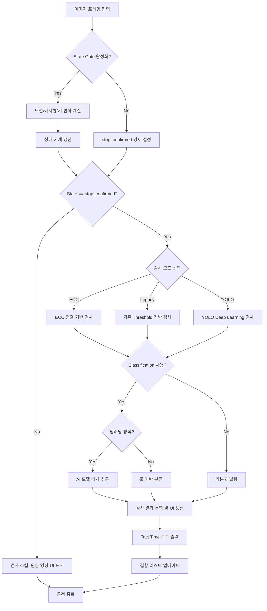

# 상세 검사 프로세스 플로우차트 (Detailed Inspection Flow)

본 문서는 바이알 이물 검사 시스템의 전체 알고리즘 처리를 **파라미터와의 연동 관계**까지 포함하여 상세하게 설명합니다. 각 단계에서 어떤 파라미터가 어떻게 작용하는지를 명시합니다.

> 파라미터의 단위, 범위, 기본값에 대한 상세한 설명은 [Inspection_Parameters_Description.md](./Inspection_Parameters_Description.md)를 참조하세요.

---

## 1. 전체 통합 프로세스 흐름도

프레임 입력부터 최종 결과 출력까지의 전 과정입니다.



> **cf. 용어 해설**
> - **State Gate**: 바이알이 정지 상태인지 판별하여 검사 시작 여부를 결정하는 게이트 로직
> - **상태 기계 (State Machine)**: 유한 개의 상태와 전이 조건으로 시스템 동작을 제어하는 설계 패턴. 여기서는 바이알의 운행/정지 상태를 관리함
> - **ECC**: Enhanced Correlation Coefficient. 두 영상 간 정렬(정합)을 수행하는 반복적 최적화 알고리즘
> - **Legacy**: 기존 방식의 검사 모드. 전통적인 임계값 기반 이진화 + 형태학 처리로 이물을 검출하는 파이프라인
> - **YOLO**: You Only Look Once. 실시간 객체 검출 딥러닝 모델로, 한 번의 전방향 패스로 이물 위치와 클래스를 동시에 예측
> - **Classification**: 검출된 후보 영역을 Particle/Noise_Dust/Bubble 등 카테고리로 분류하는 단계
> - **DL (Deep Learning)**: 심층 신경망을 이용한 학습 기반 추론 방법
> - **Tact Time**: 한 프레임(또는 한 사이클)의 검사 처리에 소요되는 총 시간 (ms 단위)
> - **UI**: User Interface. 사용자에게 검사 결과와 영상을 표시하는 화면 인터페이스

---

## 2. 정지 인식 상세 (State Gate)

### 2.1 변화량 계산 — 사용 파라미터

매 프레임마다 아래 3가지를 계산합니다. 모든 계산은 **검사 ROI 영역** 내에서만 수행됩니다.

| 단계 | 계산 방법 | 출력 단위 | 관련 파라미터 |
|------|-----------|-----------|--------------|
| **Motion Score** | `MSE(현재ROI, 이전ROI)` = 인접 프레임 간 밝기 차이 제곱 평균 | gray level² | `state_stop_motion_threshold`, `state_reenter_motion_threshold` |
| **Edge Change** | `mean(absdiff(Canny(현재), Canny(이전)))` = 에지맵 변화 평균 | gray level (0~255 스케일) | `state_stop_edge_threshold`, `state_reenter_edge_threshold` |
| **Dark Change** | `|dark_ratio(현재) - dark_ratio(이전)|` = 어두운 영역 비율의 절대 변화 | 비율 (0.0~1.0) | `state_stop_dark_change_threshold`, `state_reenter_dark_change_threshold` |

> **Dark Change의 dark 기준**: `outer_mask_threshold` (gray level) 이하인 픽셀을 어두운 영역으로 판정합니다.

> **cf. 용어 해설**
> - **MSE (Mean Squared Error)**: 평균 제곱 오차. 두 영상의 대응 픽셀 값 차이를 제곱하여 평균한 값으로, 프레임 간 변화량을 수치화하는 지표
> - **Canny**: Canny 에지 검출기. 가우시안 블러 → 그래디언트 계산 → 비극대 억제 → 이중 임계값 적용을 통해 영상의 윤곽선(에지)을 검출하는 알고리즘
> - **absdiff**: 두 영상(또는 행렬) 간 각 픽셀의 절대 차이를 계산하는 OpenCV 함수
> - **ROI (Region of Interest)**: 관심 영역. 전체 프레임 중 실제 검사를 수행할 부분 영역을 지정한 직사각형 범위
> - **gray level**: 그레이스케일 밝기값. 0(검정)~255(흰색) 범위의 8비트 픽셀 밝기 단위
> - **Motion Score**: 인접 프레임 간 MSE를 계산하여 바이알의 움직임 정도를 수치화한 지표
> - **Edge Change**: 인접 프레임 간 에지맵의 절대 차이 평균으로, 영상 내 윤곽 변화를 정량화한 지표
> - **Dark Change**: 어두운 영역 비율의 프레임 간 변화량. 바이알이 시야에 들어오거나 나갈 때 큰 값을 보임
> - **outer_mask_threshold**: 어두운 영역(유리벽 등)으로 판정하는 gray level 임계값. Dark Change 계산과 외곽 마스킹에 공용으로 사용됨

### 2.2 상태 전이 — 사용 파라미터

```
┌─────────────────────────────────────────────────────────────┐
│ Reenter 조건 (OR): Motion ≥ 12.0 OR Edge ≥ 12.0 OR Dark ≥ 0.05  │
│   → running (안정 카운트 = 0)                                     │
│                                                                     │
│ Stable 조건 (AND): Motion ≤ 5.0 AND Edge ≤ 6.0 AND Dark ≤ 0.02  │
│   → 안정 카운트 +1                                                 │
│     카운트 ≥ 4 (confirm_frames) → stop_confirmed (검사 시작)       │
│     카운트 ≥ 2 (candidate_frames) → stop_candidate                │
│     그 외 → settling                                               │
│                                                                     │
│ 어디에도 해당 안 함 → settling (안정 카운트 = 0)                    │
└─────────────────────────────────────────────────────────────┘
```

**핵심 설계**: Stop 임계값과 Reenter 임계값 사이에 **히스테리시스 구간**이 존재합니다. 예를 들어 Motion이 5.0~12.0 사이이면 "안정도 아니고 운행도 아닌" 불확정 구간이며, 이전 상태를 유지(settling)합니다. 이것이 채터링을 방지합니다.

> **cf. 용어 해설**
> - **히스테리시스 (Hysteresis)**: 상태 전환 시 진입 임계값과 복귀 임계값을 다르게 설정하여, 경계 근처에서의 반복적 전환(채터링)을 방지하는 기법
> - **채터링 (Chattering)**: 임계값 경계 부근에서 상태가 빠르게 반복 전환되는 불안정 현상. 히스테리시스로 억제함
> - **상태 전이 (State Transition)**: 상태 기계에서 특정 조건을 만족할 때 현재 상태에서 다른 상태로 이동하는 것
> - **running**: 바이알이 이동 중인 상태. 변화량이 Reenter 임계값 이상일 때 진입하며 검사를 수행하지 않음
> - **settling**: 안정화 과도 상태. 아직 안정(Stable) 조건을 충족하지 못했지만 운행(Reenter) 조건에도 해당하지 않는 중간 상태
> - **stop_candidate**: 안정 카운트가 candidate_frames 이상이지만 confirm_frames 미만인 상태. 정지 후보로 판정된 단계
> - **stop_confirmed**: 안정 카운트가 confirm_frames 이상에 도달하여 정지가 확정된 상태. 이 상태에서 실제 검사가 시작됨
> - **Reenter**: 정지 상태에서 다시 운행 상태로 전이하는 조건. 변화량이 Reenter 임계값 이상이면 즉시 running으로 복귀함
> - **Stable**: 모든 변화량(Motion, Edge, Dark)이 Stop 임계값 이하인 안정 조건. 이 조건이 연속 충족되면 정지 확정으로 진행

---

## 3. 모드별 상세 알고리즘 단계

### 3.1 기존 검사 모드 (Legacy) — 파라미터별 동작

일반 검출과 버블 검출을 **ThreadPoolExecutor로 병렬 실행**한 후 결과를 병합합니다.

#### 일반 검출 파이프라인

```
① Gray 변환
  ↓
② GaussianBlur(3,3)
  ↓                            ┌── Adaptive 모드 (use_adaptive=True):
③ 이진화 ──────────────────────┤   adaptiveThreshold(blockSize=15, C=3) AND (blurred < threshold)
  ↓                            └── Static 모드: threshold(blurred, threshold)
④ Opening(open_kernel)         ← 작은 노이즈 제거
  ↓
⑤ Closing(close_kernel)        ← 끊어진 이물 연결
  ↓
⑥ findContours
  ↓
⑦ 필터: min_area ≤ area ≤ max_area
         circularity ≥ min_circularity
         solidity ≥ min_solidity
         aspect_ratio ≤ max_aspect_ratio
```

| 단계 | 사용 파라미터 | 효과 |
|------|--------------|------|
| ③ | `threshold` (gray level), `use_adaptive` (on/off) | 이물 후보 분리의 민감도 결정 |
| ④ | `open_kernel` (px) | 커널 크기만큼의 작은 점 노이즈 제거 |
| ⑤ | `close_kernel` (px) | 커널 크기만큼의 끊어진 부분 연결 |
| ⑦ | `min_area`, `max_area` (px²), 형상 계수 (비율) | 최종 후보 필터링 |

> **다운샘플링**: 입력 이미지의 최소 변이 512px를 초과하면 2배 축소하여 처리합니다. 면적 필터는 축소 비율의 제곱으로 자동 보정되며, 검출 좌표는 원본 해상도로 복원됩니다.

> **cf. 용어 해설**
> - **Gray 변환**: 컬러(BGR) 영상을 단일 채널 그레이스케일 영상으로 변환하는 처리. `cv2.cvtColor(img, cv2.COLOR_BGR2GRAY)` 사용
> - **GaussianBlur**: 가우시안 커널을 이용한 블러(평활화) 처리. 고주파 노이즈를 억제하여 후속 이진화의 안정성을 높임
> - **이진화 (Binarization)**: 그레이스케일 영상을 임계값 기준으로 0과 255 두 값으로 분리하는 처리. 이물 후보 영역과 배경을 분리함
> - **Adaptive Threshold**: 영상 내 국소 영역별로 다른 임계값을 자동 계산하여 이진화하는 방법. 조명 불균일에 강건함
> - **adaptiveThreshold**: OpenCV의 적응형 이진화 함수. 지정된 blockSize 내 평균/가우시안 가중 평균에서 C를 뺀 값을 임계값으로 사용
> - **blockSize**: 적응형 이진화에서 국소 임계값을 계산할 이웃 영역의 크기 (픽셀 단위, 홀수)
> - **C**: 적응형 이진화에서 계산된 국소 평균으로부터 차감하는 상수. 값이 클수록 이진화가 관대해짐
> - **Threshold**: 이진화에 사용하는 고정 임계값 (gray level). 이 값 미만의 픽셀을 이물 후보로 판정
> - **Opening**: 침식(Erosion) 후 팽창(Dilation)을 수행하는 형태학 연산. 작은 점 노이즈를 제거하면서 큰 객체의 형태를 보존
> - **Closing**: 팽창(Dilation) 후 침식(Erosion)을 수행하는 형태학 연산. 끊어진 윤곽을 연결하고 작은 구멍을 메움
> - **커널 (Kernel)**: 형태학 연산에서 사용하는 구조 요소(Structuring Element). 크기가 클수록 더 큰 범위의 노이즈를 제거하거나 더 넓은 간격을 연결함
> - **findContours**: 이진화 영상에서 객체의 외곽 윤곽선(Contour) 좌표 목록을 추출하는 OpenCV 함수
> - **Contour**: 이진 영상에서 동일 값을 가진 연결 영역의 경계를 따라 추출된 점들의 연속 곡선
> - **면적 (Area)**: Contour가 둘러싸는 영역의 넓이. `cv2.contourArea()`로 계산하며 px² 단위
> - **Circularity**: 원형도. `4π × Area / Perimeter²`로 계산하며, 완전한 원은 1.0, 길쭉하거나 불규칙하면 0에 가까움
> - **Solidity**: 충실도. `Area / ConvexHullArea`로 계산하며, 윤곽이 볼록 껍질에 얼마나 꽉 차 있는지를 나타냄. 1.0이면 볼록 형태
> - **Aspect Ratio**: 종횡비. Contour의 바운딩 박스에서 장축/단축 비율. 1.0이면 정사각형에 가까움
> - **px²**: 픽셀 제곱 단위. 영상 내 면적을 나타내는 단위
> - **다운샘플링 (Downsampling)**: 영상의 해상도를 축소하는 처리. 처리 속도 향상을 위해 사용하며, 검출 결과는 원본 좌표로 역변환함
> - **형태학 (Morphology)**: 영상 처리에서 구조 요소를 이용하여 객체의 형태를 변형하는 연산 체계. Opening, Closing, Erosion, Dilation 등을 포함
> - **침식 (Erosion)**: 구조 요소 범위 내 최솟값을 취하는 형태학 연산. 객체의 경계를 안쪽으로 축소시켜 작은 돌기나 노이즈를 제거
> - **팽창 (Dilation)**: 구조 요소 범위 내 최댓값을 취하는 형태학 연산. 객체의 경계를 바깥으로 확장시켜 끊어진 부분을 연결

#### 버블 검출 파이프라인

```
① Morphological Opening(bg_open_ksize) + GaussianBlur(bg_smooth_sigma)
  → 배경(bg) 추출
  ↓
② flat = max(bg - work, work - bg)  ← 양극성 배경 차이
  ↓
③ [선택] CLAHE(clahe_clip, clahe_grid) 적용
  ↓
④ 노이즈 제거 (denoise_mode에 따라):
   median(median_ksize) / bilateral(bilateral_d, σColor, σSpace) / none
  ↓
⑤ DoG = |GaussianBlur(σ_small) - GaussianBlur(σ_large)|
  ↓
⑥ MAD 임계: T = median + thr_k × 1.4826 × MAD
   DoG > T 인 픽셀만 후보
  ↓
⑦ Morphology: Close(morph_close_size) → Open(morph_open_size)
  ↓
⑧ findContours → 형상 필터:
   min_diameter/2 ≤ radius ≤ max_diameter/2
   π×(min_r)²×0.35 ≤ area ≤ π×(max_r)²×1.30
   circularity ≥ circularity_min
   solidity ≥ solidity_min
   aspect ≤ max_aspect_ratio
```

| 단계 | 사용 파라미터 | 효과 |
|------|--------------|------|
| ① | `bg_open_ksize` (px), `bg_smooth_sigma` (σ) | 배경 추정 스케일. 바이알 곡면 크기에 맞춰야 한다 |
| ③ | `use_clahe`, `clahe_clip`, `clahe_grid` | 저대비 기포의 가시성 향상 |
| ④ | `denoise_mode`, `median_ksize`, `bilateral_*` | DoG 전 노이즈 억제 |
| ⑤ | `sigma_small` (px), `sigma_large` (px) | 검출 대상 기포 크기 범위 결정 |
| ⑥ | `thr_k` (무차원 배수) | 기포 판정 민감도 |
| ⑦ | `morph_close_size`, `morph_open_size` (px) | 후보 정리 |
| ⑧ | `min/max_diameter` (px), 형상 계수 (비율) | 최종 기포 확정 |

> **cf. 용어 해설**
> - **Morphological Opening**: 형태학적 열림 연산 (Erosion → Dilation). 배경 추정 시 큰 커널로 수행하여 전경(기포) 성분을 제거하고 배경 조명 패턴만 남김
> - **GaussianBlur**: 가우시안 커널 기반 블러. 배경 추정에서는 Opening 결과를 추가 평활화하여 매끄러운 배경 모델을 생성
> - **σ (Sigma)**: 가우시안 함수의 표준편차. 블러 강도를 결정하며, 값이 클수록 더 넓은 범위를 평활화함
> - **DoG (Difference of Gaussians)**: 서로 다른 σ 값의 가우시안 블러 결과 간 차이. 특정 크기 범위의 blob(원형 구조)을 강조하는 밴드패스 필터 역할
> - **밴드패스 (Bandpass)**: 특정 주파수(크기) 범위의 성분만 통과시키는 필터. DoG가 공간 주파수 도메인에서 밴드패스 역할을 수행
> - **CLAHE (Contrast Limited Adaptive Histogram Equalization)**: 대비 제한 적응형 히스토그램 평활화. 국소 영역별로 대비를 향상시키되 노이즈 증폭을 제한하는 기법
> - **Clip Limit**: CLAHE에서 히스토그램 빈의 최대 허용 높이. 값이 높으면 대비 향상이 강해지지만 노이즈도 증가
> - **Grid**: CLAHE에서 영상을 분할하는 타일 격자 크기. 격자가 작을수록 더 국소적으로 대비를 조정
> - **Median Filter**: 중앙값 필터. 커널 내 픽셀값의 중앙값으로 대체하여 소금-후추 노이즈에 효과적. 에지를 비교적 잘 보존
> - **Bilateral Filter**: 양방향 필터. 공간적 거리와 밝기 차이를 동시에 고려하여 에지는 보존하면서 평탄 영역만 평활화하는 비선형 필터
> - **MAD (Median Absolute Deviation)**: 중앙값 절대 편차. 데이터의 중앙값으로부터 각 값의 절대 편차의 중앙값으로, 이상치에 강건한 산포 척도
> - **1.4826**: MAD를 정규분포의 표준편차로 변환하는 상수. σ ≈ 1.4826 × MAD 관계에서 유래
> - **Morphology Close/Open**: 형태학적 닫힘(Dilation → Erosion)과 열림(Erosion → Dilation). Close로 끊어진 기포 영역을 연결하고 Open으로 잔여 노이즈를 제거
> - **findContours**: 이진화 영상에서 객체의 외곽 윤곽선 좌표를 추출하는 OpenCV 함수
> - **minEnclosingCircle**: Contour를 완전히 포함하는 최소 외접원의 중심과 반지름을 계산하는 함수. 기포의 직경 추정에 사용
> - **Circularity**: 원형도. `4π × Area / Perimeter²`. 기포는 원형에 가까우므로 높은 값을 가짐
> - **Solidity**: 충실도. `Area / ConvexHullArea`. 윤곽의 볼록 정도를 나타내며, 기포는 높은 solidity를 보임
> - **Aspect Ratio**: 종횡비. 장축/단축 비율로, 기포는 1.0에 가까운 값을 가짐
> - **Diameter**: 직경. minEnclosingCircle로 추정한 기포의 지름 (px 단위)
> - **π**: 원주율 (≈3.14159). 원형 기포의 면적 계산에 사용 (Area = π × r²)
> - **양극성 (Bipolar)**: 배경 대비 밝거나 어두운 양쪽 방향 모두를 감지하는 방식. `max(bg - work, work - bg)`로 밝은 기포와 어두운 기포를 동시에 검출

#### 결과 병합

일반 검출 결과(base)와 버블 검출 결과(new)를 병합할 때, 버블 후보의 중심점이 기존 일반 검출 bbox 내부(30% 마진 포함)에 있으면 **중복으로 간주하여 스킵**합니다. 즉 **일반 검출이 우선**합니다.

> **cf. 용어 해설**
> - **bbox (Bounding Box)**: 경계 상자. Contour를 완전히 감싸는 최소 직사각형 영역으로, 객체의 위치와 크기를 간단히 표현
> - **중심점 (Centroid)**: Contour의 무게중심 좌표 (cx, cy). 영상 모멘트로 계산하며 객체의 대표 위치를 나타냄
> - **마진 (Margin)**: 여유 범위. bbox를 30% 확장하여 근접한 검출 결과도 중복으로 판정할 수 있도록 하는 허용 영역

### 3.2 ECC 정렬 검사 모드 — 파라미터별 동작

#### 정렬(Alignment) 단계

```
① 정렬 영역 결정:
   alignment_mode == "full_frame" → 전체 프레임
   alignment_mode == "inspection_roi_padding" → ROI + padding_x/y 영역 크롭

② 알고리즘 실행:
   align_method == "ecc"
     → ecc_downscale_factor배 축소
     → GaussianBlur(ecc_gauss_filt_size)
     → findTransformECC(max_iter=ecc_max_iter, epsilon=ecc_epsilon)
   align_method == "phase_correlate"
     → FFT 기반 위상 상관 (dx, dy만 계산)
   align_method == "orb_feature"
     → ORB 특징점 매칭 + RANSAC

③ Warp Matrix 좌표 보정:
   크롭으로 정렬한 경우, warp를 전체 프레임 좌표로 변환
```

| 단계 | 사용 파라미터 | 효과 |
|------|--------------|------|
| ① | `alignment_mode`, `alignment_padding_x/y` (px) | 정렬 연산 범위. 작으면 빠르지만 정보 부족 위험 |
| ② | `align_method`, `ecc_downscale_factor`, `ecc_max_iter`, `ecc_epsilon`, `ecc_gauss_filt_size` | 정렬 정밀도와 속도의 트레이드오프 |

> **cf. 용어 해설**
> - **alignment_mode**: 정렬 연산을 수행할 영역을 결정하는 설정. 전체 프레임 또는 ROI+패딩 중 선택
> - **full_frame**: 전체 프레임을 정렬 대상으로 사용하는 모드. 정보량이 많아 정확하지만 연산 비용이 높음
> - **inspection_roi_padding**: 검사 ROI에 패딩을 추가한 영역만 정렬에 사용하는 모드. 속도와 정확도의 절충
> - **padding**: 패딩. ROI 경계 바깥으로 추가 확장하는 여백 (px 단위). 정렬 시 경계 효과를 줄이기 위해 사용
> - **ECC**: Enhanced Correlation Coefficient. 두 영상 간 상관 계수를 최대화하는 방향으로 변환 행렬을 반복 최적화하는 정렬 알고리즘
> - **ecc_downscale_factor**: ECC 연산 전 영상을 축소하는 배율. 높으면 빠르지만 정밀도가 떨어질 수 있음
> - **GaussianBlur**: 가우시안 블러. ECC 정렬 전 고주파 노이즈를 억제하여 수렴 안정성을 높이는 전처리
> - **findTransformECC**: OpenCV의 ECC 기반 영상 정렬 함수. 반복 최적화로 최적 변환 행렬을 계산
> - **max_iter**: ECC 최적화의 최대 반복 횟수. 높으면 수렴 가능성이 높아지지만 처리 시간 증가
> - **epsilon**: ECC 수렴 판정 기준. 반복 간 상관 계수 변화가 이 값 미만이면 수렴으로 판정하고 종료
> - **Phase Correlate**: 위상 상관법. 두 영상의 FFT 위상 차이로부터 병진 이동(dx, dy)을 추정하는 기법. 회전/스케일 변환은 미지원
> - **FFT (Fast Fourier Transform)**: 고속 푸리에 변환. 영상을 공간 도메인에서 주파수 도메인으로 변환하는 알고리즘
> - **ORB (Oriented FAST and Rotated BRIEF)**: 회전 불변 특징점 검출 및 기술자 알고리즘. 실시간 특징 매칭에 적합한 이진 기술자 사용
> - **특징점 (Feature Point)**: 영상에서 코너, 에지 교차점 등 고유하게 식별 가능한 지점. 정렬 시 대응점 매칭에 사용
> - **RANSAC (Random Sample Consensus)**: 무작위 샘플 합의법. 이상치(오매칭)가 포함된 대응점 집합에서 최적 변환 모델을 강건하게 추정하는 알고리즘
> - **Warp Matrix**: 변환 행렬. 2×3 아핀 또는 3×3 투영 변환 행렬로, 한 영상을 다른 영상에 정합시키는 기하학적 변환을 정의
> - **좌표 보정**: 크롭 영역에서 계산된 변환 행렬을 전체 프레임 좌표계로 보정하는 처리. 크롭 오프셋을 warp 행렬에 반영

#### 마스크 생성 단계

```
④ Valid Mask = 검사 ROI ∩ ¬(Exclude Mask)

⑤ Safe Liquid Mask:
   ROI에서 사방을 축소:
   - 좌우: safe_wall_margin (px)
   - 상부: safe_surface_band (px), 또는 추정 액면 + safe_surface_band
   - 하부: safe_bottom_band (px)
   유효 면적 < safe_min_area → 검사 불가(invalid_safe_roi)

⑥ [선택] 표면 Dark 제외:
   surface_dark_threshold 이하 + 경계 접촉 성분만 제외
   dilate(surface_dark_dilate)로 확장

⑦ [선택] 외곽 마스킹 (outer_mask_enabled):
   outer_mask_threshold 이하 + ROI 경계 접촉 성분만 제외
```

| 단계 | 사용 파라미터 | 효과 |
|------|--------------|------|
| ⑤ | `safe_wall_margin`, `safe_surface_band`, `safe_bottom_band` (px), `safe_min_area` (px²), `use_surface_estimate`, `surface_search_ratio` | 노이즈가 많은 가장자리를 제외하여 오검출 감소 |
| ⑥ | `surface_dark_exclude_enabled`, `surface_dark_threshold` (gray level), `surface_dark_dilate` (px) | 액면 뒤쪽 저휘도 띠 제외 |
| ⑦ | `outer_mask_enabled`, `outer_mask_threshold` (gray level) | 유리벽 영역 동적 제외 |

> **cf. 용어 해설**
> - **Valid Mask**: 유효 마스크. 검사 ROI에서 제외 영역(Exclude Mask)을 뺀 실제 검사 대상 영역을 나타내는 이진 마스크
> - **Exclude Mask**: 제외 마스크. 사용자가 수동으로 지정한 검사 제외 영역 (라벨, 결함 등 항상 무시할 영역)
> - **Safe Liquid Mask**: 안전 액체 마스크. 바이알 내부의 액체 영역 중 벽면/액면/바닥 경계를 제외하고 실제 이물 검출이 유효한 안전 영역만 남긴 마스크
> - **safe_wall_margin**: 좌우 유리벽 경계에서 안쪽으로 제외할 여백 (px). 벽면 반사/굴절에 의한 오검출 방지
> - **safe_surface_band**: 액면(수면) 근처에서 제외할 띠 영역 높이 (px). 액면 출렁임에 의한 오검출 방지
> - **safe_bottom_band**: 바이알 바닥 경계에서 위쪽으로 제외할 띠 영역 높이 (px). 바닥 굴절에 의한 오검출 방지
> - **safe_min_area**: 안전 영역의 최소 유효 면적 (px²). 이보다 작으면 검사 불가(invalid_safe_roi)로 판정
> - **Sobel**: 소벨 연산자. x 또는 y 방향의 1차 미분 근사로 에지 강도를 계산하는 필터. 액면 추정 시 수평 에지 검출에 사용
> - **surface_dark_threshold**: 액면 뒤 어두운 띠를 판정하는 gray level 임계값. 이 값 이하의 픽셀을 어두운 영역으로 분류
> - **dilate**: 팽창 연산. 어두운 영역 마스크를 확장하여 경계 근처의 불안정한 영역까지 제외 범위에 포함시킴
> - **outer_mask**: 외곽 마스크. gray level이 outer_mask_threshold 이하이면서 ROI 경계에 접촉하는 연결 성분을 제외하는 동적 마스크. 유리벽 영역을 자동 제거
> - **연결 성분 (Connected Component)**: 이진 영상에서 인접한 같은 값의 픽셀들이 연결된 하나의 덩어리. 라벨링 알고리즘으로 개별 식별

#### 차영상 분석 및 Blob 검출 단계

```
⑧ Warp 적용:
   use_roi_only_warp == True → ROI만 warp (빠름)
   use_roi_only_warp == False → 전체 프레임 warp

⑨ 차영상 = subtract(이전 정렬 프레임, 현재 정렬 프레임)  ← 단방향
   (현재 프레임에서 새로 어두워진 부분만 밝게 남음)

⑩ Sweet Spot 판정:
   diff_mean > diff_too_high → 유동이 큼, 검사 스킵
   diff_mean < diff_too_low → 변화 없음, low confidence

⑪ 이진화: diff > blob_threshold

⑫ Morphology: Open(morph_open_size) → Close(morph_close_size)

⑬ findContours → 필터:
   blob_min_area ≤ area ≤ blob_max_area
   circularity ≥ blob_min_circularity
```

| 단계 | 사용 파라미터 | 효과 |
|------|--------------|------|
| ⑧ | `use_roi_only_warp` | 속도 최적화 |
| ⑩ | `diff_too_high`, `diff_too_low` (gray level) | 정렬 실패/정지 상태 이중 검증 |
| ⑪ | `blob_threshold` (gray level) | 이물 판정 민감도 |
| ⑫ | `morph_open_size`, `morph_close_size` (px) | 후보 정리 |
| ⑬ | `blob_min/max_area` (px²), `blob_min_circularity` (비율) | 최종 blob 필터 |

> **cf. 용어 해설**
> - **Warp**: 변환 행렬을 적용하여 영상의 기하학적 변형(이동, 회전, 스케일)을 수행하는 처리. `cv2.warpAffine()` 또는 `cv2.warpPerspective()` 사용
> - **use_roi_only_warp**: ROI 영역만 warp 연산을 적용하는 옵션. 전체 프레임 대비 연산량을 줄여 속도 향상
> - **subtract**: 두 영상의 픽셀 값 차이를 계산하는 연산. 음수는 0으로 클리핑되는 단방향(saturate) 방식 사용
> - **단방향 (Unidirectional)**: 차영상 계산에서 한 방향의 변화만 감지하는 방식. `이전 - 현재`로 현재 프레임에서 새로 어두워진(이물이 나타난) 부분만 검출
> - **Sweet Spot**: 차영상의 평균 밝기가 적정 범위 내에 있어 검사가 유효한 조건. 너무 높으면 유동/정렬 실패, 너무 낮으면 변화 없음
> - **diff_too_high**: 차영상 평균이 이 값을 초과하면 정렬 실패 또는 과도한 유동으로 판정하여 검사를 스킵하는 상한 임계값
> - **diff_too_low**: 차영상 평균이 이 값 미만이면 의미 있는 변화가 없어 신뢰도가 낮다고 판정하는 하한 임계값
> - **이진화**: 차영상을 blob_threshold 기준으로 0/255로 분리하여 이물 후보 영역을 추출하는 처리
> - **blob_threshold**: 차영상에서 이물 후보를 분리하는 gray level 임계값. 낮으면 민감(오검출↑), 높으면 둔감(실검출↓)
> - **Morphology Open/Close**: 형태학 열림/닫힘 연산. Open으로 소형 노이즈를 제거하고 Close로 끊어진 blob을 연결
> - **findContours**: 이진화된 차영상에서 blob의 외곽 윤곽선을 추출하는 함수
> - **blob_min_area**: 최종 blob으로 인정하는 최소 면적 (px²). 이보다 작은 blob은 노이즈로 제거
> - **blob_max_area**: 최종 blob으로 인정하는 최대 면적 (px²). 이보다 큰 blob은 정렬 오류 등 비정상으로 제거
> - **blob_min_circularity**: blob의 최소 원형도. 이보다 낮은 불규칙한 형태의 blob을 제거

#### 다프레임 추적 (Temporal Tracking) 단계

```
⑭ track_enabled == True일 때:
   - 현재 프레임 blob들의 중심점(cx, cy)과 면적(area) 계산
   - 기존 track 목록에서 매칭 시도:
     거리 = sqrt((cx1-cx2)² + (cy1-cy2)²) ≤ track_match_distance
     면적비 = max(a1,a2)/min(a1,a2) ≤ track_max_area_ratio
   - 매칭 성공 → track.hits += 1
   - 매칭 실패 → 새 track 생성 (hits = 1)
   - track.hits ≥ track_min_hits → 최종 defect로 확정
   - 마지막 관찰 후 track_history_frames 초과 → track 소멸
```

| 파라미터 | 단위 | 역할 |
|----------|------|------|
| `track_history_frames` | 프레임 | track 유지 기간. 길면 느린 이물도 추적, 짧으면 빠르게 소멸 |
| `track_match_distance` | px | 프레임 간 동일 이물 판정 거리. 이물 이동 속도에 맞춰 설정 |
| `track_min_hits` | 회 | 확정 최소 횟수. 높으면 오검출↓, 실검출↓ |
| `track_max_area_ratio` | 배수 | 면적 변화 허용 범위. 크면 크기 변하는 이물도 추적 가능 |

> **cf. 용어 해설**
> - **Temporal Tracking**: 시간축 추적. 여러 프레임에 걸쳐 동일 이물의 반복 출현을 추적하여 일시적 노이즈와 실제 이물을 구분하는 기법
> - **track**: 하나의 추적 대상 객체. 중심 좌표, 면적, 누적 관측 횟수(hits), 마지막 관측 프레임 등의 정보를 유지
> - **중심점 (Centroid)**: blob의 무게중심 좌표 (cx, cy). 프레임 간 매칭 시 위치 비교의 기준점
> - **유클리드 거리 (Euclidean Distance)**: 두 점 사이의 직선 거리. `sqrt((x1-x2)² + (y1-y2)²)`로 계산하며, 프레임 간 blob 매칭에 사용
> - **hit**: track에 blob이 매칭된 횟수. 매 프레임에서 매칭 성공 시 1씩 증가
> - **track_match_distance**: 프레임 간 blob 중심점의 최대 허용 유클리드 거리 (px). 이 거리 이내의 blob을 동일 이물로 매칭
> - **track_max_area_ratio**: 매칭 시 허용하는 면적 비율의 최대값 (배수). 프레임 간 blob 크기 변화가 이 범위 내여야 동일 이물로 판정
> - **track_min_hits**: 최종 defect로 확정하기 위해 필요한 최소 매칭 횟수. 높일수록 확정 기준이 엄격해져 오검출은 감소하지만 실검출도 감소할 수 있음
> - **track_history_frames**: track을 유지하는 최대 프레임 수. 마지막 관측 이후 이 프레임 수를 초과하면 track이 소멸됨
> - **Defect**: 최종 확정된 결함(이물). track_min_hits 이상 반복 관측되어 실제 이물로 판정된 검출 결과

---

## 4. 분류 단계 (Classification) 상세

검출된 각 후보 영역(Contour)에 대해 정밀 판정을 수행합니다.

### 4.1 Deep Learning (AI) 분류

```
① 각 검출 좌표 중심으로 고정 크기(224×224) 이미지 Crop
  ↓
② ONNX/OpenVINO 모델에 배치 입력
  ↓
③ Softmax 확률값 계산
  ↓
④ 최고 확률 클래스로 확정: Particle / Noise_Dust / Bubble
```

| 관련 설정 | 효과 |
|-----------|------|
| `optimization_level` (0~5) | 추론 속도 최적화 단계 |
| `openvino_device` (CPU/GPU/NPU) | Level 5에서 사용할 하드웨어 |

> **cf. 용어 해설**
> - **Crop**: 영상에서 특정 좌표를 중심으로 고정 크기의 부분 영상을 잘라내는 처리. 분류 모델 입력 크기(224×224)에 맞춤
> - **ONNX (Open Neural Network Exchange)**: 딥러닝 모델의 표준 교환 포맷. 프레임워크 독립적으로 모델을 배포·추론할 수 있게 함
> - **OpenVINO**: Intel의 추론 최적화 툴킷. ONNX 모델을 CPU/GPU/NPU에서 고속 추론할 수 있도록 최적화
> - **Softmax**: 모델 출력 로짓(logit)을 0~1 범위의 확률 분포로 변환하는 활성화 함수. 모든 클래스의 확률 합이 1이 됨
> - **확률 (Probability)**: Softmax 출력값. 각 클래스에 대한 모델의 신뢰도를 0.0~1.0 범위로 표현
> - **Batch**: 배치. 여러 개의 검출 영역을 한 번에 모델에 입력하여 추론 효율을 높이는 처리 방식
> - **Particle**: 이물 입자. 바이알 내 존재하는 실제 이물질로 판정된 클래스 (NG 판정 대상)
> - **Noise_Dust**: 노이즈/먼지. 바이알 외부 먼지, 센서 노이즈 등 실제 이물이 아닌 허위 검출로 분류된 클래스
> - **Bubble**: 기포. 액체 내 공기 방울로 분류된 클래스. 일반적으로 제품 결함이 아님
> - **optimization_level**: ONNX Runtime의 추론 최적화 수준 (0=비활성 ~ 5=OpenVINO). 높을수록 빠르지만 호환성 제약 가능
> - **openvino_device**: OpenVINO 추론에 사용할 하드웨어 장치. CPU, GPU(내장 그래픽), NPU(신경망 처리 장치) 중 선택

### 4.2 Rule-Based (Heuristics) 분류

```
① 각 검출 영역의 평균 밝기 대비(Contrast) 계산
  ↓
② Contrast ≥ noise_contrast_threshold → Particle
   Contrast < noise_contrast_threshold → Noise_Dust
```

| 관련 설정 | 단위 | 기본값 | 효과 |
|-----------|------|--------|------|
| `noise_contrast_threshold` | gray level | 10 (현재) / 30 (코드) | 높이면 Particle 기준이 엄격해져 더 많은 것이 Noise로 분류 |

> **cf. 용어 해설**
> - **Contrast**: 대비. 검출 영역의 평균 밝기와 주변 배경 밝기 간의 차이. 이물이 배경 대비 얼마나 뚜렷한지를 나타냄
> - **Heuristics**: 휴리스틱. 경험적 규칙에 기반한 판정 방법. 딥러닝 없이 간단한 수치 조건으로 분류를 수행
> - **룰 기반 (Rule-based)**: 명시적으로 정의된 조건 규칙에 따라 판정하는 방식. 학습 데이터 없이도 동작하며 해석이 용이함
> - **noise_contrast_threshold**: 노이즈와 이물을 구분하는 대비 임계값 (gray level). 이 값 이상이면 Particle, 미만이면 Noise_Dust로 분류

---

## 5. 최종 결과 처리 및 UI 반영

알고리즘이 완료되면 `MainWindow._on_detection_result`가 호출되어 다음 작업을 수행합니다.

### 5.1 Visual Drawing

원본 영상 위에 각 이물의 윤곽선(Contour)과 라벨을 그립니다:
- **Particle** → 빨간색 윤곽선 + 라벨
- **Noise_Dust** → 파란색 윤곽선 + 라벨
- **Bubble** → 초록색 윤곽선 + 라벨

> **cf. 용어 해설**
> - **Contour**: 검출된 이물의 외곽 윤곽선 좌표. 원본 영상 위에 색상별로 그려 이물 위치를 시각적으로 표시
> - **오버레이 (Overlay)**: 원본 영상 위에 검출 결과(윤곽선, 라벨, 바운딩 박스 등)를 겹쳐 그리는 시각화 처리
> - **라벨 (Label)**: 각 검출 결과에 부여되는 분류 명칭 (Particle, Noise_Dust, Bubble). 영상 위에 텍스트로 표시
> - **Visual Drawing**: 검출 결과를 원본 영상에 시각적으로 표현하는 처리. 윤곽선 색상과 라벨 텍스트로 분류 결과를 직관적으로 전달

### 5.2 Performance Logging

각 처리 단계의 소요 시간을 합산하여 하단 로그 바에 표시합니다:
- **Tact** = Gate + Inspect + Classification 총합 (ms)
- **Gate** = state 계산 시간 (ms)
- **Inspect** = 정렬 + 마스크 + 차영상 + blob + 트래킹 총합 (ms)

> **cf. 용어 해설**
> - **Tact Time**: 택트 타임. 한 프레임의 전체 처리(Gate + Inspect + Classification)에 소요된 총 시간 (ms 단위). 시스템 실시간 성능의 핵심 지표
> - **Gate**: State Gate 처리에 소요된 시간. 모션/에지/밝기 변화 계산과 상태 전이 판정에 걸린 시간
> - **Inspect**: 검사 알고리즘 처리에 소요된 시간. 정렬, 마스크 생성, 차영상, blob 검출, 트래킹의 합산
> - **ms**: 밀리초 (1/1000초). 처리 시간의 단위
> - **Performance Logging**: 성능 로깅. 각 처리 단계의 소요 시간을 기록하여 병목 분석과 최적화에 활용하는 기능

### 5.3 Defect List

우측 결함 리스트에 항목별 상세 정보를 업데이트합니다:
- 형식: `#번호: 라벨 (Area: 면적px², 장축: Npx, 단축: Npx)`
- 필터(ALL/Particle/Noise/Bubble)에 따라 표시 항목이 달라집니다
- 하단에 분류별 합계: `Noise: N, Particle: N, Bubble: N`

> **cf. 용어 해설**
> - **Defect List**: 결함 목록. 검출된 모든 이물의 상세 정보(라벨, 면적, 치수)를 정리한 UI 리스트
> - **minAreaRect**: 최소 면적 회전 직사각형. Contour를 감싸는 최소 넓이의 회전된 직사각형으로, 장축·단축 계산에 사용
> - **장축 (Major Axis)**: minAreaRect의 긴 변 길이 (px). 이물의 최대 치수를 나타냄
> - **단축 (Minor Axis)**: minAreaRect의 짧은 변 길이 (px). 이물의 최소 치수를 나타냄
> - **필터 (Filter)**: 결함 리스트에서 특정 분류(ALL/Particle/Noise/Bubble)만 선택적으로 표시하는 UI 기능

### 5.4 Status 판정

| 조건 | Status | 색상 |
|------|--------|------|
| 검출된 이물이 1개 이상 | **NG: Foreign Body** | 빨간색 |
| 검출된 이물이 0개 | **OK** | 초록색 |
| 검사 미수행 (대기/이동 중) | **WAIT** | 회색 |

> **cf. 용어 해설**
> - **NG (No Good)**: 불합격 판정. 1개 이상의 이물(Particle 등)이 검출되어 해당 바이알이 품질 기준을 충족하지 못한 상태
> - **OK**: 합격 판정. 검출된 이물이 0개로 해당 바이알이 품질 기준을 충족한 상태
> - **WAIT**: 대기 상태. 바이알이 이동 중이거나 아직 정지 확정(stop_confirmed)되지 않아 검사가 수행되지 않은 상태
> - **Status**: 검사 상태 표시. NG/OK/WAIT 중 하나로 현재 바이알의 최종 판정 결과를 UI에 색상과 함께 표시
