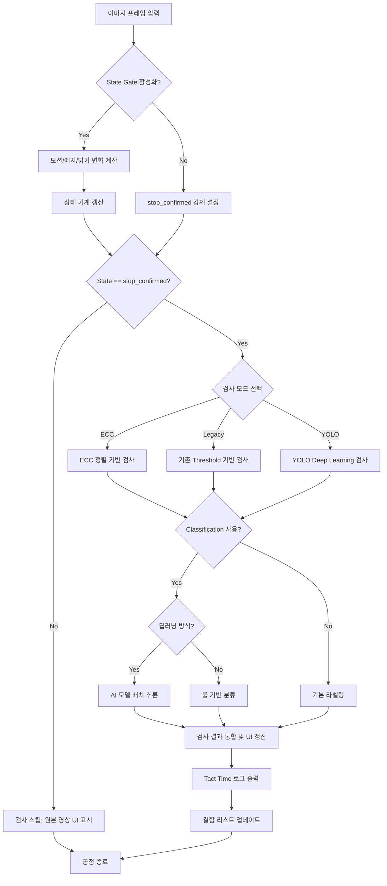

# 상세 검사 프로세스 플로우차트 (Detailed Inspection Flow)

본 문서는 바이알 이물 검사 시스템의 전체 알고리즘 처리를 **파라미터와의 연동 관계**까지 포함하여 상세하게 설명합니다. 각 단계에서 어떤 파라미터가 어떻게 작용하는지를 명시합니다.

> 파라미터의 단위, 범위, 기본값에 대한 상세한 설명은 [Inspection_Parameters_Description.md](./Inspection_Parameters_Description.md)를 참조하세요.

---

## 1. 전체 통합 프로세스 흐름도

프레임 입력부터 최종 결과 출력까지의 전 과정입니다.



---

## 2. 정지 인식 상세 (State Gate)

### 2.1 변화량 계산 — 사용 파라미터

매 프레임마다 아래 3가지를 계산합니다. 모든 계산은 **검사 ROI 영역** 내에서만 수행됩니다.

| 단계 | 계산 방법 | 출력 단위 | 관련 파라미터 |
|------|-----------|-----------|--------------|
| **Motion Score** | `MSE(현재ROI, 이전ROI)` = 인접 프레임 간 밝기 차이 제곱 평균 | gray level² | `state_stop_motion_threshold`, `state_reenter_motion_threshold` |
| **Edge Change** | `mean(absdiff(Canny(현재), Canny(이전)))` = 에지맵 변화 평균 | gray level (0~255 스케일) | `state_stop_edge_threshold`, `state_reenter_edge_threshold` |
| **Dark Change** | `|dark_ratio(현재) - dark_ratio(이전)|` = 어두운 영역 비율의 절대 변화 | 비율 (0.0~1.0) | `state_stop_dark_change_threshold`, `state_reenter_dark_change_threshold` |

> **Dark Change의 dark 기준**: `outer_mask_threshold` (gray level) 이하인 픽셀을 어두운 영역으로 판정합니다.

### 2.2 상태 전이 — 사용 파라미터

```
┌─────────────────────────────────────────────────────────────┐
│ Reenter 조건 (OR): Motion ≥ 12.0 OR Edge ≥ 12.0 OR Dark ≥ 0.05  │
│   → running (안정 카운트 = 0)                                     │
│                                                                     │
│ Stable 조건 (AND): Motion ≤ 5.0 AND Edge ≤ 6.0 AND Dark ≤ 0.02  │
│   → 안정 카운트 +1                                                 │
│     카운트 ≥ 4 (confirm_frames) → stop_confirmed (검사 시작)       │
│     카운트 ≥ 2 (candidate_frames) → stop_candidate                │
│     그 외 → settling                                               │
│                                                                     │
│ 어디에도 해당 안 함 → settling (안정 카운트 = 0)                    │
└─────────────────────────────────────────────────────────────┘
```

**핵심 설계**: Stop 임계값과 Reenter 임계값 사이에 **히스테리시스 구간**이 존재합니다. 예를 들어 Motion이 5.0~12.0 사이이면 "안정도 아니고 운행도 아닌" 불확정 구간이며, 이전 상태를 유지(settling)합니다. 이것이 채터링을 방지합니다.

---

## 3. 모드별 상세 알고리즘 단계

### 3.1 기존 검사 모드 (Legacy) — 파라미터별 동작

일반 검출과 버블 검출을 **ThreadPoolExecutor로 병렬 실행**한 후 결과를 병합합니다.

#### 일반 검출 파이프라인

```
① Gray 변환
  ↓
② GaussianBlur(3,3)
  ↓                            ┌── Adaptive 모드 (use_adaptive=True):
③ 이진화 ──────────────────────┤   adaptiveThreshold(blockSize=15, C=3) AND (blurred < threshold)
  ↓                            └── Static 모드: threshold(blurred, threshold)
④ Opening(open_kernel)         ← 작은 노이즈 제거
  ↓
⑤ Closing(close_kernel)        ← 끊어진 이물 연결
  ↓
⑥ findContours
  ↓
⑦ 필터: min_area ≤ area ≤ max_area
         circularity ≥ min_circularity
         solidity ≥ min_solidity
         aspect_ratio ≤ max_aspect_ratio
```

| 단계 | 사용 파라미터 | 효과 |
|------|--------------|------|
| ③ | `threshold` (gray level), `use_adaptive` (on/off) | 이물 후보 분리의 민감도 결정 |
| ④ | `open_kernel` (px) | 커널 크기만큼의 작은 점 노이즈 제거 |
| ⑤ | `close_kernel` (px) | 커널 크기만큼의 끊어진 부분 연결 |
| ⑦ | `min_area`, `max_area` (px²), 형상 계수 (비율) | 최종 후보 필터링 |

> **다운샘플링**: 입력 이미지의 최소 변이 512px를 초과하면 2배 축소하여 처리합니다. 면적 필터는 축소 비율의 제곱으로 자동 보정되며, 검출 좌표는 원본 해상도로 복원됩니다.

#### 버블 검출 파이프라인

```
① Morphological Opening(bg_open_ksize) + GaussianBlur(bg_smooth_sigma)
  → 배경(bg) 추출
  ↓
② flat = max(bg - work, work - bg)  ← 양극성 배경 차이
  ↓
③ [선택] CLAHE(clahe_clip, clahe_grid) 적용
  ↓
④ 노이즈 제거 (denoise_mode에 따라):
   median(median_ksize) / bilateral(bilateral_d, σColor, σSpace) / none
  ↓
⑤ DoG = |GaussianBlur(σ_small) - GaussianBlur(σ_large)|
  ↓
⑥ MAD 임계: T = median + thr_k × 1.4826 × MAD
   DoG > T 인 픽셀만 후보
  ↓
⑦ Morphology: Close(morph_close_size) → Open(morph_open_size)
  ↓
⑧ findContours → 형상 필터:
   min_diameter/2 ≤ radius ≤ max_diameter/2
   π×(min_r)²×0.35 ≤ area ≤ π×(max_r)²×1.30
   circularity ≥ circularity_min
   solidity ≥ solidity_min
   aspect ≤ max_aspect_ratio
```

| 단계 | 사용 파라미터 | 효과 |
|------|--------------|------|
| ① | `bg_open_ksize` (px), `bg_smooth_sigma` (σ) | 배경 추정 스케일. 바이알 곡면 크기에 맞춰야 한다 |
| ③ | `use_clahe`, `clahe_clip`, `clahe_grid` | 저대비 기포의 가시성 향상 |
| ④ | `denoise_mode`, `median_ksize`, `bilateral_*` | DoG 전 노이즈 억제 |
| ⑤ | `sigma_small` (px), `sigma_large` (px) | 검출 대상 기포 크기 범위 결정 |
| ⑥ | `thr_k` (무차원 배수) | 기포 판정 민감도 |
| ⑦ | `morph_close_size`, `morph_open_size` (px) | 후보 정리 |
| ⑧ | `min/max_diameter` (px), 형상 계수 (비율) | 최종 기포 확정 |

#### 결과 병합

일반 검출 결과(base)와 버블 검출 결과(new)를 병합할 때, 버블 후보의 중심점이 기존 일반 검출 bbox 내부(30% 마진 포함)에 있으면 **중복으로 간주하여 스킵**합니다. 즉 **일반 검출이 우선**합니다.

### 3.2 ECC 정렬 검사 모드 — 파라미터별 동작

#### 정렬(Alignment) 단계

```
① 정렬 영역 결정:
   alignment_mode == "full_frame" → 전체 프레임
   alignment_mode == "inspection_roi_padding" → ROI + padding_x/y 영역 크롭

② 알고리즘 실행:
   align_method == "ecc"
     → ecc_downscale_factor배 축소
     → GaussianBlur(ecc_gauss_filt_size)
     → findTransformECC(max_iter=ecc_max_iter, epsilon=ecc_epsilon)
   align_method == "phase_correlate"
     → FFT 기반 위상 상관 (dx, dy만 계산)
   align_method == "orb_feature"
     → ORB 특징점 매칭 + RANSAC

③ Warp Matrix 좌표 보정:
   크롭으로 정렬한 경우, warp를 전체 프레임 좌표로 변환
```

| 단계 | 사용 파라미터 | 효과 |
|------|--------------|------|
| ① | `alignment_mode`, `alignment_padding_x/y` (px) | 정렬 연산 범위. 작으면 빠르지만 정보 부족 위험 |
| ② | `align_method`, `ecc_downscale_factor`, `ecc_max_iter`, `ecc_epsilon`, `ecc_gauss_filt_size` | 정렬 정밀도와 속도의 트레이드오프 |

#### 마스크 생성 단계

```
④ Valid Mask = 검사 ROI ∩ ¬(Exclude Mask)

⑤ Safe Liquid Mask:
   ROI에서 사방을 축소:
   - 좌우: safe_wall_margin (px)
   - 상부: safe_surface_band (px), 또는 추정 액면 + safe_surface_band
   - 하부: safe_bottom_band (px)
   유효 면적 < safe_min_area → 검사 불가(invalid_safe_roi)

⑥ [선택] 표면 Dark 제외:
   surface_dark_threshold 이하 + 경계 접촉 성분만 제외
   dilate(surface_dark_dilate)로 확장

⑦ [선택] 외곽 마스킹 (outer_mask_enabled):
   outer_mask_threshold 이하 + ROI 경계 접촉 성분만 제외
```

| 단계 | 사용 파라미터 | 효과 |
|------|--------------|------|
| ⑤ | `safe_wall_margin`, `safe_surface_band`, `safe_bottom_band` (px), `safe_min_area` (px²), `use_surface_estimate`, `surface_search_ratio` | 노이즈가 많은 가장자리를 제외하여 오검출 감소 |
| ⑥ | `surface_dark_exclude_enabled`, `surface_dark_threshold` (gray level), `surface_dark_dilate` (px) | 액면 뒤쪽 저휘도 띠 제외 |
| ⑦ | `outer_mask_enabled`, `outer_mask_threshold` (gray level) | 유리벽 영역 동적 제외 |

#### 차영상 분석 및 Blob 검출 단계

```
⑧ Warp 적용:
   use_roi_only_warp == True → ROI만 warp (빠름)
   use_roi_only_warp == False → 전체 프레임 warp

⑨ 차영상 = subtract(이전 정렬 프레임, 현재 정렬 프레임)  ← 단방향
   (현재 프레임에서 새로 어두워진 부분만 밝게 남음)

⑩ Sweet Spot 판정:
   diff_mean > diff_too_high → 유동이 큼, 검사 스킵
   diff_mean < diff_too_low → 변화 없음, low confidence

⑪ 이진화: diff > blob_threshold

⑫ Morphology: Open(morph_open_size) → Close(morph_close_size)

⑬ findContours → 필터:
   blob_min_area ≤ area ≤ blob_max_area
   circularity ≥ blob_min_circularity
```

| 단계 | 사용 파라미터 | 효과 |
|------|--------------|------|
| ⑧ | `use_roi_only_warp` | 속도 최적화 |
| ⑩ | `diff_too_high`, `diff_too_low` (gray level) | 정렬 실패/정지 상태 이중 검증 |
| ⑪ | `blob_threshold` (gray level) | 이물 판정 민감도 |
| ⑫ | `morph_open_size`, `morph_close_size` (px) | 후보 정리 |
| ⑬ | `blob_min/max_area` (px²), `blob_min_circularity` (비율) | 최종 blob 필터 |

#### 다프레임 추적 (Temporal Tracking) 단계

```
⑭ track_enabled == True일 때:
   - 현재 프레임 blob들의 중심점(cx, cy)과 면적(area) 계산
   - 기존 track 목록에서 매칭 시도:
     거리 = sqrt((cx1-cx2)² + (cy1-cy2)²) ≤ track_match_distance
     면적비 = max(a1,a2)/min(a1,a2) ≤ track_max_area_ratio
   - 매칭 성공 → track.hits += 1
   - 매칭 실패 → 새 track 생성 (hits = 1)
   - track.hits ≥ track_min_hits → 최종 defect로 확정
   - 마지막 관찰 후 track_history_frames 초과 → track 소멸
```

| 파라미터 | 단위 | 역할 |
|----------|------|------|
| `track_history_frames` | 프레임 | track 유지 기간. 길면 느린 이물도 추적, 짧으면 빠르게 소멸 |
| `track_match_distance` | px | 프레임 간 동일 이물 판정 거리. 이물 이동 속도에 맞춰 설정 |
| `track_min_hits` | 회 | 확정 최소 횟수. 높으면 오검출↓, 실검출↓ |
| `track_max_area_ratio` | 배수 | 면적 변화 허용 범위. 크면 크기 변하는 이물도 추적 가능 |

---

## 4. 분류 단계 (Classification) 상세

검출된 각 후보 영역(Contour)에 대해 정밀 판정을 수행합니다.

### 4.1 Deep Learning (AI) 분류

```
① 각 검출 좌표 중심으로 고정 크기(224×224) 이미지 Crop
  ↓
② ONNX/OpenVINO 모델에 배치 입력
  ↓
③ Softmax 확률값 계산
  ↓
④ 최고 확률 클래스로 확정: Particle / Noise_Dust / Bubble
```

| 관련 설정 | 효과 |
|-----------|------|
| `optimization_level` (0~5) | 추론 속도 최적화 단계 |
| `openvino_device` (CPU/GPU/NPU) | Level 5에서 사용할 하드웨어 |

### 4.2 Rule-Based (Heuristics) 분류

```
① 각 검출 영역의 평균 밝기 대비(Contrast) 계산
  ↓
② Contrast ≥ noise_contrast_threshold → Particle
   Contrast < noise_contrast_threshold → Noise_Dust
```

| 관련 설정 | 단위 | 기본값 | 효과 |
|-----------|------|--------|------|
| `noise_contrast_threshold` | gray level | 10 (현재) / 30 (코드) | 높이면 Particle 기준이 엄격해져 더 많은 것이 Noise로 분류 |

---

## 5. 최종 결과 처리 및 UI 반영

알고리즘이 완료되면 `MainWindow._on_detection_result`가 호출되어 다음 작업을 수행합니다.

### 5.1 Visual Drawing

원본 영상 위에 각 이물의 윤곽선(Contour)과 라벨을 그립니다:
- **Particle** → 빨간색 윤곽선 + 라벨
- **Noise_Dust** → 파란색 윤곽선 + 라벨
- **Bubble** → 초록색 윤곽선 + 라벨

### 5.2 Performance Logging

각 처리 단계의 소요 시간을 합산하여 하단 로그 바에 표시합니다:
- **Tact** = Gate + Inspect + Classification 총합 (ms)
- **Gate** = state 계산 시간 (ms)
- **Inspect** = 정렬 + 마스크 + 차영상 + blob + 트래킹 총합 (ms)

### 5.3 Defect List

우측 결함 리스트에 항목별 상세 정보를 업데이트합니다:
- 형식: `#번호: 라벨 (Area: 면적px², 장축: Npx, 단축: Npx)`
- 필터(ALL/Particle/Noise/Bubble)에 따라 표시 항목이 달라집니다
- 하단에 분류별 합계: `Noise: N, Particle: N, Bubble: N`

### 5.4 Status 판정

| 조건 | Status | 색상 |
|------|--------|------|
| 검출된 이물이 1개 이상 | **NG: Foreign Body** | 빨간색 |
| 검출된 이물이 0개 | **OK** | 초록색 |
| 검사 미수행 (대기/이동 중) | **WAIT** | 회색 |
