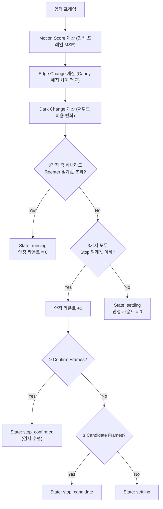
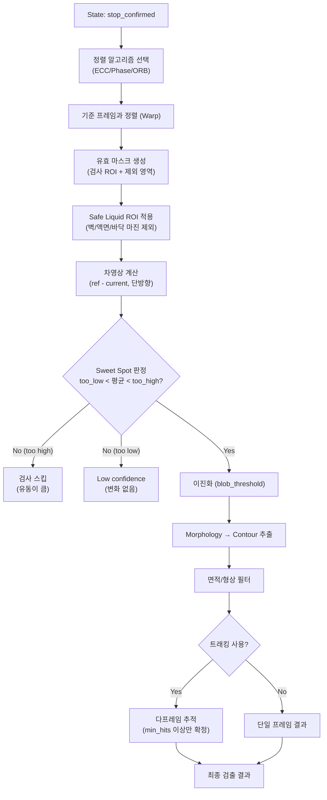
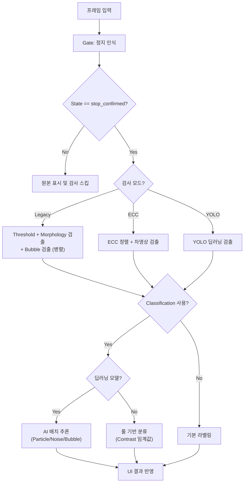

# Main Window UI 상세 설명

본 문서는 바이알 이물 검사 시스템(ForeignBodyInsp)의 메인 창(Main Window) 내 모든 화면 구성 요소, 버튼, 설정 컨트롤, 상태 표시의 의미와 기능을 설명합니다.

---

## 1. 좌측 패널 (Debug & Defect View)

### 1.1 Debug Image (디버그 이미지 탭)
검사 알고리즘의 중간 처리 과정을 실시간으로 확인할 수 있는 영역입니다. 3개의 탭으로 구성됩니다.

#### 일반 검출 (Normal Detection)
| 단계 | 이미지 | 설명 |
|------|--------|------|
| 1 | **gray** | 원본 영상을 그레이스케일(0~255)로 변환한 이미지. |
| 2 | **blurred** | GaussianBlur(3,3)로 노이즈를 제거한 이미지. |
| 3 | **threshold** | 이진화(Adaptive 또는 Static Threshold)를 적용하여 이물 후보를 흰색으로 분리한 이미지. |
| 4 | **Morphology (closed)** | Opening(노이즈 제거) → Closing(끊어진 이물 연결) 형태학적 연산을 거친 최종 이진화 이미지. |

#### 버블 검출 (Bubble Detection)
| 단계 | 이미지 | 설명 |
|------|--------|------|
| 1 | **CLAHE / Flat** | Morphological Opening으로 배경 평탄화 후, 선택적으로 CLAHE 대비 보정이 적용된 이미지. |
| 2 | **DoG Diff** | Difference of Gaussians(σ_small - σ_large) 필터로 기포 후보를 밝은 신호로 강조한 이미지. |
| 3 | **MAD Binary** | MAD(Median Absolute Deviation) 기반 통계적 이진화로 기포 후보를 흑/백 분리한 이미지. |
| 4 | **Bubble Result** | 형상 필터(직경, 원형도, 볼록도)를 통과한 최종 기포만 표시한 결과 이미지. |

#### ECC 검출 (ECC Alignment)
| 단계 | 이미지 | 설명 |
|------|--------|------|
| 1 | **ECC Motion** | 인접 프레임 간 절대 차이(absdiff). 전역 움직임 판단용 입력. |
| 2 | **ECC Aligned** | 기준 템플릿과 현재 프레임을 정렬(Warp)한 결과. 정렬 품질 확인용. |
| 3 | **ECC Diff** | 정렬된 영상과 기준 영상의 단방향 차이. 이물 부분만 밝게 나타남. |
| 4 | **ECC Binary** | 차영상을 blob_threshold로 이진화하여 이물 후보를 추출한 결과. |

### 1.2 Defect View (결함 확대 보기)
우측 **Results** 리스트에서 특정 항목을 선택하면, 해당 이물 위치를 확대하여 보여주는 영역입니다.

---

## 2. 중앙 패널 (Main View & Info)

### 2.1 메인 뷰 (Main View)
| 기능 | 설명 |
|------|------|
| **카메라 피드** | 연결된 Basler 카메라 또는 로드된 파일의 실시간 영상을 표시한다. |
| **오버레이** | 검출된 이물 주위에 윤곽선(Contour)과 라벨(Particle=빨간색, Noise_Dust=파란색, Bubble=초록색)을 표시한다. 검사 ROI는 초록색 사각형으로 표시된다. |
| **마우스 휠** | 확대/축소 가능. |
| **마우스 드래그** | 확대된 화면 내에서 이동(Panning). |

### 2.2 하단 슬라이더 및 정보
| 항목 | 설명 |
|------|------|
| **동영상 슬라이더** | 동영상 파일 재생 시 현재 위치를 표시하고 드래그로 제어한다. |
| **파일 정보** | 현재 로드된 파일 경로와 정보를 표시한다. |

---

## 3. 중앙 하단 정보 바 (Information Bar)

중앙 패널 하단에 위치하며, 현재 프레임의 데이터와 시스템 동작 로그를 실시간으로 표시합니다. 2개 행으로 구성됩니다.

### 3.1 Row 1: 마우스 정보 + 검출 수 요약

| 항목 | 위치 | 표시 형식 | 설명 |
|------|------|-----------|------|
| **마우스 정보 (lbl_mouse_info)** | 좌측 | `Position: (X, Y) GrayValue: V` | 마우스 커서가 가리키는 이미지 픽셀 좌표와 해당 위치의 밝기값(0~255). |
| **검출 수 (lbl_defect_counts)** | 우측 | `Noise: N, Particle: N, Bubble: N` | 현재 프레임에서 분류별로 검출된 이물 개수. 주황색 모노스페이스 폰트로 표시. |

### 3.2 Row 2: Tact Time & 상세 로그 (lbl_tact_info)

초록색 모노스페이스 폰트로 시스템 처리 속도와 내부 상태를 표시합니다. **검사 모드에 따라 표시 항목이 달라집니다.**

#### [공통 항목]

| 항목 | 단위 | 의미 |
|------|------|------|
| **Tact** | ms | 한 프레임 처리에 걸린 **총 시간**. |
| **Gate** | ms | 정지 인식(State Gate) 단계 소요 시간. Motion/Edge/Dark 계산 + 상태 머신 갱신. |
| **Inspect** | ms | 정지 확인 후 실제 검사(정렬, 차영상, blob 추출 등) 소요 시간. |

#### [ECC 검사 모드 시 추가 항목]

| 항목 | 단위 | 의미 |
|------|------|------|
| **State** | — | 상태 머신 현재 단계: `running` / `settling` / `stop_candidate` / `stop_confirmed` |
| **ECC (status)** | — | 프레임 정렬 결과: `ok`, `size_mismatch`, `ecc_fail`, `no_reference` 등 |
| **Max** | ms | 가장 오래 걸린 처리 단계명과 소요 시간 |
| **상세 단계별 시간** | ms | 아래 약어로 표시 |

| 약어 | 풀네임 | 의미 |
|------|--------|------|
| **St** | State Update | 상태 머신 갱신 |
| **Al** | Align | 이미지 정렬 계산 |
| **VM** | Valid Mask | 유효 영역 마스크 생성 |
| **Wp** | Warp Apply | 이미지 변환(Warping) 적용 |
| **Mask** | Safe Mask | Safe Liquid ROI + 표면 dark 제외 마스크 처리 |
| **Df** | Diff | 기준 영상과의 차이 계산 |
| **Bin** | Binary | 이진화 처리 |
| **Cnt** | Contour | 윤곽선 추출 |
| **Trk** | Track | 이전 프레임과의 다프레임 추적 |

#### [Legacy 모드 시 항목]

| 항목 | 단위 | 의미 |
|------|------|------|
| **State** | — | ECC와 동일한 상태 (`running` ~ `stop_confirmed`). State Gate 활성화 시에만 표시. |
| **Gate / Inspect** | ms | 공통 항목과 동일. |
| **Rule** | ms | 룰 기반(Threshold) 검출 소요 시간 |
| **Bub** | ms | 버블 전용 검출 로직 소요 시간 |
| **Class** | ms + `[n]개` | 딥러닝 분류기 구동 시간 및 분류된 개수 |
| **검출 (Bub/Gen)** | 개 | 버블(Bub)과 일반 이물(Gen) 각각의 검출 개수 |

#### [DL 상세 프로파일 (딥러닝 모델 구동 시)]

| 항목 | 단위 | 의미 |
|------|------|------|
| **DL (mode)** | — | 모델 구동 방식: CPU, GPU, OpenVINO 등 |
| **N** | 개 | 검사 대상 후보 개수 |
| **B** | 개 | 배치 처리 사이즈 |
| **GC** | ms | GC(Garbage Collection) 일시 정지 시간 |
| **G** | ms | 기하학적 변환(Crop/Resize 등) 시간 |
| **R** | ms | ROI 영역 추출 시간 |
| **I** | ms | 순수 모델 추론(Inference) 시간 |
| **P** | ms | 결과 해석 및 후처리 시간 |

---

## 4. 우측 패널 (Control Panel)

### 4.1 Basler Cam Control (카메라 제어)

| 버튼/컨트롤 | 기능 |
|-------------|------|
| **Connect / Disconnect** | Basler 카메라 연결/해제. 연결 시 버튼 텍스트가 `Disconnect`로 변경된다. |
| **RealTime View** | 체크 시 카메라에서 연속으로 영상을 가져온다. 해제 시 검사 시작 시에만 1프레임 획득. |
| **Load Image / Video** | 로컬 파일에서 이미지 또는 동영상을 불러온다. |
| **재생/일시정지/정지** | 동영상 재생 상태를 제어한다. |
| **Cam 설정** | 카메라 노출(Exposure), 이득(Gain) 등 하드웨어 설정 변경. |
| **Grab&Save** | 현재 화면의 원본 프레임을 파일로 저장한다. |
| **영상 저장** | 검사 중 실시간 영상을 녹화하여 저장한다. |

### 4.2 Inspection (검사 실행)

| 항목 | 기능 |
|------|------|
| **Start/Stop Inspection** | 전체 검사 프로세스 시작/중단. 시작 시 State Gate가 동작하고, 정지가 확정되면 자동으로 검사를 수행한다. |

### 4.3 Settings (설정)

| 항목 | 기능 |
|------|------|
| **Threshold** | 이진화 임계값 수동 조절. 단위: gray level (0~255). |
| **Min Area** | 검출 최소 면적. 단위: px². 이보다 작은 객체는 무시. |
| **Adaptive Threshold** | 적응형 이진화 사용 여부. 조명 불균일 시 효과적. |
| **MainView에 표시** | 메인 화면에 검출 박스(윤곽선)와 라벨을 오버레이할지 선택. |
| **검사 ROI 설정** | 화면에서 실제 검사를 수행할 영역을 마우스 드래그로 지정 (초록색 상자). |
| **어노테이션 ROI 설정** | AI 학습용 데이터 추출 영역 설정 (빨간색 상자). |
| **검사 ROI 표시** | 설정된 ROI 박스를 화면에 상시 표시할지 선택. |
| **검사 모드** | (Maker 모드 전용) 'Threshold + 분류' 방식과 'YOLO 통합 검출' 방식 중 선택. |
| **Use Classification** | 딥러닝 기반 2차 분류기(Particle/Noise/Bubble) 사용 여부. |
| **모델 로드** | 학습된 분류 모델 파일(.onnx 등)을 수동으로 불러온다. |
| **YOLO 모델 로드 / Confidence** | (Maker 전용) YOLO 모델 로드 및 검출 확신도 임계값 설정. |
| **Defect 이미지 저장** | 이물 검출 시 해당 결함 이미지를 자동으로 파일 저장. |
| **ECC 기준 템플릿 제어** | (ECC 모드 시 표시) 현재 영상을 기준(Reference)으로 저장하거나 초기화. |

### 4.4 Results (결과 목록)

| 항목 | 기능 |
|------|------|
| **Status** | 검사 상태를 큰 글씨(16px 볼드)로 표시. `WAIT`(회색), `OK`(초록), `NG: Foreign Body`(빨간). |
| **글자 보기** | 검출된 객체 옆에 라벨 텍스트를 표시할지 선택. |
| **필터 (ALL / Particle / Noise / Bubble)** | 특정 카테고리의 결과만 리스트에 보이도록 필터링. 검출 자체에는 영향 없음. |
| **결과 리스트** | 각 검출 객체의 상세 정보를 나열한다. 형식: `#번호: 라벨 (Area: 면적, 장축: N, 단축: N)` |

> - **Area**: 윤곽선 내부 면적 (px²)
> - **장축/단축**: minAreaRect 기준 장변/단변 길이 (px)
> - 항목 **클릭** 시 좌측 Defect View에 해당 이물이 확대 표시된다.
> - 항목 **더블 클릭** 시 메인 뷰가 해당 위치로 자동 이동 및 확대된다.

---

## 5. 상세 프로세스 및 알고리즘 흐름

시스템은 **정지 인식(Gate) → 이물 검사(Inspection) → 분류(Classification)** 순서로 동작합니다.

### 5.1 정지 인식 흐름 (Stop Recognition / Gate)

바이알이 검사 가능한 상태(정지 완료)인지 판단하는 로직입니다.

> **기존 검사(Legacy)와 ECC 검사** 모두 동일한 정지 인식 알고리즘을 공유합니다. 파라미터는 검사 모드별로 독립적으로 설정할 수 있습니다.

### 5.2 이물 검사 흐름 (ECC Mode)

`stop_confirmed` 상태가 되면 실제 이물 검출 알고리즘이 구동됩니다.

### 5.3 전체 검사 프로세스 (Overall Flow)

---

## 6. 상태 바 (Status Bar)

| 항목 | 위치 | 기능 |
|------|------|------|
| **User/Maker 모드** | 좌측 | 현재 권한 상태를 표시. `User` = 제한된 설정만 가능, `Maker` = 전체 설정 가능. |
| **Viewer 버튼** | 중앙 | 클릭 시 좌측 패널과 우측 일부 설정을 숨기고 메인 뷰를 최대화하여 표시. |
| **Maker 로그인** | 우측 | 관리자(Maker) 모드로 전환하기 위한 비밀번호 입력 창을 띄운다. |

---

## 7. 색상 코드 가이드

| 색상 | 대상 | 의미 |
|------|------|------|
| **빨간색 (#FF0000)** | 윤곽선 + 라벨 | Particle (실제 이물) |
| **파란색 (#FF0000 → BGR: #0000FF)** | 윤곽선 + 라벨 | Noise_Dust (노이즈/먼지) |
| **초록색 (#00FF00)** | 윤곽선 + 라벨 | Bubble (기포) |
| **초록색** | ROI 사각형 | 검사 ROI 영역 |
| **노란색** | ROI 사각형 | 정렬 ROI 영역 (ECC 모드, 디버그 시) |
| **빨간색** | Status 텍스트 | NG: Foreign Body (불량) |
| **초록색** | Status 텍스트 | OK (정상) |
| **회색** | Status 텍스트 | WAIT (대기) |
