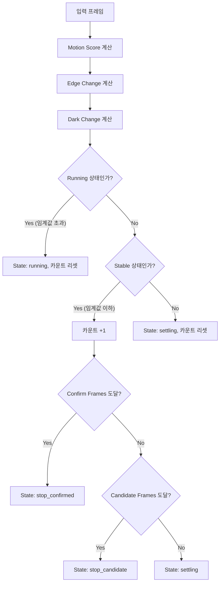
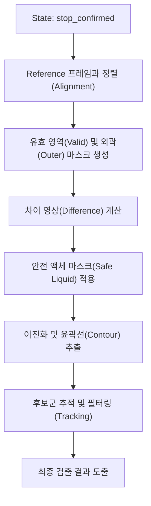
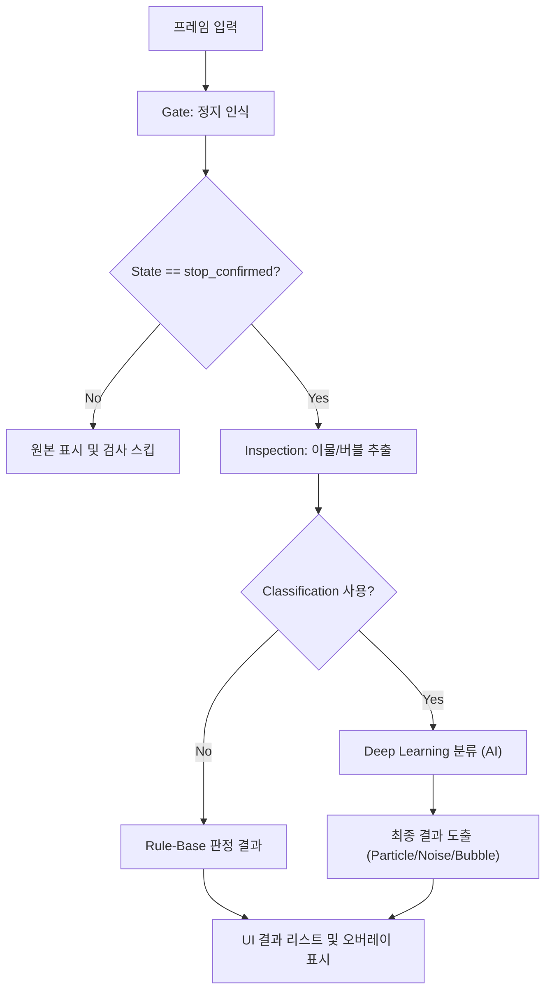

# Main Window UI 상세 설명

본 문서는 바이알 이물 검사 시스템(ForeignBodyInsp)의 메인 창(Main Window) 내 각 화면 구성 요소와 입출력 항목, 버튼 및 설정 컨트롤의 의미와 기능을 설명합니다.

---

## 1. 좌측 패널 (Debug & Defect View)

### 1.1 Debug Image (디버그 이미지 탭)
검사 알고리즘의 중간 처리 과정을 실시간으로 확인할 수 있는 영역입니다. 3개의 탭으로 구성되어 있습니다.

*   **일반 검출 (Normal Detection)**
    *   **gray**: 원본 영상을 그레이스케일로 변환한 이미지.
    *   **blurred**: 노이즈 제거를 위해 블러 처리를 적용한 이미지.
    *   **threshold**: 이진화(Thresholding)를 적용하여 후보군을 분리한 이미지.
    *   **Morphology (closed)**: 형태학적 연산(닫기 연산 등)을 통해 파편(Contour)을 정제한 이미지.
*   **버블 검출 (Bubble Detection)**
    *   **CLAHE / Flat**: 대비 개선(CLAHE) 또는 평탄화 처리가 적용된 이미지.
    *   **DoG Diff**: Difference of Gaussians 필터를 통해 버블 후보를 강조한 이미지.
    *   **MAD Binary**: 통계적 방식(MAD)으로 이진화된 버블 후보 이미지.
    *   **Bubble Result**: 최종적으로 버블로 판정된 결과 이미지.
*   **ECC 검출 (ECC Alignment)**
    *   **ECC Motion**: 정렬을 위한 모션 분석 입력 이미지.
    *   **ECC Aligned**: 기준 템플릿과 현재 프레임을 정렬(Warping)한 결과.
    *   **ECC Diff**: 기준 영상과 현재 영상의 차이(Difference) 이미지.
    *   **ECC Binary**: 차이 이미지를 이진화하여 이물을 검출한 결과.

### 1.2 Defect View (결함 확대 보기)
*   **lbl_defect_view**: 우측 **Results** 리스트에서 특정 항목을 선택했을 때, 해당 이물 위치를 확대하여 보여주는 영역입니다.

---

## 2. 중앙 패널 (Main View & Info)

### 2.1 메인 뷰 (Main View)
*   **카메라 피드 (Camera Feed)**: 연결된 Basler 카메라 또는 로드된 파일의 실시간 영상을 표시합니다.
*   **오버레이 (Overlays)**: 검출된 이물 주위에 사각형(Bounding Box), 라벨(Label), 검사 영역(ROI) 등을 표시합니다.
*   **마우스 휠/드래그**: 휠을 사용하여 확대/축소가 가능하며, 드래그를 통해 확대된 화면 내에서 이동(Panning)할 수 있습니다.

### 2.2 하단 슬라이더 및 정보
*   **동영상 슬라이더**: 동영상 파일 재생 시 현재 재생 위치를 표시하고 제어합니다.
*   **파일 정보**: 현재 로드된 이미지 또는 동영상의 파일 경로와 정보를 표시합니다.

---

## 3. 중앙 하단 정보 바 (Information Bar)

중앙 패널 하단에 위치하며, 현재 프레임의 데이터 정보와 시스템의 세부 동작 로그(Tact Time, State 등)를 실시간으로 표시합니다.

### 3.1 파일 및 영상 정보 (`lbl_file_info`)
*   **Source**: 현재 입력 소스의 이름 (예: `Camera (Live)`, `test_video.mp4` 등).
*   **영상 크기**: 입력 영상의 전체 해상도 (가로×세로).
*   **검사 ROI**: 현재 설정되어 활성화된 검사 영역의 크기 (가로×세로).
*   **File Size**: (파일 소스일 경우) 원본 파일의 디스크 용량.

### 3.2 마우스 포인터 정보
*   **Position (`lbl_pos`)**: 현재 마우스 커서가 가리키는 이미지상의 픽셀 좌표 (X, Y).
*   **GrayValue (`lbl_gray`)**: 마우스 커서 위치 픽셀의 밝기 값 (0~255, 그레이스케일 기준).

### 3.3 검사 결과 요약 (`lbl_defect_info`)
*   **검출 개수**: 현재 프레임에서 최종 판정된 총 이물(Particle, Bubble 등)의 개수.

### 3.4 세부 동작 로그 및 성능 정보 (`lbl_tact_info`)
시스템의 처리 속도와 내부 상태를 상세히 나타내며, 설정된 **검사 모드**에 따라 표기 항목이 달라집니다.

#### [공통 항목]
*   **Tact**: 전체 시스템이 한 프레임을 처리하는 데 걸린 총 시간 (ms).
*   **Gate**: **정지 인식(Gating) 시간**. 모션 및 에지 변화를 분석하여 바이알이 검사 가능한 상태(정지 상태)인지 판단하는 데 소요된 시간입니다.
*   **Inspect**: **실제 검사 시간**. 정지 확인 단계 이후, 이미지 정렬 및 이물 검출 알고리즘을 수행하는 데 소요된 시간입니다.

#### [ECC 검사 모드 시]
정렬 기반 검출 모드에서는 다음과 같은 상세 파라미터가 표시됩니다:
*   **State**: 바이알의 이동 및 정지 상태를 제어하는 상태 기계의 현재 단계
    *   `running`: 바이알이 이동 중이거나 변화가 커서 검사가 대기 중인 상태.
    *   `settling`: 모션이 줄어들어 정지 판정 단계로 진입 중인 상태.
    *   `stop_candidate`: 정지된 것으로 보이나, 확정을 위해 추가 프레임을 확인 중인 상태.
    *   `stop_confirmed`: 완전히 정지된 것으로 판정되어 실제 검사가 수행되는 상태.
*   **ECC (status)**: 프레임 정렬 결과 상태 (`ok`, `size_mismatch` 등).
*   **Max**: 단일 처리 단계 중 가장 오래 걸린 단계명과 시간.
*   **상세 단계별 시간 (Detailed Stages)**:
    *   `St` (State Update): 상태 기계 갱신 시간.
    *   `Al` (Align): 이미지 정렬 계산 시간.
    *   `VM` (Valid Mask): 유효 영역 마스크 생성 시간.
    *   `Wp` (Warp Apply): 이미지 변환(Warping) 적용 시간.
    *   `Mask`: 제외 영역 마스크 처리 시간.
    *   `Df` (Diff): 기준 영상과의 차이 계산 시간.
    *   `Bin` (Binary): 이진화 처리 시간.
    *   `Cnt` (Contour): 객체(윤곽선) 추출 시간.
    *   `Trk` (Track): 이전 프레임과의 객체 추적 시간.

#### [Maker / Legacy 모드 (기존 검사) 시]
기존 검사 방식에서도 'State Gate' 설정이 활성화된 경우 정지 인식 및 검사 시간이 표시됩니다.
*   **State**: 위 ECC 모드와 동일한 상태(`running`, `settling`, `stop_candidate`, `stop_confirmed`)가 표시됩니다.
*   **Gate / Inspect**: 위 공통 항목 설명과 동일한 의미로 사용됩니다.
*   **Rule**: 룰 기반(Threshold) 검출 소요 시간.
*   **Bub**: 버블 전용 검출 로직 소요 시간.
*   **Class**: 딥러닝 분류기 구동 시간 및 분류된 개수 (`[n]개`).
*   **검출 (Bub/Gen)**: 버블(Bub)과 일반 이물(Gen) 각각의 검출 개수.

#### [Deep Learning (DL) 상세 프로파일]
딥러닝 모델 구동 시 추가적으로 표시되는 성능 분석 로그입니다:
*   **DL (mode)**: 모델 구동 방식 (CPU, GPU, OpenVINO 등).
*   **N**: 검사 대상 후보 개수.
*   **B (Batch)**: 배치 처리 사이즈.
*   **GC (Garbage Collection)**: 메모리 정리로 인한 일시 정지 시간.
*   **G (Geom)**: 기하학적 변환 시간.
*   **R (ROI)**: ROI 영역 추출 시간.
*   **I (Infer)**: 순수 모델 추론(Inference) 시간.
*   **P (Post)**: 결과 해석 및 후처리 시간.

### 3.5 상태 표시 (`lbl_status`)
시스템의 현재 운영 상태를 나타내는 핵심 키워드입니다.
*   **WAIT**: 검사 대기 중 (장치 준비 완료).
*   **OK**: 이물 없음 (정상 판정).
*   **NG: Foreign Body**: 이물 검출됨 (불량 판정).
*   **Stopped**: 검사 프로세스 중단됨.
*   **Camera Connected / Disconnected**: 카메라 연결 상태.
*   **Video/File Loaded / Error**: 영상 파일 로드 상태 및 오류 여부.

---

## 4. 우측 패널 (Control Panel)

### 4.1 Basler Cam Control (카메라 제어)
*   **Connect / Disconnect**: Basler 카메라와의 연결을 시도하거나 해제합니다.
*   **RealTime View**: 체크 시 카메라에서 연속으로 영상을 가져오고, 해제 시 검사 시작 시에만 1프레임을 가져옵니다.
*   **Load Image / Video**: 로컬 드라이브에서 이미지 또는 동영상 파일을 불러옵니다.
*   **재생/일시정지/정지 버튼**: 불러온 동영상의 재생 상태를 제어합니다.
*   **Cam 설정**: 카메라의 노출(Exposure), 이득(Gain) 등 하드웨어 설정을 변경합니다.
*   **Grab&Save**: 현재 화면의 원본 프레임을 파일로 저장합니다.
*   **영상 저장**: 검사 중 실시간 영상을 녹화하여 저장합니다.

### 4.2 Inspection (검사 실행)
*   **Start/Stop Inspection**: 전체 검사 프로세스를 시작하거나 중단합니다.

### 4.3 Settings (설정)
*   **Threshold**: 이진화 임계값을 수동으로 조절합니다.
*   **Min Area**: 검출할 최소 면적(픽셀 단위)을 설정합니다. 이보다 작은 객체는 무시됩니다.
*   **Adaptive Threshold**: 조명 변화에 강인한 적응형 이진화 기법 사용 여부를 설정합니다.
*   **MainView에 표시**: 메인 화면에 검출 박스와 라벨을 표시할지 여부를 결정합니다.
*   **검사 ROI 설정**: 화면 내에서 실제 검사를 수행할 영역을 마우스 드래그로 지정합니다 (초록색 상자).
*   **어노테이션 ROI 설정**: AI 모델 학습을 위한 데이터 추출 영역을 설정합니다 (빨간색 상자).
*   **검사 ROI 표시**: 설정된 ROI 박스를 화면에 상시 표시할지 여부를 결정합니다.
*   **검사 모드**: (Maker 모드 전용) 'Threshold + 분류' 방식과 'YOLO 통합 검출' 방식 중 선택합니다.
*   **Use Classification**: 딥러닝 기반의 2차 분류기(Particle/Noise 등) 사용 여부를 설정합니다.
*   **모델 로드**: 학습된 분류 모델 파일을 수동으로 불러옵니다.
*   **YOLO 모델 로드 / Confidence**: (Maker 전용) YOLO 모델 로드 및 검출 확신도 임계값을 설정합니다.
*   **Defect 이미지 저장**: 검출될 때마다 해당 결함의 이미지를 자동으로 저장합니다.
*   **ECC 기준 템플릿 제어**: (ECC 모드 시) 현재 영상을 기준(Reference)으로 저장하거나 초기화합니다.

### 4.4 Results (결과 목록)
*   **Status**: 검사 상태(WAIT, OK, NG)를 큰 글씨로 표시합니다.
*   **글자 보기**: 검출된 객체 옆에 라벨 텍스트를 표시할지 설정합니다.
*   **필터 (ALL, Particle, Noise, Bubble)**: 특정 카테고리의 결과만 리스트에 보이도록 필터링합니다.
*   **결과 리스트**: 검출된 각 객체의 번호, 라벨, 확신도(Confidence), 면적(Area) 정보를 나열합니다. 
    *   항목 선택 시 **Defect View**에 해당 이미지가 표시됩니다.
    *   더블 클릭 시 메인 뷰가 해당 객체 위치로 자동 이동 및 확대됩니다.

---

---

## 4. 상세 프로세스 및 알고리즘 흐름

시스템은 크게 **정지 인식(Gate) -> 이물 검사(Inspection) -> 분류(Classification)** 순서로 동작합니다.

### 4.1 정지 인식 흐름 (Stop Recognition / Gate)

바이알이 컨베이어를 통해 진입한 후, 검사 가능한 상태(정지 완료)인지 판단하는 로직입니다.

#### 정지 인식 파라미터 설명
*   **Motion Score**: 인접 프레임 간의 픽셀 밝기 MSE(평균 제곱 오차) 변화량.
*   **Edge Change**: ROI 내 Canny 에지 밀도 변화량. 바이알의 테두리 진입/이탈 감지에 민감함.
*   **Dark Change**: ROI 내 어두운 영역(바이알 본체)의 면적 비율 변화량.
*   **Confirm Frames**: 정지 상태가 이 횟수만큼 유지되어야 `stop_confirmed`로 판정함.

> [!NOTE]
> **기존 검사(Legacy) / ECC 검사** 모두 동일한 정지 인식 알고리즘을 공유하며, 설정창의 'State Gate' 관련 파라미터를 통해 임계값을 조절할 수 있습니다.

---

### 4.2 이물 검사 흐름 (Inspection - ECC Mode)

`stop_confirmed` 상태가 되면 실제 이물 검출 알고리즘이 구동됩니다.

#### ECC 검사 주요 단계
1.  **Alignment**: ORB 특징점 또는 ECC 알고리즘을 사용하여 현재 프레임을 기준 영상에 픽셀 단위로 정렬합니다.
2.  **Difference**: 정렬된 두 영상의 차이를 구하여 움직이는 이물 후보를 강조합니다.
3.  **Safe Liquid Mask**: 바이알 벽면, 액체 표면(Surface), 바닥면의 노이즈를 제거하기 위해 설정된 마진을 제외한 순수 액체 영역만 검사합니다.

---

### 4.3 전체 검사 프로세스 (Overall Flow)

정지 인식부터 최종 분류 완료까지의 전체 파이프라인입니다.

*   **Classification Use**: 활성화 시, 검출된 객체 영역(ROI)을 잘라내어 AI 모델(CNN 등)에 입력하고 최종적으로 이물의 종류를 재판정합니다.

---

## 5. 상태 바 (Status Bar)

*   **User/Maker 모드 표시**: 현재 권한 상태를 표시합니다. (🔒 User / 🔓 Maker)
*   **👁 Viewer 버튼**: 클릭 시 좌측 패널과 우측 일부 설정을 숨기고 메인 뷰를 최대화하여 보여줍니다.
*   **🔐 Maker 로그인**: 관리자(Maker) 모드로 전환하기 위한 비밀번호 입력 창을 띄웁니다.
