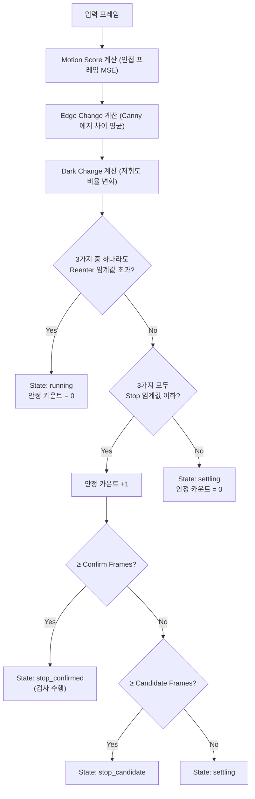
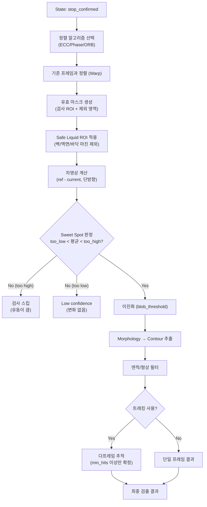
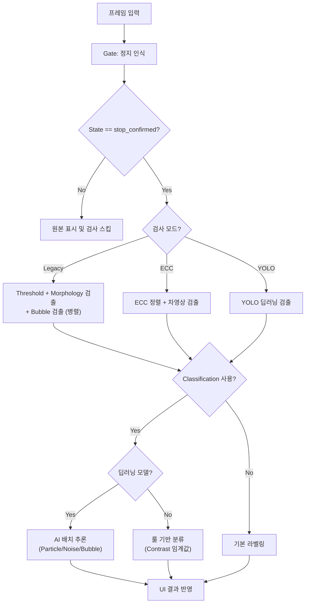

# Main Window UI 상세 설명

본 문서는 바이알 이물 검사 시스템(ForeignBodyInsp)의 메인 창(Main Window) 내 모든 화면 구성 요소, 버튼, 설정 컨트롤, 상태 표시의 의미와 기능을 설명합니다.

---

## 1. 좌측 패널 (Debug & Defect View)

### 1.1 Debug Image (디버그 이미지 탭)
검사 알고리즘의 중간 처리 과정을 실시간으로 확인할 수 있는 영역입니다. 3개의 탭으로 구성됩니다.

#### 일반 검출 (Normal Detection)
| 단계 | 이미지 | 설명 |
|------|--------|------|
| 1 | **gray** | 원본 영상을 그레이스케일(0~255)로 변환한 이미지. |
| 2 | **blurred** | GaussianBlur(3,3)로 노이즈를 제거한 이미지. |
| 3 | **threshold** | 이진화(Adaptive 또는 Static Threshold)를 적용하여 이물 후보를 흰색으로 분리한 이미지. |
| 4 | **Morphology (closed)** | Opening(노이즈 제거) → Closing(끊어진 이물 연결) 형태학적 연산을 거친 최종 이진화 이미지. |

#### 버블 검출 (Bubble Detection)
| 단계 | 이미지 | 설명 |
|------|--------|------|
| 1 | **CLAHE / Flat** | Morphological Opening으로 배경 평탄화 후, 선택적으로 CLAHE 대비 보정이 적용된 이미지. |
| 2 | **DoG Diff** | Difference of Gaussians(σ_small - σ_large) 필터로 기포 후보를 밝은 신호로 강조한 이미지. |
| 3 | **MAD Binary** | MAD(Median Absolute Deviation) 기반 통계적 이진화로 기포 후보를 흑/백 분리한 이미지. |
| 4 | **Bubble Result** | 형상 필터(직경, 원형도, 볼록도)를 통과한 최종 기포만 표시한 결과 이미지. |

#### ECC 검출 (ECC Alignment)
| 단계 | 이미지 | 설명 |
|------|--------|------|
| 1 | **ECC Motion** | 인접 프레임 간 절대 차이(absdiff). 전역 움직임 판단용 입력. |
| 2 | **ECC Aligned** | 기준 템플릿과 현재 프레임을 정렬(Warp)한 결과. 정렬 품질 확인용. |
| 3 | **ECC Diff** | 정렬된 영상과 기준 영상의 단방향 차이. 이물 부분만 밝게 나타남. |
| 4 | **ECC Binary** | 차영상을 blob_threshold로 이진화하여 이물 후보를 추출한 결과. |

> **cf. 용어 해설**
> - **그레이스케일 (Grayscale)**: 색상 정보를 제거하고 밝기(0~255)만으로 표현한 단일 채널 이미지 형식.
> - **GaussianBlur**: 가우시안 커널을 사용하여 이미지의 고주파 노이즈를 부드럽게 제거하는 블러 필터.
> - **이진화 (Binarization)**: 픽셀 값을 임계값 기준으로 0(검정) 또는 255(흰색)로 변환하는 처리.
> - **Adaptive Threshold**: 이미지의 각 영역별로 지역적 평균/가중 평균을 기반으로 임계값을 자동 산출하는 이진화 방식. 조명 불균일에 강함.
> - **Static Threshold**: 전체 이미지에 동일한 고정 임계값을 적용하는 단순 이진화 방식.
> - **Morphology**: 구조 요소(커널)를 이용하여 이진 이미지의 형태를 변형하는 연산 체계.
> - **Opening**: 침식(Erosion) → 팽창(Dilation) 순서로 적용하여 작은 노이즈를 제거하는 형태학적 연산.
> - **Closing**: 팽창(Dilation) → 침식(Erosion) 순서로 적용하여 끊어진 영역을 연결하는 형태학적 연산.
> - **CLAHE (Contrast Limited Adaptive Histogram Equalization)**: 이미지를 타일로 분할한 뒤 각 타일별로 히스토그램 균일화를 수행하되 대비 증폭을 제한하여 과도한 노이즈 증가를 방지하는 보정 기법.
> - **DoG (Difference of Gaussians)**: 서로 다른 σ(표준편차)의 가우시안 블러를 적용한 두 이미지의 차이를 구하여 특정 크기 범위의 구조(기포 등)를 강조하는 필터.
> - **σ (Sigma)**: 가우시안 분포의 표준편차. 블러 커널의 확산 범위를 결정하는 파라미터.
> - **MAD (Median Absolute Deviation)**: 중앙값으로부터의 절대 편차의 중앙값. 이상치에 강건한 통계적 분산 추정량으로, 동적 이진화 임계값 산출에 사용.
> - **Contour**: 이진화 이미지에서 연결된 흰색 영역의 외곽 경계선. OpenCV의 findContours로 추출.
> - **직경 (Diameter)**: 검출된 객체의 외접원 또는 등가원의 지름(px).
> - **원형도 (Circularity)**: 윤곽선이 원에 얼마나 가까운지를 나타내는 지표. 4π×면적/둘레² 로 계산하며 1.0이면 완전한 원.
> - **볼록도 (Solidity)**: 윤곽선 면적 / 볼록 껍질(Convex Hull) 면적. 객체가 얼마나 꽉 차 있는지를 나타내는 형상 지표.
> - **ECC (Enhanced Correlation Coefficient)**: 두 이미지 간 정렬 품질을 측정하는 상관 계수 기반 알고리즘. 기하학적 변환 매개변수를 반복적으로 최적화.
> - **absdiff**: 두 이미지의 대응 픽셀 간 절대 차이를 계산하는 OpenCV 함수.
> - **Warp**: 기하학적 변환 행렬(Affine/Perspective)을 적용하여 이미지를 회전, 이동, 스케일링하는 처리.
> - **차영상 (Difference Image)**: 기준 이미지와 현재 이미지의 픽셀 값 차이를 계산한 결과 이미지. 변화 영역이 밝게 나타남.
> - **기준 템플릿 (Reference Template)**: 정지 상태에서 이물이 없는 깨끗한 프레임으로, 이후 프레임과 비교하기 위한 기준 이미지.
> - **Blob**: 이진화 이미지에서 연결된 흰색 픽셀 덩어리. 이물 후보 객체를 의미.
> - **blob_threshold**: 차영상을 이진화할 때 사용하는 임계값. 이 값 이상의 밝기 차이만 이물 후보로 추출.
> - **형태학적 연산 (Morphological Operation)**: 침식, 팽창, Opening, Closing 등 구조 요소를 이용하여 이진 이미지의 형태를 가공하는 연산의 총칭.

### 1.2 Defect View (결함 확대 보기)
우측 **Results** 리스트에서 특정 항목을 선택하면, 해당 이물 위치를 확대하여 보여주는 영역입니다.

> **cf. 용어 해설**
> - **Contour**: 검출된 이물 객체의 외곽 경계선. 결함 위치와 크기를 시각적으로 나타냄.
> - **Defect**: 검사에서 발견된 결함(이물, 기포, 노이즈 등)을 총칭하는 용어.
> - **확대 (Zoom)**: 선택된 결함 영역을 원본 해상도 이상으로 크게 표시하여 육안 확인을 돕는 기능.

---

## 2. 중앙 패널 (Main View & Info)

### 2.1 메인 뷰 (Main View)
| 기능 | 설명 |
|------|------|
| **카메라 피드** | 연결된 Basler 카메라 또는 로드된 파일의 실시간 영상을 표시한다. |
| **오버레이** | 검출된 이물 주위에 윤곽선(Contour)과 라벨(Particle=빨간색, Noise_Dust=파란색, Bubble=초록색)을 표시한다. 검사 ROI는 초록색 사각형으로 표시된다. |
| **마우스 휠** | 확대/축소 가능. |
| **마우스 드래그** | 확대된 화면 내에서 이동(Panning). |

> **cf. 용어 해설**
> - **카메라 피드 (Camera Feed)**: 카메라로부터 실시간으로 전달되는 연속 영상 스트림.
> - **오버레이 (Overlay)**: 원본 영상 위에 검출 결과(윤곽선, 라벨, ROI 등)를 겹쳐서 표시하는 시각화 방식.
> - **Contour**: 검출된 객체의 외곽 경계선. 이물 위치를 시각적으로 표시하는 데 사용.
> - **라벨 (Label)**: 검출된 객체 옆에 표시되는 분류명 텍스트 (Particle, Noise_Dust, Bubble 등).
> - **Particle**: 실제 이물로 분류된 검출 객체. 빨간색으로 표시.
> - **Noise_Dust**: 노이즈 또는 먼지로 분류된 검출 객체. 파란색으로 표시.
> - **Bubble**: 기포로 분류된 검출 객체. 초록색으로 표시.
> - **ROI (Region of Interest)**: 관심 영역. 전체 이미지 중 실제 검사를 수행할 사각형 영역.
> - **Panning**: 확대된 이미지에서 마우스 드래그로 시야를 이동하는 조작.

### 2.2 하단 슬라이더 및 정보
| 항목 | 설명 |
|------|------|
| **동영상 슬라이더** | 동영상 파일 재생 시 현재 위치를 표시하고 드래그로 제어한다. |
| **파일 정보** | 현재 로드된 파일 경로와 정보를 표시한다. |

> **cf. 용어 해설**
> - **슬라이더 (Slider)**: 동영상 타임라인 위의 드래그 가능한 UI 컨트롤. 현재 재생 위치를 표시하고 원하는 프레임으로 탐색할 수 있게 함.

---

## 3. 중앙 하단 정보 바 (Information Bar)

중앙 패널 하단에 위치하며, 현재 프레임의 데이터와 시스템 동작 로그를 실시간으로 표시합니다. 2개 행으로 구성됩니다.

### 3.1 Row 1: 마우스 정보 + 검출 수 요약

| 항목 | 위치 | 표시 형식 | 설명 |
|------|------|-----------|------|
| **마우스 정보 (lbl_mouse_info)** | 좌측 | `Position: (X, Y) GrayValue: V` | 마우스 커서가 가리키는 이미지 픽셀 좌표와 해당 위치의 밝기값(0~255). |
| **검출 수 (lbl_defect_counts)** | 우측 | `Noise: N, Particle: N, Bubble: N` | 현재 프레임에서 분류별로 검출된 이물 개수. 주황색 모노스페이스 폰트로 표시. |

> **cf. 용어 해설**
> - **픽셀 (Pixel)**: 디지털 이미지를 구성하는 최소 단위. 각 픽셀은 위치(X, Y)와 밝기/색상 값을 가짐.
> - **GrayValue**: 그레이스케일 이미지에서 해당 픽셀의 밝기값. 0(검정)~255(흰색) 범위.
> - **모노스페이스 (Monospace)**: 모든 문자가 동일한 너비를 차지하는 고정폭 글꼴. 숫자 정렬이 깔끔하여 데이터 표시에 적합.

### 3.2 Row 2: Tact Time & 상세 로그 (lbl_tact_info)

초록색 모노스페이스 폰트로 시스템 처리 속도와 내부 상태를 표시합니다. **검사 모드에 따라 표시 항목이 달라집니다.**

#### [공통 항목]

| 항목 | 단위 | 의미 |
|------|------|------|
| **Tact** | ms | 한 프레임 처리에 걸린 **총 시간**. |
| **Gate** | ms | 정지 인식(State Gate) 단계 소요 시간. Motion/Edge/Dark 계산 + 상태 머신 갱신. |
| **Inspect** | ms | 정지 확인 후 실제 검사(정렬, 차영상, blob 추출 등) 소요 시간. |

#### [ECC 검사 모드 시 추가 항목]

| 항목 | 단위 | 의미 |
|------|------|------|
| **State** | — | 상태 머신 현재 단계: `running` / `settling` / `stop_candidate` / `stop_confirmed` |
| **ECC (status)** | — | 프레임 정렬 결과: `ok`, `size_mismatch`, `ecc_fail`, `no_reference` 등 |
| **Max** | ms | 가장 오래 걸린 처리 단계명과 소요 시간 |
| **상세 단계별 시간** | ms | 아래 약어로 표시 |

| 약어 | 풀네임 | 의미 |
|------|--------|------|
| **St** | State Update | 상태 머신 갱신 |
| **Al** | Align | 이미지 정렬 계산 |
| **VM** | Valid Mask | 유효 영역 마스크 생성 |
| **Wp** | Warp Apply | 이미지 변환(Warping) 적용 |
| **Mask** | Safe Mask | Safe Liquid ROI + 표면 dark 제외 마스크 처리 |
| **Df** | Diff | 기준 영상과의 차이 계산 |
| **Bin** | Binary | 이진화 처리 |
| **Cnt** | Contour | 윤곽선 추출 |
| **Trk** | Track | 이전 프레임과의 다프레임 추적 |

#### [Legacy 모드 시 항목]

| 항목 | 단위 | 의미 |
|------|------|------|
| **State** | — | ECC와 동일한 상태 (`running` ~ `stop_confirmed`). State Gate 활성화 시에만 표시. |
| **Gate / Inspect** | ms | 공통 항목과 동일. |
| **Rule** | ms | 룰 기반(Threshold) 검출 소요 시간 |
| **Bub** | ms | 버블 전용 검출 로직 소요 시간 |
| **Class** | ms + `[n]개` | 딥러닝 분류기 구동 시간 및 분류된 개수 |
| **검출 (Bub/Gen)** | 개 | 버블(Bub)과 일반 이물(Gen) 각각의 검출 개수 |

#### [DL 상세 프로파일 (딥러닝 모델 구동 시)]

| 항목 | 단위 | 의미 |
|------|------|------|
| **DL (mode)** | — | 모델 구동 방식: CPU, GPU, OpenVINO 등 |
| **N** | 개 | 검사 대상 후보 개수 |
| **B** | 개 | 배치 처리 사이즈 |
| **GC** | ms | GC(Garbage Collection) 일시 정지 시간 |
| **G** | ms | 기하학적 변환(Crop/Resize 등) 시간 |
| **R** | ms | ROI 영역 추출 시간 |
| **I** | ms | 순수 모델 추론(Inference) 시간 |
| **P** | ms | 결과 해석 및 후처리 시간 |

> **cf. 용어 해설**
> - **Tact Time**: 한 프레임(또는 한 사이클)을 처리하는 데 소요되는 총 시간(ms). 시스템 성능 지표.
> - **State Gate**: 바이알의 움직임 상태를 판별하여 검사 가능 시점을 결정하는 전처리 단계.
> - **Motion Score**: 인접 프레임 간 픽셀 변화량을 수치화한 움직임 지표. MSE 기반으로 산출.
> - **MSE (Mean Squared Error)**: 평균 제곱 오차. 두 이미지 간 픽셀 차이의 제곱 평균으로 움직임 크기를 정량화.
> - **Canny**: 에지(경계선) 검출 알고리즘. 그래디언트 크기와 방향을 이용하여 이미지의 윤곽선을 추출.
> - **ECC (Enhanced Correlation Coefficient)**: 상관 계수 기반 이미지 정렬 알고리즘. 기준 프레임과 현재 프레임 간의 기하학적 변환을 반복 최적화.
> - **State Machine (상태 머신)**: 입력 조건에 따라 미리 정의된 상태 간 전이를 수행하는 로직 구조.
> - **running / settling / stop_candidate / stop_confirmed**: 상태 머신의 4단계. running=움직임 감지, settling=안정화 진입, stop_candidate=정지 후보, stop_confirmed=정지 확정(검사 수행).
> - **Warp**: 기하학적 변환 행렬을 적용하여 이미지를 회전/이동/스케일링하는 처리.
> - **Valid Mask**: 정렬 후 유효한(검사 가능한) 영역만을 표시하는 이진 마스크. 정렬로 인해 잘린 가장자리 등을 제외.
> - **Safe Mask**: 액체 표면, 바이알 벽면, 바닥 등 검사 대상이 아닌 영역을 제외한 안전 검사 영역 마스크.
> - **Safe Liquid ROI**: 바이알 내부 액체 영역에서 벽면/액면/바닥 마진을 제외한 실제 검사 유효 영역.
> - **Diff**: 기준 영상과 현재 영상의 픽셀 값 차이를 계산하는 단계.
> - **Binary**: 차영상 등을 임계값 기준으로 이진화(0 또는 255)하는 처리 단계.
> - **Contour**: 이진화된 이미지에서 연결된 흰색 영역의 외곽 경계선을 추출하는 단계.
> - **Track**: 여러 프레임에 걸쳐 동일 객체를 추적하여 일관된 검출 결과를 생성하는 단계.
> - **다프레임 추적**: 단일 프레임이 아닌 복수 프레임에 걸쳐 객체를 연속 추적하여 노이즈성 단발 검출을 제거하는 기법.
> - **DL (Deep Learning)**: 딥러닝. 다층 신경망을 이용한 학습 기반 분류/검출 기법.
> - **Batch**: 여러 입력 데이터를 한꺼번에 묶어 모델에 전달하는 단위. 배치 크기가 클수록 처리 효율이 높음.
> - **GC (Garbage Collection)**: 가비지 컬렉션. 사용하지 않는 메모리를 자동 해제하는 런타임 메커니즘. 일시적으로 처리를 멈출 수 있음.
> - **Inference**: 학습된 딥러닝 모델에 입력 데이터를 넣어 예측 결과를 얻는 추론 과정.
> - **ROI (Region of Interest)**: 관심 영역. 전체 이미지 중 실제 처리를 수행할 지정된 사각형 영역.
> - **Crop**: 이미지에서 특정 영역만 잘라내는 처리.
> - **Resize**: 이미지의 해상도(크기)를 변경하는 처리. 모델 입력 크기에 맞추기 위해 사용.

---

## 4. 우측 패널 (Control Panel)

### 4.1 Basler Cam Control (카메라 제어)

| 버튼/컨트롤 | 기능 |
|-------------|------|
| **Connect / Disconnect** | Basler 카메라 연결/해제. 연결 시 버튼 텍스트가 `Disconnect`로 변경된다. |
| **RealTime View** | 체크 시 카메라에서 연속으로 영상을 가져온다. 해제 시 검사 시작 시에만 1프레임 획득. |
| **Load Image / Video** | 로컬 파일에서 이미지 또는 동영상을 불러온다. |
| **재생/일시정지/정지** | 동영상 재생 상태를 제어한다. |
| **Cam 설정** | 카메라 노출(Exposure), 이득(Gain) 등 하드웨어 설정 변경. |
| **Grab&Save** | 현재 화면의 원본 프레임을 파일로 저장한다. |
| **영상 저장** | 검사 중 실시간 영상을 녹화하여 저장한다. |

> **cf. 용어 해설**
> - **Basler Camera**: 산업용 머신 비전 카메라 제조사(Basler AG)의 카메라. GigE/USB3 인터페이스를 통해 고해상도 영상을 제공.
> - **Exposure (노출)**: 카메라 센서가 빛을 받아들이는 시간(μs). 값이 클수록 밝아지나 움직임 블러가 증가.
> - **Gain (이득)**: 센서 신호를 전자적으로 증폭하는 정도(dB). 값이 클수록 밝아지나 노이즈가 증가.
> - **RealTime View**: 카메라에서 연속적으로 프레임을 가져와 실시간으로 화면에 표시하는 모드.
> - **Grab**: 카메라에서 한 프레임의 이미지를 획득(캡처)하는 동작.

### 4.2 Inspection (검사 실행)

| 항목 | 기능 |
|------|------|
| **Start/Stop Inspection** | 전체 검사 프로세스 시작/중단. 시작 시 State Gate가 동작하고, 정지가 확정되면 자동으로 검사를 수행한다. |

> **cf. 용어 해설**
> - **State Gate**: 바이알의 움직임 상태를 판별하여 검사 가능 시점(정지 확정)을 결정하는 전처리 모듈.
> - **Inspection (검사)**: 정지가 확정된 프레임에 대해 이물 검출 알고리즘을 실행하는 전체 과정.

### 4.3 Settings (설정)

| 항목 | 기능 |
|------|------|
| **Threshold** | 이진화 임계값 수동 조절. 단위: gray level (0~255). |
| **Min Area** | 검출 최소 면적. 단위: px². 이보다 작은 객체는 무시. |
| **Adaptive Threshold** | 적응형 이진화 사용 여부. 조명 불균일 시 효과적. |
| **MainView에 표시** | 메인 화면에 검출 박스(윤곽선)와 라벨을 오버레이할지 선택. |
| **검사 ROI 설정** | 화면에서 실제 검사를 수행할 영역을 마우스 드래그로 지정 (초록색 상자). |
| **어노테이션 ROI 설정** | AI 학습용 데이터 추출 영역 설정 (빨간색 상자). |
| **검사 ROI 표시** | 설정된 ROI 박스를 화면에 상시 표시할지 선택. |
| **검사 모드** | (Maker 모드 전용) 'Threshold + 분류' 방식과 'YOLO 통합 검출' 방식 중 선택. |
| **Use Classification** | 딥러닝 기반 2차 분류기(Particle/Noise/Bubble) 사용 여부. |
| **모델 로드** | 학습된 분류 모델 파일(.onnx 등)을 수동으로 불러온다. |
| **YOLO 모델 로드 / Confidence** | (Maker 전용) YOLO 모델 로드 및 검출 확신도 임계값 설정. |
| **Defect 이미지 저장** | 이물 검출 시 해당 결함 이미지를 자동으로 파일 저장. |
| **ECC 기준 템플릿 제어** | (ECC 모드 시 표시) 현재 영상을 기준(Reference)으로 저장하거나 초기화. |

> **cf. 용어 해설**
> - **Threshold (임계값)**: 이진화 시 픽셀을 흰색/검정으로 구분하는 기준 밝기값. gray level 0~255 범위.
> - **gray level**: 그레이스케일 이미지에서 픽셀의 밝기 수준. 0(완전 검정)~255(완전 흰색).
> - **Min Area (최소 면적)**: 검출 객체로 인정하는 최소 윤곽선 내부 면적(px²). 이보다 작은 객체는 노이즈로 간주하여 무시.
> - **px² (제곱 픽셀)**: 면적의 단위. 픽셀 단위의 가로×세로.
> - **Adaptive Threshold (적응형 임계값)**: 이미지의 각 지역별로 자동 산출된 임계값을 적용하는 이진화 방식. 조명 불균일 환경에서 유용.
> - **ROI (Region of Interest)**: 관심 영역. 검사 또는 데이터 추출을 수행할 지정된 사각형 영역.
> - **어노테이션 (Annotation)**: AI 학습 데이터를 생성하기 위해 이미지 내 객체의 위치와 라벨을 표기하는 작업 또는 그 데이터.
> - **Classification (분류)**: 검출된 객체를 Particle, Noise_Dust, Bubble 등 카테고리로 구분하는 처리.
> - **ONNX (Open Neural Network Exchange)**: 딥러닝 모델을 프레임워크 간에 호환 가능한 형식으로 저장하는 공개 표준 포맷.
> - **YOLO (You Only Look Once)**: 이미지 전체를 한 번에 처리하여 객체의 위치와 분류를 동시에 수행하는 실시간 딥러닝 검출 모델.
> - **Confidence (확신도)**: 모델이 검출 결과에 대해 부여하는 신뢰 점수(0~1). 이 값 이상인 검출만 유효로 판정.
> - **ECC 기준 템플릿 (ECC Reference Template)**: ECC 정렬의 기준이 되는 정지 상태 프레임. 이후 프레임과 비교하여 변화를 검출.

### 4.4 Results (결과 목록)

| 항목 | 기능 |
|------|------|
| **Status** | 검사 상태를 큰 글씨(16px 볼드)로 표시. `WAIT`(회색), `OK`(초록), `NG: Foreign Body`(빨간). |
| **글자 보기** | 검출된 객체 옆에 라벨 텍스트를 표시할지 선택. |
| **필터 (ALL / Particle / Noise / Bubble)** | 특정 카테고리의 결과만 리스트에 보이도록 필터링. 검출 자체에는 영향 없음. |
| **결과 리스트** | 각 검출 객체의 상세 정보를 나열한다. 형식: `#번호: 라벨 (Area: 면적, 장축: N, 단축: N)` |

> - **Area**: 윤곽선 내부 면적 (px²)
> - **장축/단축**: minAreaRect 기준 장변/단변 길이 (px)
> - 항목 **클릭** 시 좌측 Defect View에 해당 이물이 확대 표시된다.
> - 항목 **더블 클릭** 시 메인 뷰가 해당 위치로 자동 이동 및 확대된다.

> **cf. 용어 해설**
> - **Status (상태)**: 현재 검사 판정 결과를 나타내는 표시. WAIT(대기), OK(정상), NG(불량) 중 하나.
> - **NG (No Good)**: 불량 판정. 이물이 검출되어 제품이 부적합한 상태.
> - **OK**: 양품 판정. 이물이 검출되지 않아 제품이 적합한 상태.
> - **WAIT**: 대기 상태. 검사가 아직 수행되지 않았거나 진행 중인 상태.
> - **필터 (Filter)**: 결과 목록에서 특정 카테고리만 선택적으로 표시하는 UI 기능. 검출 로직 자체에는 영향 없음.
> - **Contour**: 검출된 객체의 외곽 경계선. 면적 및 형상 계산의 기준.
> - **minAreaRect**: OpenCV에서 윤곽선을 감싸는 최소 면적 회전 사각형을 구하는 함수. 객체의 장축/단축 길이 산출에 사용.
> - **장축/단축 (Major/Minor Axis)**: minAreaRect로 구한 회전 사각형의 긴 변(장축)과 짧은 변(단축) 길이(px).

---

## 5. 상세 프로세스 및 알고리즘 흐름

시스템은 **정지 인식(Gate) → 이물 검사(Inspection) → 분류(Classification)** 순서로 동작합니다.

### 5.1 정지 인식 흐름 (Stop Recognition / Gate)

바이알이 검사 가능한 상태(정지 완료)인지 판단하는 로직입니다.

> **기존 검사(Legacy)와 ECC 검사** 모두 동일한 정지 인식 알고리즘을 공유합니다. 파라미터는 검사 모드별로 독립적으로 설정할 수 있습니다.

> **cf. 용어 해설**
> - **State Gate**: 바이알의 움직임 상태를 판별하여 검사 가능 시점을 결정하는 전처리 모듈.
> - **정지 인식 (Stop Recognition)**: 바이알이 완전히 정지했는지를 여러 지표(Motion, Edge, Dark)로 판단하는 과정.
> - **MSE (Mean Squared Error)**: 평균 제곱 오차. 인접 프레임 간 픽셀 차이의 제곱 평균으로 움직임을 정량화.
> - **Canny**: 그래디언트 기반 에지(경계선) 검출 알고리즘. 에지 변화량을 통해 움직임을 보조 판단.
> - **absdiff**: 두 이미지의 대응 픽셀 간 절대 차이를 계산하는 OpenCV 함수.
> - **히스테리시스 (Hysteresis)**: 상태 전이 시 진입 임계값과 이탈 임계값을 다르게 설정하여 빈번한 상태 전환(채터링)을 방지하는 기법. Stop 임계값과 Reenter 임계값이 이에 해당.
> - **Reenter (재진입)**: 정지 또는 안정 상태에서 다시 움직임이 감지되어 running 상태로 되돌아가는 전이. Reenter 임계값 초과 시 발생.
> - **상태 머신 (State Machine)**: 미리 정의된 상태(running, settling, stop_candidate, stop_confirmed) 간 조건부 전이를 수행하는 로직 구조.
> - **Confirm Frames**: 정지 상태를 최종 확정(stop_confirmed)하기 위해 연속으로 안정 조건을 충족해야 하는 최소 프레임 수.

### 5.2 이물 검사 흐름 (ECC Mode)

`stop_confirmed` 상태가 되면 실제 이물 검출 알고리즘이 구동됩니다.

> **cf. 용어 해설**
> - **ECC (Enhanced Correlation Coefficient)**: 상관 계수 기반 이미지 정렬 알고리즘. 기준 프레임과 현재 프레임 간 기하학적 변환을 반복 최적화하여 정밀 정렬.
> - **stop_confirmed**: 상태 머신에서 바이알의 정지가 최종 확정된 상태. 이 상태에서만 검사가 수행됨.
> - **Warp**: 기하학적 변환 행렬(Affine/Perspective)을 적용하여 이미지를 정렬(회전, 이동, 스케일링)하는 처리.
> - **Phase Correlate**: 주파수 영역(FFT)에서 두 이미지 간 이동량을 추정하는 정렬 알고리즘. 서브픽셀 정밀도 제공.
> - **ORB (Oriented FAST and Rotated BRIEF)**: 특징점 기반 이미지 매칭 알고리즘. 특징점을 검출하고 매칭하여 기하학적 변환을 추정.
> - **Safe Liquid ROI**: 바이알 내부 액체 영역에서 벽면/액면/바닥 마진을 제외한 실제 검사 유효 영역.
> - **차영상 (Difference Image)**: 기준 이미지와 현재 이미지의 픽셀 값 차이를 계산한 결과. 이물 등 변화 영역이 밝게 나타남.
> - **Sweet Spot**: 차영상의 평균 밝기가 적정 범위(too_low~too_high) 안에 있어 신뢰할 수 있는 검사가 가능한 조건.
> - **이진화 (Binarization)**: 차영상의 픽셀 값을 blob_threshold 기준으로 0 또는 255로 변환하는 처리.
> - **Blob**: 이진화 이미지에서 연결된 흰색 픽셀 덩어리. 이물 후보 객체.
> - **Contour**: 이진화된 이미지에서 연결된 흰색 영역의 외곽 경계선.
> - **Track**: 여러 프레임에 걸쳐 동일 객체를 추적하여 일관된 검출 결과를 생성하는 처리.
> - **다프레임 추적**: 복수 프레임에 걸쳐 객체를 연속 추적하여 단발성 노이즈 검출을 제거하고 실제 이물만 확정하는 기법.
> - **Morphology**: 침식, 팽창 등 구조 요소를 이용한 이진 이미지 형태 가공 연산. 노이즈 제거 및 객체 연결에 사용.

### 5.3 전체 검사 프로세스 (Overall Flow)

> **cf. 용어 해설**
> - **Legacy (레거시)**: 기존 방식의 검사 모드. Threshold + Morphology 기반 룰 검출을 사용하며, ECC 정렬 없이 동작.
> - **ECC (Enhanced Correlation Coefficient)**: 기준 프레임과 정렬 후 차영상을 이용하는 정밀 검사 모드.
> - **YOLO (You Only Look Once)**: 이미지 전체를 한 번에 처리하여 객체의 위치와 분류를 동시에 수행하는 딥러닝 검출 모델.
> - **Classification (분류)**: 검출된 객체를 Particle, Noise_Dust, Bubble 카테고리로 구분하는 2차 처리.
> - **DL (Deep Learning)**: 딥러닝. 다층 신경망을 이용한 학습 기반 분류/검출 기법.
> - **룰 기반 분류 (Rule-based Classification)**: 딥러닝 없이 밝기 대비(Contrast) 임계값 등 수동 규칙으로 객체를 분류하는 방식.
> - **Contrast (대비)**: 객체와 배경 간의 밝기 차이. 룰 기반 분류에서 Particle과 Noise_Dust를 구분하는 주요 지표.

---

## 6. 상태 바 (Status Bar)

| 항목 | 위치 | 기능 |
|------|------|------|
| **User/Maker 모드** | 좌측 | 현재 권한 상태를 표시. `User` = 제한된 설정만 가능, `Maker` = 전체 설정 가능. |
| **Viewer 버튼** | 중앙 | 클릭 시 좌측 패널과 우측 일부 설정을 숨기고 메인 뷰를 최대화하여 표시. |
| **Maker 로그인** | 우측 | 관리자(Maker) 모드로 전환하기 위한 비밀번호 입력 창을 띄운다. |

> **cf. 용어 해설**
> - **User/Maker 모드**: 시스템 접근 권한 레벨. User 모드는 기본 조작만 가능하고, Maker 모드는 모든 설정(검사 모드, 모델 로드, ROI 등)에 접근 가능.
> - **Viewer**: 좌측 디버그 패널과 우측 설정 패널을 숨기고 메인 뷰만 최대화하여 표시하는 간소화 모드.
> - **권한 (Permission)**: 사용자 역할에 따라 접근 가능한 기능 범위를 제한하는 보안 체계. User < Maker 순으로 권한이 증가.

---

## 7. 색상 코드 가이드

| 색상 | 대상 | 의미 |
|------|------|------|
| **빨간색 (#FF0000)** | 윤곽선 + 라벨 | Particle (실제 이물) |
| **파란색 (#FF0000 → BGR: #0000FF)** | 윤곽선 + 라벨 | Noise_Dust (노이즈/먼지) |
| **초록색 (#00FF00)** | 윤곽선 + 라벨 | Bubble (기포) |
| **초록색** | ROI 사각형 | 검사 ROI 영역 |
| **노란색** | ROI 사각형 | 정렬 ROI 영역 (ECC 모드, 디버그 시) |
| **빨간색** | Status 텍스트 | NG: Foreign Body (불량) |
| **초록색** | Status 텍스트 | OK (정상) |
| **회색** | Status 텍스트 | WAIT (대기) |

> **cf. 용어 해설**
> - **Color code (색상 코드)**: UI에서 검출 분류 및 상태를 시각적으로 구분하기 위해 지정된 색상 체계.
> - **BGR**: OpenCV에서 사용하는 색상 채널 순서. Blue-Green-Red 순으로, 일반적인 RGB와 채널 순서가 반대.
> - **RGB**: Red-Green-Red 순서의 색상 채널 표현 방식. 웹 및 일반 이미지 뷰어에서 사용하는 표준 순서.
> - **Contour**: 검출된 객체의 외곽 경계선. 분류에 따라 다른 색상으로 렌더링됨.
