# TheLim 마스터 플랜 v5 — Flow 차트

> 상단: 전체 조감도 (1장)
> 하단: 계층별 상세 (5개 다이어그램)
>
> 7일 생활 패턴 전체를 이 문서 하나로 커버.

---

## 0. 전체 조감도 (한 장)

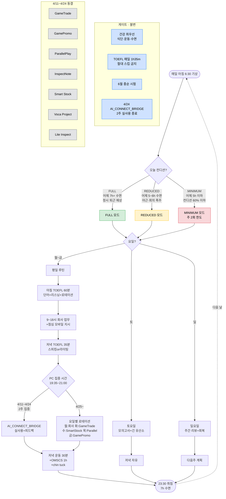

---

## 1. 컨디션 판정 & 모드 분기 상세

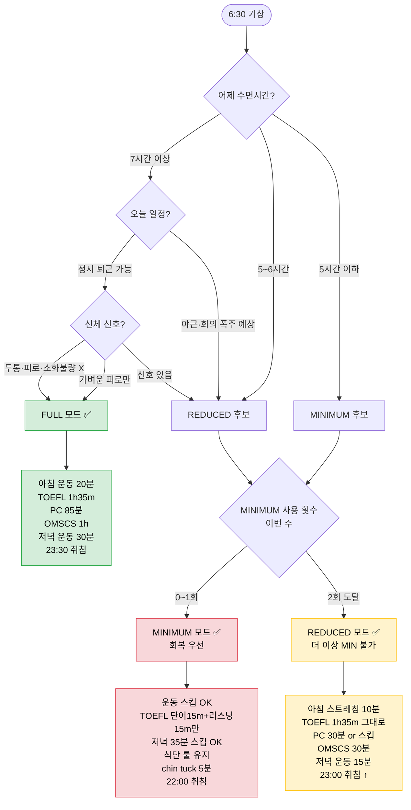

### MINIMUM 모드에서도 절대 스킵 금지

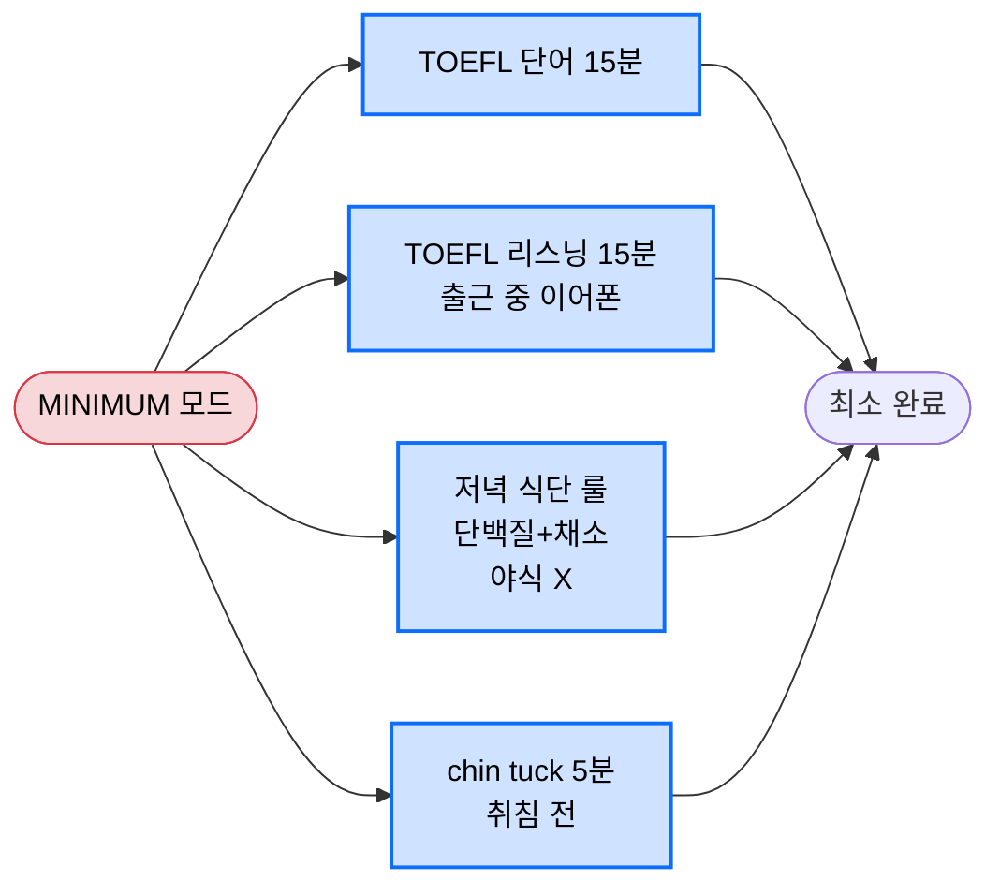

---

## 2. 평일 FULL 모드 타임라인

```mermaid
flowchart TB
    T0630[6:30~7:00<br/>공복 유산소 20분<br/>걷기/실내자전거] --> T0700
    T0700[7:00~7:20<br/>아침 황제 식사<br/>볶음 덮밥<br/>현미밥 1공기+계란 3개<br/>+참치 반캔+채소+김<br/>~630kcal 단백40g] --> T0720
    T0720[7:20~7:35<br/>TOEFL 단어 15분<br/>26초 토단정 30단어] --> T0735
    T0735[7:35~7:50<br/>TOEFL 리스닝 15분<br/>Howard Macs+쉐도잉] --> T0750
    T0750[7:50~8:20<br/>TOEFL 로테이션 30분<br/>월:리딩 화:리스닝<br/>수:리딩 목:리스닝<br/>금:리딩] --> T0820
    T0820[8:20~9:00<br/>출근 중 모바일<br/>AI 작업 결과 리뷰<br/>Discord+Slack] --> T0900

    T0900[9:00~12:00<br/>회사 업무] --> T1200
    T1200[12:00~13:00<br/>점심 귀족 식사<br/>회사 샐러드<br/>잎채소+닭가슴살 100g<br/>+올리브오일 드레싱<br/>~500kcal 단백30g<br/>+모바일 프로젝트 지시] --> T1300
    T1300[13:00~17:30<br/>회사 업무<br/>+Codex 코드 검토] --> T1730
    T1730[17:30~18:00<br/>퇴근 준비<br/>AI 결과 정리] --> T1800

    T1800[18:00~18:30<br/>퇴근 중 모바일<br/>AI 작업 지시] --> T1830
    T1830[18:30~19:00<br/>저녁 빈자 식사<br/>삶은 계란 2~3개<br/>+WPI 1스쿱 물 250ml<br/>+생채소<br/>~400kcal 단백44g<br/>19시 이전 종료] --> T1900
    T1900[19:00~19:30<br/>TOEFL 로테이션 30분<br/>월수금:스피킹<br/>화목:라이팅] --> T1930
    T1930[19:30~19:35<br/>TOEFL 발음 5분<br/>th·r/l + TED Talk] --> T1935
    T1935[19:35~21:00<br/>PC 집중 85분<br/>2주 모드 or 일반 모드<br/>분기는 섹션 4 참조] --> T2100
    T2100[21:00~21:30<br/>저녁 운동 30분<br/>요일별 근력/유산소] --> T2130
    T2130[21:30~21:35<br/>WPI 추가 1스쿱<br/>물 250ml<br/>근합성 골든타임<br/>월수금 근력일만<br/>저녁 것과 별개] --> T2135
    T2135[21:35~22:30<br/>OMSCS 1h<br/>수학/딥러닝] --> T2230
    T2230[22:30~22:55<br/>AI 밤새 작업 지시<br/>내일 할 일 정리] --> T2255
    T2255[22:55~23:00<br/>chin tuck 5분<br/>경추 케어] --> T2300
    T2300([23:00~23:30<br/>마무리+취침<br/>7h 수면])

    subgraph MorningSection[오전 6:30~9:00]
        T0630
        T0700
        T0720
        T0735
        T0750
        T0820
    end

    subgraph WorkSection[낮 9:00~18:00 · 회사 업무]
        T0900
        T1200
        T1300
        T1730
    end

    subgraph EveningSection[저녁 18:00~23:30]
        T1800
        T1830
        T1900
        T1930
        T1935
        T2100
        T2130
        T2135
        T2230
        T2255
        T2300
    end

    classDef toefl fill:#cfe2ff,stroke:#0d6efd,color:#000
    classDef exercise fill:#d4edda,stroke:#28a745,color:#000
    classDef food fill:#fff3cd,stroke:#ffc107,color:#000
    classDef work fill:#e2e3e5,stroke:#6c757d,color:#000
    classDef project fill:#f8d7da,stroke:#dc3545,color:#000

    class T0720,T0735,T0750,T1900,T1930 toefl
    class T0630,T2100,T2255 exercise
    class T0700,T1200,T1830,T2130 food
    class T0900,T1300,T1730 work
    class T0820,T1800,T1935,T2135,T2230 project
```

---

## 3. REDUCED · MINIMUM 모드 축소 규칙 (항목별)

### 3-1. 아침 운동

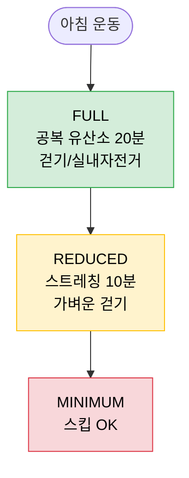

### 3-2. TOEFL

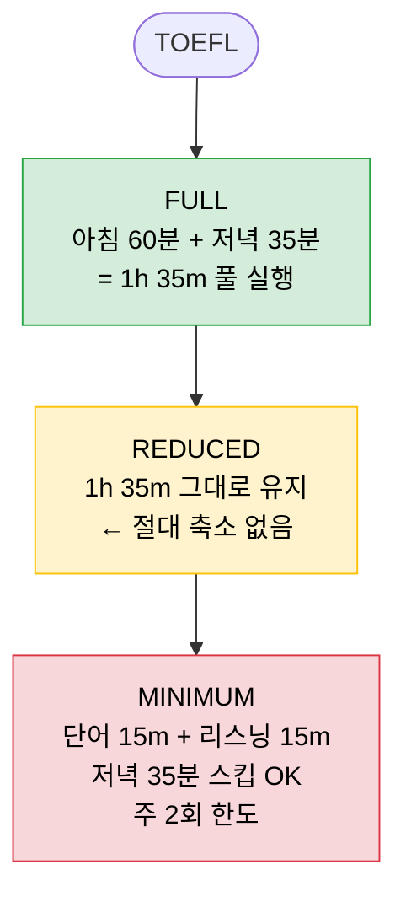

### 3-3. PC 집중 시간 (19:35~21:00)

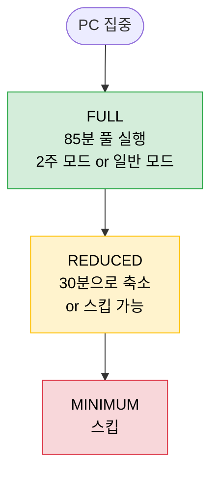

### 3-4. 저녁 운동

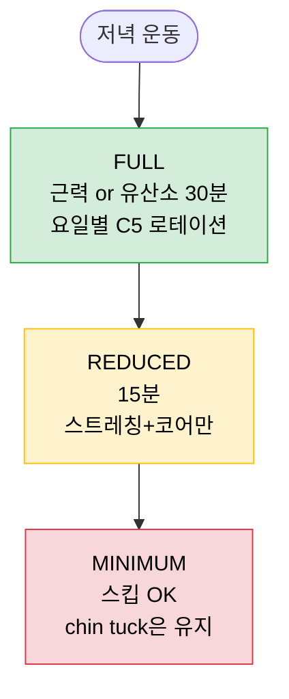

### 3-5. OMSCS 기초 학습

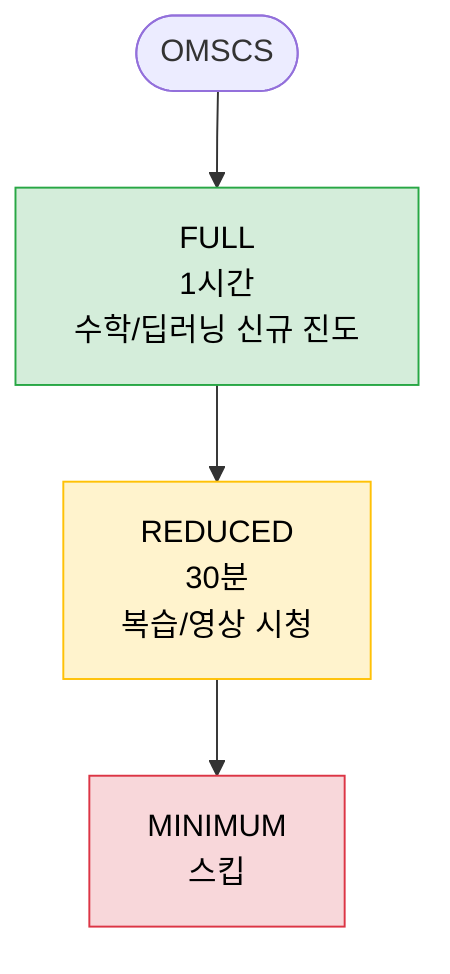

### 3-6. 수면

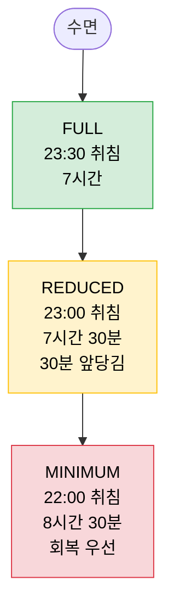

### 3-7. 식단 · chin tuck (모드 무관 고정)

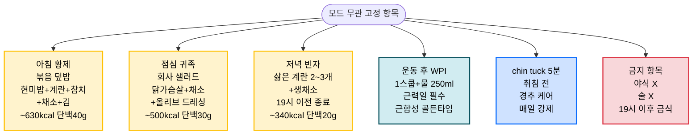

---

## 4. 요일별 로테이션 (TOEFL + PC 집중 시간)

### 4-1. 월요일

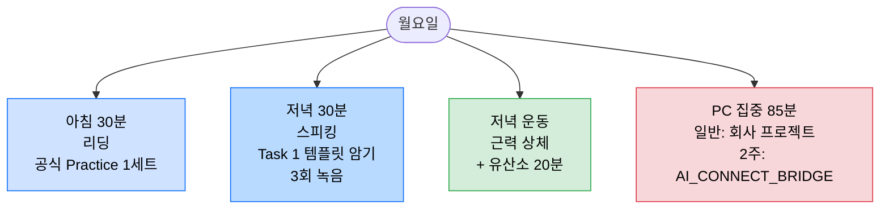

### 4-2. 화요일

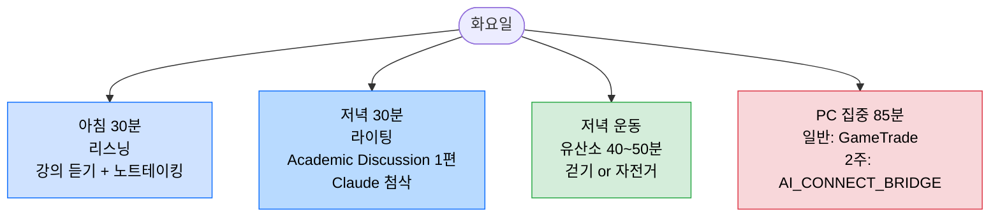

### 4-3. 수요일

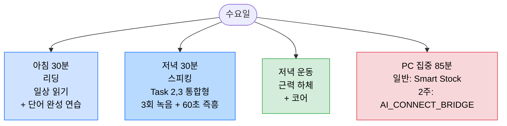

### 4-4. 목요일

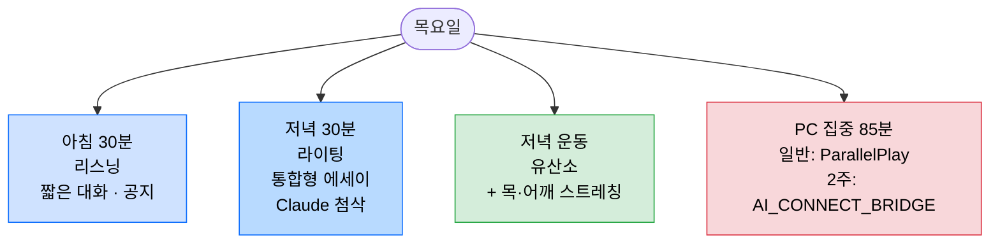

### 4-5. 금요일

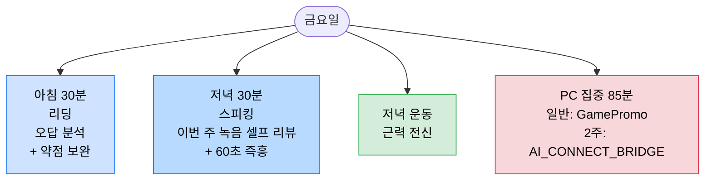

---

## 5. 주말 스케줄

### 5-1. 토요일 (FULL 모드)

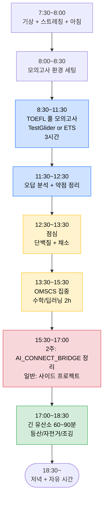

> **토요일 REDUCED/MIN 모드일 때**:
> - 모의고사 3h → 2h 단축형 (REDUCED) 또는 단어+리스닝 1h만 (MIN)
> - OMSCS 2h → 1h (REDUCED) 또는 스킵 (MIN)
> - 프로젝트 1.5h → 45분 (REDUCED) 또는 스킵 (MIN)
> - **긴 유산소는 그대로 유지** (회복 효과 큼)

---

### 5-2. 일요일 (FULL 모드)

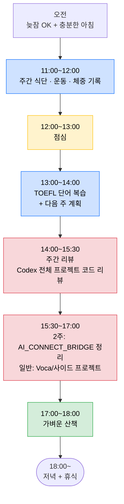

> **일요일 REDUCED/MIN 모드일 때**:
> - 주간 리뷰 30분만
> - 산책 30분
> - 다음 주 일정 점검만 하고 **나머지는 회복 우선**

---

## 6. 4/11 ~ 4/24 · AI_CONNECT_BRIDGE 2주 집중 기간

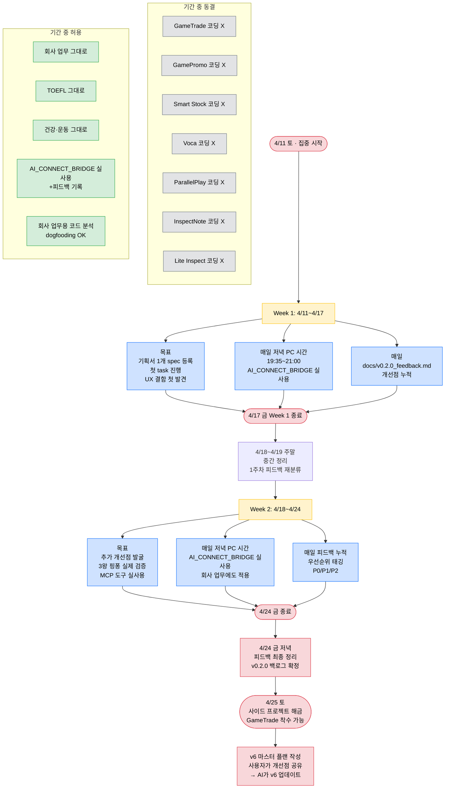

---

## 읽는 법

1. **첫 판단**: 섹션 0 전체 조감도로 오늘 모드 빠르게 정함
2. **컨디션 애매하면**: 섹션 1 플로우로 정확히 판정
3. **평일 시간표 확인**: 섹션 2 (FULL) → 섹션 3 (REDUCED/MIN 축소)
4. **오늘 뭘 할지 (요일별)**: 섹션 4
5. **주말**: 섹션 5
6. **지금 2주 모드 중이면**: 섹션 6 참조

색상 코드:
- 🟦 파란색 = TOEFL
- 🟩 초록색 = 운동·허용
- 🟨 노란색 = 식단·REDUCED 모드
- 🟥 빨간색 = 프로젝트·MINIMUM 모드·마일스톤
- ⬜ 회색 = 회사 업무·동결·회복
